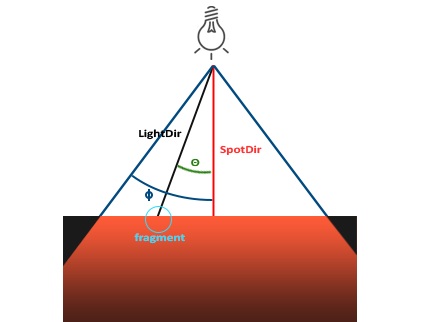

[TOC]

# 一、基础材质模型

> 基础材质模型是对 BRDF 光照模型进行简化和理想化后的经验模型

**着色（shading）**：计算某个观察方向出射度的过程，期间需要材质属性、光源信息 和 一个等式（这个等式也称为光照模型）
$$
基础材质模型 = 自发光 f_e + 环境光 f_a + 漫反射 f_d + 镜面反射 f_s
$$


## 1. 颜色计算

常用的计算光照颜色的方法：

- **物体反射的颜色（我们感知到的颜色）：光源的颜色 * 物体的颜色**
- 多光源的情况下，一般都是将各个光源的颜色累加起来，最后得出最终的颜色
- 同一个光源的光衰减系数是一样的，因此 **最终颜色 = 光衰减系数 * 光照模型计算的颜色**


## 2. 自发光 Emissive

直接由光源发射的光照，自发光一般为材质的颜色
实时渲染中自发光不会作为光源来照亮其他物体（不提供间接光照）


## 3. 环境光 Ambient

是一个全局光照，同一个场景中的所有物体都使用同样的环境光（一般为常量）

**泛光模型**
即只考虑环境光，这是最简单的**经验**模型，只会去考虑环境光的影响

- $K_a$ 代表物体表面对环境光的反射率
- $I_a$ 代表入射环境光的亮度

$$
I_{Env} = K_a I_a
$$


## 4. 漫反射 Diffuse

物体表面随机散射后反射的光照

### 4.1 兰伯特光照模型


反射的光线强度 与 表面法线和光源方向夹角 的余弦值 成正比（物体背面的光照不会参与着色计算）

- 计算方法
  两个单位向量的点积  $\hat n \cdot I = |\hat n||I| \cos \theta = \cos \theta$
  反射的光线强度 和 **单位**表面法线和**单位**光源方向 的点积 成正比
- 实际计算公式
  max 函数防止出现表面法线 $n$ 和 光源方向 $I$ 夹角 $\theta$ 大于 90 度的情况（即，光源被物体遮挡的情况）

$$
Color_{diff} = Color_{light} \cdot Color_{材质强度} \max(0, n \cdot I)
$$

### 4.2 半兰伯特光照模型

基于兰伯特光照模型（物体背面的光照会参与着色计算）

- 计算方法
  不通过限制余弦值的大小而是将余弦值的范围从 [-1, 1] 映射到 [0, 1]
- 实际计算公式

$$
Color_{diff} = Color_{light} \cdot Color_{材质强度} (0.5 + 0.5* n \cdot I)
$$


## 5. 镜面反射 Specular

### 5.1 Phong 反射模型

> Phong 着色：使用 Phong 光照模型，在**片元着色器**逐像素的计算（使用的顶点法线在当前片面的插值）
> Gouraud 着色：使用 Phong 光照模型，在**顶点着色器**逐顶点的计算（计算量相对较小）

Phong 照模型只关心由光源发射，经过物体表面一次反射后**进入摄像机的光线**

**镜面反射 Specular**：


**计算反射方向** $r$，已知法线 $\hat n$ 是单位向量，$L$ 是入射光线 $I$ 到 $\hat n$ 的投影
$$
\begin{align}
|\hat n| &= 1 \\ \\
r + I &= 2 L\\
&= 2(|I|cos \theta) \\
&= 2(|\hat n||I|cos \theta) \\
&= 2(\hat n\cdot I) \\
r &= 2 (\hat n \cdot I) \hat n - I
\end{align}
$$

**高光反射**，已知 观察方向 $\hat v$ 是单位向量


$$
Color_{spec} = Color_{light} \cdot Color_{高光强度} \max(0, \hat v \cdot r)^{Gloss}
$$
Gloss：光泽度，控制高光区域的亮点（光泽度越大，亮点越小）
max 函数防止出现 $v$ 和 $r$ 夹角 $\theta$ 大于 90 度的情况（即，光源在摄像头后侧的情况）


### 5.2 Blinn-Phong 反射模型

**Phong 光照的缺点**：
当物体的反光度非常小时，它产生的镜面高光半径足以让相反方向的光线对亮度产生足够大的影响。在这种情况下就不能忽略它们对镜面光分量的贡献了


Blinn-Phong 光照模型为了解决 Phong 光照的上述缺点，**计算高光强度的方法改为**计算 **半程向量** 与 法线向量 的夹角的方式


$$
\hat h = {I + \hat v \over |I + \hat v|}
$$
Blinn-Phong 的高光强度
$$
Color_{spec} = Color_{light} \cdot Color_{高光强度} \max(0, \hat h \cdot \hat n)^{Gloss}
$$


Blinn-Phong 较 Phong 具有更真实的光照效果


## 6. 代码实现


```glsl
// VS
#version 330 core
layout (location = 0) in vec3 aPos;
layout (location = 1) in vec3 aNormal;
layout (location = 2) in vec2 aTexCoords;

out vec3 FragPos;
out vec3 Normal;
out vec2 TexCoords;

uniform mat4 model;
uniform mat4 view;
uniform mat4 projection;

void main() {
    // Word coordinate
    FragPos = vec3(model * vec4(aPos, 1.0));
    
    // mode 4D to 3D for remove translate
    Normal = mat3(transpose(inverse(model))) * aNormal;  
    TexCoords = aTexCoords;
    
    gl_Position = projection * view * vec4(FragPos, 1.0);
}

// FS
vec3 CalcPointLight(PointLight light, vec3 normal, vec3 fragPos, vec3 viewDir)
{
    // lightDir from frag to light
    vec3 lightDir = normalize(light.position - fragPos);
    
    // diffuse shading
    float diff = max(dot(normal, lightDir), 0.0);
    
    // specular shading
    vec3 halfwayDir = normalize(viewDir + lightDir);
    float spec = pow(max(dot(viewDir, halfwayDir), 0.0), material.shininess);
    
    // combine results
    vec3 ambient = light.ambient * vec3(texture(material.diffuse, TexCoords));
    vec3 diffuse = light.diffuse * diff * vec3(texture(material.diffuse, TexCoords));
    vec3 specular = light.specular * spec * vec3(texture(material.specular, TexCoords));
    
    // attenuation
    float distance = length(light.position - fragPos);
    float attenuation = 1.0 / (light.constant + light.linear * distance + light.quadratic * (distance * distance)); 

    return (ambient + diffuse + specular) * attenuation;
}
```


# 二、光的属性

## 2. 光的衰减

衰减（Attenuation）：随着光线传播距离的增长逐渐削减光的强度

光的衰减的模拟公式（其中 $K_c$、$K_l$、$K_q$ 的取值都是经验值）

- $K_c$ 通常保持为 1.0，它的主要作用是保证分母永远不会比1小，否则的话在某些距离上它反而会增加强度，这肯定不是我们想要的效果
- $K_l$ 与距离值相乘，以线性的方式减少强度
- $K_q$ 与距离的平方相乘，让光源以二次递减的方式减少强度。二次项在距离比较小的时候影响会比一次项小很多，但当距离值比较大的时候它就会比一次项更大了

$$
L_{att} = {1.0 \over K_c + K_l * d + K_q * d^2}
$$

实际的光的衰减的计算

1. 通过一张 256 * 1 的纹理作为查找表
   通过的**点到光源距离的平方** 来（为了避免开方操作）查找衰减值（Unity 内的光衰减纹理）
2. 使用简化后的数学公式计算衰减（Unity 内使用的计算公式）

$$
L_{att} = {1.0 \over D_{光源到着色物体的距离}}
$$


## 3. 光源类型

光源类型，即投光物(Light Caster)：将光**投射**(Cast)到物体的光源
在渲染方程中常常称一个具体的光源类型为 **精确光源 punctual lights**  


### 3.1 天光 Sky light

天光 (单位：$cd/m^2$)：环境光，模拟场景中带有太阳或阴天的光照环境，不仅可以用于户外环境，也可以给室内环境带来环境光效果

1. 使用固定的场景贴图：多用天空球网格贴图
2. 实时从场景中捕捉生成 Cubemap（立方体图）来生成环境光


### 3.2 平行光 Directional light


平行光 (单位：$lux$)，又称定向光：光源处于无限远处，所有光线有相同的方向

- 不考虑光源位置，只考虑光的方向
- 表示用方向：平行光从光源发出的方向
- 计算用方向：平行光从片段发出到光源的方向（与平行光的表示相反）


**光照度**物理光照计算公式（其中，$\Phi _e$ 表示光通量，为已知条件）
$$
E_e = {\Phi_e \over A\cos \theta}
$$
实际简化后的计算方式：
使用 Phong 光照模型里的兰伯特漫反射模型<u>乘以固定的系数</u>来计算

```glsl
vec3 CalcDirLight(DirLight light, vec3 normal, vec3 viewDir)
{
    vec3 lightDir = normalize(-light.direction);
    
    // diffuse shading
    float diff = max(dot(normal, lightDir), 0.0);
    
    // specular shading
    vec3 reflectDir = reflect(-lightDir, normal);
    float spec = pow(max(dot(viewDir, reflectDir), 0.0), material.shininess);
    
    // combine results
    vec3 ambient = light.ambient * vec3(texture(material.diffuse, TexCoords));
    vec3 diffuse = light.diffuse * diff * vec3(texture(material.diffuse, TexCoords));
    vec3 specular = light.specular * spec * vec3(texture(material.specular, TexCoords));
    
    return (ambient + diffuse + specular);
}

```


### 3.3 点光源 Point light


点光源 (单位：$cd$)：光源处于世界中某一个位置的光源，它会朝着所有方向发光，但光线会随着距离逐渐衰减

- 计算用方向：平行光从片段发出到点光源的方向
- 衰减系数：点光源的最终结果需要乘以一个衰减系数


**光强度**物理光照计算公式（其中，$\Phi _e$ 表示光通量，为已知条件）
$$
\begin{align}
\phi &= \int _s I_e d I_e = \int _0^{2\pi} \int_0^{\pi} I_e d\theta d\phi = 4\pi \space I_e \\\\
I_e &= {d\Phi \over d\Omega}\\
&= {\Phi_e},  \space(\Phi_e \space 光通量 lm)
L_e &= f(v, l)E_e \\
&= f(v, l)L_{in} <n \cdot l> \\
&= f(v, l){I_e \over distance^2}<n \cdot l >\\
&= f(v, l){\phi \over{4 \pi \space distance^2}}<n \cdot l>
\end{align}
$$


$$
L_{att} = {1.0 \over D_{光源到着色物体的距离}}
$$

```glsl
vec3 CalcPointLight(PointLight light, vec3 normal, vec3 fragPos, vec3 viewDir)
{
    vec3 lightDir = normalize(light.position - fragPos);
    
    // diffuse shading
    float diff = max(dot(normal, lightDir), 0.0);
    
    // specular shading, func reflect need inverse direction of input light
    vec3 reflectDir = reflect(-lightDir, normal);
    float spec = pow(max(dot(viewDir, reflectDir), 0.0), material.shininess);
    
    // combine results
    vec3 ambient = light.ambient * vec3(texture(material.diffuse, TexCoords));
    vec3 diffuse = light.diffuse * diff * vec3(texture(material.diffuse, TexCoords));
    vec3 specular = light.specular * spec * vec3(texture(material.specular, TexCoords));
    
    // attenuation
    float distance = length(light.position - fragPos);
    float attenuation = 1.0 / (light.constant + light.linear * distance + light.quadratic * (distance * distance));   

    return (ambient + diffuse + specular) * attenuation;
}
```


### 3.4 聚光灯 Spot light



聚光 (单位：$cd$)：只朝一个特定方向而不是所有方向照射光线，只有在聚光方向的特定半径内的物体才会被照亮，其它的物体都会保持黑暗

**光强度**物理光照计算公式（其中，$\Phi _e$ 表示光通量，为已知条件）
$$
\begin{align}
\phi &= 
\end{align}
$$
实际简化后的计算方式：

- LightDir：聚光照射到片元的方向

- SpotDir：聚光的方向

- $\phi$ 切光角：聚光的照在物体上光圈的半径大小

- $\theta$ LightDir 和 SpotDir 之间的夹角


**聚光的边缘软化**

- 聚光边缘强度变化：需要一个内切光角和一个外切光角，通过从内到外切光角的过渡来表示聚光强度的变化

- 强度计算公式，其中
  $I$ 为聚光强度，范围是 [0, 1] 
  $\theta$ 为 LightDir 和 SpotDir 之间的夹角
  $\phi$ 为外切光角，$\gamma$ 为内切光角（$\phi$、$\gamma$ 一般作为聚光的属性，都是常数）

  $I = {\theta - \phi \over cos\gamma - cos\phi}$

```glsl
vec3 CalcSpotLight(SpotLight light, vec3 normal, vec3 fragPos, vec3 viewDir)
{
    vec3 lightDir = normalize(light.position - fragPos);
    
    // diffuse shading
    float diff = max(dot(normal, lightDir), 0.0);
    
    // specular shading
    vec3 reflectDir = reflect(-lightDir, normal);
    float spec = pow(max(dot(viewDir, reflectDir), 0.0), material.shininess);
    
    // combine results
    vec3 ambient = light.ambient * vec3(texture(material.diffuse, TexCoords));
    vec3 diffuse = light.diffuse * diff * vec3(texture(material.diffuse, TexCoords));
    vec3 specular = light.specular * spec * vec3(texture(material.specular, TexCoords));
    
    // attenuation
    float distance = length(light.position - fragPos);
    float attenuation = 1.0 / (light.constant + light.linear * distance + light.quadratic * (distance * distance));  

    // spotlight intensity
    float theta = dot(lightDir, normalize(-light.direction)); 
    float epsilon = light.cutOff - light.outerCutOff;
    float intensity = clamp((theta - light.outerCutOff) / epsilon, 0.0, 1.0);
    
    return (ambient + diffuse + specular) * attenuation * intensity;
}
```


### 3.5 面光源 Area light

> 由于面光源会同时从几个不同的方向照亮对象，因此阴影比其他类型的光更柔和细微
> 可用于创建逼真的路灯或靠近播放器的一排灯
>
> 小面积的光源可以模拟较小的光源（例如室内照明），比点光源具有更逼真的效果

面光源 (单位：$cd$)：由空间中的矩形限定，在所有方向上均匀地在其表面区域上发出光，但仅从矩形的一侧发出，类似于方正的聚光灯


# 三、 阴影

## 1. 阴影效果分析

**阴影具有近实（边缘锐利清晰），远虚（边缘模糊）的效果**

根据被遮挡程度，阴影的类型可分为：

1. lit 照亮：没有被遮挡
2. umbra 本影区：完全被遮挡
3. penumbra 半影区：部分被遮挡


## 2. 阴影映射 Shadow Mapping

注意：

- 由于阴影数据的精度问题，光源距离物体越远效果越好
- 点光源的阴影（透视投影）需要更高的精度和更小的竖直方向的视角
- 法线最好采用法线贴图，顶点法线生成的阴影在一些特殊视角会有阴影形变问题


整体思路


方法：

1. **渲染深度贴图（阴影贴图）**
   以光的位置为视角进行渲染，我们能看到的东西都将被点亮，看不见的是阴影
   以光源的类型选择 正交投影 或者 透视投影
   
   ```c
   // 存储的是实际 Z 的深度值，没有标准化（这个时候的 Z 无法确定输入范围）
   GLuint depthMap;
   glGenTextures(1, &depthMap);
   glBindTexture(GL_TEXTURE_2D, depthMap);
   glTexImage2D(GL_TEXTURE_2D, 0, GL_DEPTH_COMPONENT, 
                SHADOW_WIDTH, SHADOW_HEIGHT, 0, GL_DEPTH_COMPONENT, GL_FLOAT, NULL);
   glTexParameteri(GL_TEXTURE_2D, GL_TEXTURE_MIN_FILTER, GL_NEAREST);
   glTexParameteri(GL_TEXTURE_2D, GL_TEXTURE_MAG_FILTER, GL_NEAREST);
   glTexParameteri(GL_TEXTURE_2D, GL_TEXTURE_WRAP_S, GL_REPEAT); 
   glTexParameteri(GL_TEXTURE_2D, GL_TEXTURE_WRAP_T, GL_REPEAT);
   ```
   
2. **深度贴图纹理坐标计算**
   世界空间坐标 -> 光源空间坐标 -> 裁切空间的标准化设备坐标-> 根据深度贴图和坐标求出阴影深度值

3. 计算片段是否在阴影之中：若当前坐标的 Z 值比深度贴图的值大，则物体在阴影后面，物体有阴影

   ```c
   // shadow 只能为 0 或 1
   // 阴影中只有环境光，没有高光反射和漫反射
   vec3 lighting = (ambient + (1.0 - shadow) * (diffuse + specular)) * color;
	```

   

重点：

1. 不使用颜色缓冲，不包含颜色缓冲的帧缓冲是不完整的，因此只能禁止颜色缓冲
   并且在片源着色器里什么都不干
   
   ```c
   glBindFramebuffer(GL_FRAMEBUFFER, depthMapFBO);
   glFramebufferTexture2D(GL_FRAMEBUFFER, GL_DEPTH_ATTACHMENT, GL_TEXTURE_2D, depthMap, 0);
   glDrawBuffer(GL_NONE);
   glReadBuffer(GL_NONE);
   glBindFramebuffer(GL_FRAMEBUFFER, 0);
   ```
   
2. 获取阴影贴图的值为透视投影下的非线性深度值

   **解决方案**：将非线性深度值通过透视投影的逆变换转换为线性深度，[投影矩阵](../LinearAlgebra/Part1_Matrix.md)
   $$
   \begin{align}
   Z_n &= {{far + near} \over {far - near}} +{2 \cdot far \cdot near \over {far - near}}{1 \over Z_{linear}} \\
   (far - near)Z_n &= (far + near) + 2 \cdot far \cdot near {1 \over Z_{linear}} \\
   {(far - near)Z_n - (far + near) \over 2 \cdot far \cdot near} &= {1 \over Z_{linear}} \\
   Z_{linear} &= {2 \cdot far \cdot near \over (far - near)Z_n - (far + near)}
   \end{align}
   $$
   
3. 在**距离光源比较远**时，多个片段会从深度贴图的同一个值中采样
   当光以一定角度朝向物体表面时，物体表面会产生明显的线条样式

   

   **解决方案**：阴影偏移（shadow bias）+ 深度纹理的线性采样 + 精度修正
   根据对阴影贴图应用一个**随 物体表面朝向和光线的角度**变化的偏移量

   ```c
   // 1. 阴影偏移
   float bias = max(0.05 * (1.0 - dot(normal, lightDir)), 0.005);
   float shadow = currentDepth - bias > closestDepth  ? 1.0 : 0.0;
   
   // 2. 精度问题 
   // 2.1 精度打包
   vec4 bitShift = vec4(1.0, 256.0, 256.0 * 256.0, 256.0 * 256.0 * 256.0);
   const vec4 bitMask = vec4(1.0/256.0, 1.0/256.0, 1.0/256.0, 0.0);
   vec4 rgbaDepth = fract(gl_FragCoord.z * bitShift);
   rgbaDepth -= rgbaDepth.gbaa * bitMask;
   
   // 2.2 精度解包
   
   ```
   
   
   
   这样会带来一个问题 —— 悬浮
   
   
   
   解决悬浮的一种方法：通过在生成阴影深度贴图时采用正面剔除的方式，只保留实体物体背面阴影深度，这样阴影的深度更真实，由于偏移出现的部分多余的阴影也会由于阴影深度的更精确而消失，但是地板的深度会去掉
   
   
   
4. 阴影贴图有一定的范围，无法覆盖所有场景

   

   **解决方案**：让阴影贴图范围外的没有阴影

   1. <u>采样位置超出深度贴图边缘</u>
      将阴影贴图的纹理环绕选项设置为 `GL_CLAMP_TO_BORDER`，给边框设一个较亮的白色（最大深度 1）

   2. <u>深度 Z 的范围超过远平面的裁剪范围 -1.0 ～ 1.0</u>
      首先在片源着色器里判断深度值是否超出 1.0，如果超出，强制设置为无阴影

      

5. 阴影贴图受限于分辨率，画出的阴影有锯齿感

   

   **解决方案**：PCF（percentage-closer filtering）
   计算阴影时，多次进行深度图的采样计算，给做一次 BoxBlur 均值滤波，来模糊阴影边缘的锯齿


## 3. Percentage-Closer Soft Shadows（PCSS）

PCF 由于采样区域是固定大小的，因此会在所有地方展示同样形状的软阴影。
为了做到**近实远虚**的效果，我们需要一个系数来控制 PCF 的步长，让近处 PCF步长短（清晰），远处 PCF 步长长（模糊）


$$
\begin{align}
{W_{Penumbra} \over W_{Light}} &= {{(d_{Receiver} - d_{Blocker})} \over W_{Blocker}} \\
W_{Penumbra} &= {{(d_{Receiver} - d_{Blocker})}  W_{Light} \over W_{Blocker}}
\end{align}
$$

在计算平均深度时，可以使用 mipmap 来加速平均深度的计算，通过减少采样次数的方式来提高效率

```c++
#define BIAS 		5e-5
#define nSamples 	8

float findAVGBlocker(const vec3& coords, const float& bias)
{
    int blockerCount = 0;
    float totalDepth = 0;
    for (int i = 0; i < nSamples - 2; ++i) {
        vec2 uv = vec2(coords.x, coords.y) + u_offsets[i]；
        float shadowMapDepth = sample2D(texDepth, uv);
        if (coord.z > (bias + shadowMapDepth)) {
            totalDepth += shadowMapDepth;
            blockCount += 1;
        }
    }
    
    if (0 == blockCount) {
        return -1.0f;
    } else if (nSamples - 2 == blockCount) {
        return 2.0f;
    } else {
        return totalDepth / float(blockCount);
    }
}

float PercentageCloserSoftShadows(
    const vec3& coords, 
    const vec3& normal, 
    const vec3& lightDir
)
{
    float bias = MAX(BIAS, BIAS * (1.0f - nomral.dot(lightDir)));
    
    // 1. avg blocker depth
    float zBlocker = findAVGBlocker(coords, bias);
    if (zBlocker > EPS) {
        return 1.0f;
    } else if (zBlocker > 1.0f + EPS) {
        return 0.0f;
    }
    
    // 2. penumbra size
    float penumbraScale = (coord.z - zBlocker) / zBlocker;
    
    // 3. filtering
    float sum = 0.0f;
    for (int i = 0; i < nSamples; ++i) {
        vec2 uv = vec2(coord.x, coord.y) + u_offsets[i] * penumbraScale;
        sum += (coord.z > sample2D(texDepth, uv) ? 0.0f : 1.0f);
    }
    
    return sum / nSamples;
}
```

另外还有通过影子都是水平的这个假设 + 概率方差的方式来给 PCSS 计算加速的 Variance Shadow Maps（VSM），以及修正 VSM 漏光问题的 Moment Shadow Mapping（MSM）方法，由于使用场景特定且实现方式复杂等问题，这里不再详述，具体可以看 [实时渲染｜Shadow Map：PCF、PCSS、VSM、MSM - 知乎 (zhihu.com)](https://zhuanlan.zhihu.com/p/369710758)


## 4. 级联式纹理映射 Cascaded Shadow Map（CSM）

**阴影贴图**方法对于**大型场景**渲染显得力不从心，很容易出现**阴影抖动**和**锯齿边缘**现象
**Cascaded Shadow Maps(CSM)** 方法根据**对象**到**观察者**的距离提供**不同分辨率**的**深度纹理**来解决上述问题

1. 将**相机**的**视锥体**分割成若干部分，然后为分割的每一部分生成**独立**的**深度贴图**
2. 根据物体在场景中的位置对位置附近的两张深度贴图进行采样，根据 深度 距离来对两个采样进行线性插值


## 5. 平面投影阴影 Planar Projected Shadows

TODO: https://zhuanlan.zhihu.com/p/31504088


## 6. 点光源阴影 Point Shadows

点光阴影，过去的名字是万向阴影贴图（omnidirectional shadow maps）技术

方法：

1. 渲染深度**立方体**贴图
   将立方体贴图 GL_TEXTURE_CUBE_MAP 绑定到 FBO 上，通过几何着色器，一次绘制 6 个面的贴图
   顶点着色器：将顶点变换到世界空间
   几何着色器：将所有世界空间的顶点变换到 6 个不同的光空间（输入：一个三角形的 3 个顶点）

   ```c
   // 几何着色器
   #version 330 core
   layout (triangles) in;
   layout (triangle_strip, max_vertices=18) out;
   
   uniform mat4 shadowMatrices[6];
   out vec4 FragPos; // FragPos from GS (output per emitvertex)
   
   void main() {
       for(int face = 0; face < 6; ++face) {
           gl_Layer = face; // built-in variable that specifies to which face we render.
           for(int i = 0; i < 3; ++i) { // for each triangle's vertices
               FragPos = gl_in[i].gl_Position;
               gl_Position = shadowMatrices[face] * FragPos;
               EmitVertex();
           }    
           EndPrimitive();
       }
   }
   
   // 片源着色器
   #version 330 core
   in vec4 FragPos;
   
   uniform vec3 lightPos;
   uniform float far_plane;
   
   void main() {
       // get distance between fragment and light source
       float lightDistance = length(FragPos.xyz - lightPos);
   
       // map to [0;1] range by dividing by far_plane
       lightDistance = lightDistance / far_plane;
   
       // write this as modified depth
       gl_FragDepth = lightDistance;
   }
   ```

   

2. 渲染场景
   为了确保 6 个面的深度贴图边缘都对齐，设置透视投影的视角为 90 度

   ```c
   float ShadowCalculation(vec3 fragPos) {
       // Get vector between fragment position and light position
       vec3 fragToLight = fragPos - lightPos;
       // Use the fragment to light vector to sample from the depth map    
       float closestDepth = texture(depthMap, fragToLight).r;
       // It is currently in linear range between [0,1]. 
       // Let's re-transform it back to original depth value
       closestDepth *= far_plane;
       // Now get current linear depth as the length between the fragment and light position
       float currentDepth = length(fragToLight);
       // Now test for shadows
       float bias = 0.05; 
       // We use a much larger bias since depth is now in [near_plane, far_plane] range
       float shadow = currentDepth -  bias > closestDepth ? 1.0 : 0.0;
   
       return shadow;
   }
   ```


## 7. 透明物体的阴影


## 8. 屏幕空间的环境光遮挡 SSAO

屏幕空间的环境光遮挡 （Screen Space Ambient Occlusion，SSAO）通过将褶皱、孔洞和非常靠近的墙面变暗的方法近似模拟出间接光照（常用来模拟大面积的光源对整个场景的光照 如，下图）


方法：在三维物体已经生成二维图片之后计算遮蔽因子

1. 几何阶段：准备输入数据
   **1.1 渲染当前相机范围的 顶点、法线、线性深度 到观察空间下的 G-Buffer（Geometry Buffer）**
   注意：纹理采样使用 `GL_CLAMP_TO_EDGE` 方法，防止采样到在屏幕空间中纹理默认坐标区域之外的深度值
   
   ```c
   // 几何着色器 VS
   #version 330 core
   layout (location = 0) in vec3 position;
   layout (location = 1) in vec3 normal;
   layout (location = 2) in vec2 texCoords;
   
   out vec3 FragPos;
   out vec2 TexCoords;
   out vec3 Normal;
   
   uniform mat4 model;
   uniform mat4 view;
   uniform mat4 projection;
   
   void main() {
       vec4 viewPos = view * model * vec4(position, 1.0f);
       FragPos = viewPos.xyz; // 观察空间
       gl_Position = projection * viewPos;
       TexCoords = texCoords;
       
       mat3 normalMatrix = transpose(inverse(mat3(view * model)));
       Normal = normalMatrix * normal; // 观察空间 -> 切线空间
   }
   
   // 几何着色器 FS
   #version 330 core
   layout (location = 0) out vec4 gPositionDepth;
   layout (location = 1) out vec3 gNormal;
   layout (location = 2) out vec4 gAlbedoSpec;
   
   in vec2 TexCoords;
   in vec3 FragPos;
   in vec3 Normal;
   
   const float NEAR = 0.1; // 投影矩阵的近平面
   const float FAR = 50.0f; // 投影矩阵的远平面
   float LinearizeDepth(float depth) {
       float z = depth * 2.0 - 1.0; // 回到NDC
       return (2.0 * NEAR * FAR) / (FAR + NEAR - z * (FAR - NEAR));    
   }
   
   void main() {    
       // 1. 储存片段的位置矢量到第一个 G 缓冲纹理
       gPositionDepth.xyz = FragPos;
       // 2. 储存线性深度到 gPositionDepth 的 alpha 分量
       gPositionDepth.a = LinearizeDepth(gl_FragCoord.z); 
       // 3. 储存法线信息到 G 缓冲
       gNormal = normalize(Normal);
       // 4. 储存漫反射颜色
       gAlbedoSpec.rgb = vec3(0.95);
   }
   ```
   
   **1.2 计算法向半球采样在切线空间的位置**
   在**切线空间**内，距离**每个片源**半球形范围内随机取固定数量的采样坐标，一般会将采样点靠近分布
   
      ```c
   // 在应用程序初始化中调用
   // 随机浮点数，范围0.0 - 1.0
   std::uniform_real_distribution<GLfloat> randomFloats(0.0, 1.0);
   std::default_random_engine generator;
   std::vector<glm::vec3> ssaoKernel;
   
   GLfloat lerp(GLfloat a, GLfloat b, GLfloat f) {
     return a + f * (b - a);
   }
   
   for (GLuint i = 0; i < 64; ++i) {
     // 半球采样点 x，y ~ [-1, 1], z ~ [0, 1]
     glm::vec3 sample(
       randomFloats(generator) * 2.0 - 1.0, 
       randomFloats(generator) * 2.0 - 1.0, 
       randomFloats(generator)
     );
     sample = glm::normalize(sample);
     sample *= randomFloats(generator);
     GLfloat scale = GLfloat(i) / 64.0;
     // 将更多的注意放在靠近真正片段的遮蔽上，也就是将核心样本靠近原点分布
     scale = lerp(0.1f, 1.0f, scale * scale);
     ssaoKernel.push_back(sample * scale);  
   }
      ```
   
   **1.3 创建随机核心旋转噪声纹理**
   半球内采样位置会被所有片源共享使用，需要通过随机转动来确保在较低采样数量的情况下有较好的采样效果
   由于，对场景中每一个片段创建一个随机旋转向量，会占用大量内存
   因此，创建一个小的随机旋转向量纹理（4X4）<u>像瓷砖一样反复平铺</u>在屏幕上
   
      ```c
   // 纹理生成
   std::vector<glm::vec3> ssaoNoise;
   for (GLuint i = 0; i < 16; i++) {
     glm::vec3 noise(
       randomFloats(generator) * 2.0 - 1.0, 
       randomFloats(generator) * 2.0 - 1.0, 
       0.0f); // 围绕 Z 轴偏移旋转，因此 Z 轴不需要有任何变化
     ssaoNoise.push_back(noise);
   }
      ```
   
2. 光照处理阶段：计算遮蔽因子

   **2.1 SSAO 阶段**
   SSAO  着色器在 2D 的铺屏四边形上运行，它对于每一个生成的片段计算遮蔽值（为了在最终的光照着色器中使用）。由于环境遮蔽的结果是一个灰度值，只需要纹理的红色分量，所以将颜色缓冲的内部格式设置为 `GL_RED`

   ```c
   #version 330 core
   out float FragColor;
   in vec2 TexCoords;
   
   uniform sampler2D gPositionDepth;
   uniform sampler2D gNormal;
   uniform sampler2D texNoise;
   
   uniform vec3 samples[64];
   uniform mat4 projection;
   
   // 最好设置为 uniform
   int kernelSize = 64;
   float radius = 1.0;
   
   void main() {
       // Get input for SSAO algorithm
       vec3 fragPos = texture(gPositionDepth, TexCoords).xyz;
       vec3 normal = texture(gNormal, TexCoords).rgb;
     
     	// 为了将 [0,1] 的屏幕纹理坐标转化为平铺的噪声纹理坐标 [0,1]
   		// 1. 获取随机旋转向量这里需要一个缩放值
   		const vec2 noiseScale = vec2(800.0f/4.0f, 600.0f/4.0f); // 屏幕 = 800x600
       vec3 randomVec = texture(texNoise, TexCoords * noiseScale).xyz;
     
       // 2. 根据随机旋转向量创建正交坐标
       vec3 tangent = normalize(randomVec - normal * dot(randomVec, normal));
       vec3 bitangent = cross(normal, tangent);
       mat3 TBN = mat3(tangent, bitangent, normal);
     
       // 3. 根据每个片源共用的半球体内采样数量计算遮蔽因子
       float occlusion = 0.0;
       for(int i = 0; i < kernelSize; ++i)
       {
           // 3.1 获取半球体内每个采样点位置（切线空间内）
           vec3 sample = TBN * samples[i];     // 切线 -> 观察空间
           sample = fragPos + sample * radius; // 根据偏移步长和方向，计算偏移后的采样点
           
           // 3.2 将观察空间的采样点投影到屏幕上
           vec4 offset = projection * vec4(sample, 1.0); // from view to clip-space
           offset.xyz /= offset.w; 											// perspective divide
           offset.xyz = offset.xyz * 0.5 + 0.5;          // transform to range 0.0 - 1.0
           
           // 3.3 获取采样点对应周围采样的深度值
           float sampleDepth = -texture(gPositionDepth, offset.xy).w;
           
           // 3.4 检测周围采样的深度如果在法向半球采样半径内，则被保留
           // 从而避免：当检测一个靠近表面边缘的片段时，它将会考虑测试表面之下的表面的深度值
           float rangeCheck = smoothstep(0.0, 1.0, radius / abs(fragPos.z - sampleDepth ));
         
           // 3.5 若周围采样的深度比当前观察深度大，则累加遮蔽因子的值
           occlusion += (sampleDepth >= sample.z ? 1.0 : 0.0) * rangeCheck;           
       }
     
       // 4. 均值化遮蔽因子
       occlusion = 1.0 - (occlusion / kernelSize);
       
       FragColor = occlusion;
   }
   ```

   **2.2 模糊环境遮蔽结果**
   重复的噪声纹理再上一步的图中清晰可见，为了创建一个光滑的环境遮蔽结果，需要用 box bluer 来模糊环境遮蔽纹理

   ```c
   // 需要额外创建 FBO 在存储这种后处理效果
   #version 330 core
   in vec2 TexCoords;
   
   out float fragColor;
   
   uniform sampler2D ssaoInput;
   const int blurSize = 4; // use size of noise texture (4x4)
   
   void main() {
      vec2 texelSize = 1.0 / vec2(textureSize(ssaoInput, 0));
      float result = 0.0;
      for (int x = 0; x < blurSize; ++x) {
         for (int y = 0; y < blurSize; ++y) {
            vec2 offset = (vec2(-2.0) + vec2(float(x), float(y))) * texelSize;
            result += texture(ssaoInput, TexCoords + offset).r;
         }
      }
    
      fragColor = result / float(blurSize * blurSize);
   }
   ```

   **2.3 应用遮蔽因子在光照计算中**
   光照模型中的环境光 = 原来的环境光常量 * 遮蔽因子（环境遮蔽纹理中）

   ```c
   #version 330 core
   out vec4 FragColor;
   in vec2 TexCoords;
   
   uniform sampler2D gPositionDepth;
   uniform sampler2D gNormal;
   uniform sampler2D gAlbedo;
   uniform sampler2D ssao;
   
   struct Light {
       vec3 Position;
       vec3 Color;
   
       float Linear;
       float Quadratic;
       float Radius;
   };
   uniform Light light;
   
   void main() {             
       // 从 G 缓冲中提取数据
       vec3 FragPos = texture(gPositionDepth, TexCoords).rgb;
       vec3 Normal = texture(gNormal, TexCoords).rgb;
       vec3 Diffuse = texture(gAlbedo, TexCoords).rgb;
   	  // BoxBlur 后的遮蔽因子
       float AmbientOcclusion = texture(ssao, TexCoords).r;
   
       // Blinn-Phong (观察空间中)
       vec3 ambient = vec3(0.3 * AmbientOcclusion); // 这里我们加上遮蔽因子
       vec3 lighting = ambient; 
       vec3 viewDir  = normalize(-FragPos); // Viewpos 为 (0.0.0)，在观察空间中
       // 漫反射
       vec3 lightDir = normalize(light.Position - FragPos);
       vec3 diffuse = max(dot(Normal, lightDir), 0.0) * Diffuse * light.Color;
       // 镜面
       vec3 halfwayDir = normalize(lightDir + viewDir);  
       float spec = pow(max(dot(Normal, halfwayDir), 0.0), 8.0);
       vec3 specular = light.Color * spec;
       // 衰减
       float dist = length(light.Position - FragPos);
       float attenuation = 1.0 / (1.0 + light.Linear * dist + light.Quadratic * dist * dist);
       diffuse  *= attenuation;
       specular *= attenuation;
       lighting += diffuse + specular;
   
       FragColor = vec4(lighting, 1.0);
   }
   ```


# 四、游戏中的可移动性

从可移动性上，光源可以分为：

1. 静态光源 **Static Lights**：完全无法移动或者改变光源强度等属性的光源
   仅在光照贴图计算，通过离线烘焙的方式来实现
2. 固定光源
3. 可移动光源


# 五、全局光照

全局光照主要对以下生活中的现象进行模拟：

1. **间接光照**
   也称反射照明，通过其他物体反射的光线照亮物体的光照效果
   
2. **环境光遮蔽**
   常用来模拟大面积的光源对整个场景的光照
   
3. **反射**
   指镜子会反射场景中一摸一样像的效果
   
4. **焦散**
   光经过透明物体的折射后聚焦在一定范围上的效果
   


**离线渲染方案**

1. 路径追踪 
2. 光子映射 Photon Mapping 
3. 辐射度 只能模拟漫反射现象


**实时渲染方案**

- 屏幕空间
  1. 屏幕环境光遮蔽
  2. 屏幕空间反射
- 世界空间
  1. 体素 Voxel Cone Tracing
  2. 距离场 Distance Field
  3. 实时光线追踪


# 六、光照渲染路径 Rendering Path

渲染路径：**决定光照**如何应用到 shader 中，是当前渲染目标使用光照的流程

以下渲染流程按照产生的先后顺序排列


## 1. Forward

前向渲染路径（Unity 默认渲染路径）

- 方法：
  对场景中的每个物体进行着色，在 VS 或 FS 对 每个光源逐个进行计算（世界坐标系）并累加到 frame buffer
  例，Unity3D 4.X 版本中，根据光照对物体的距离采用不同程度的计算
  距离由近到远采用的光照计算方式为，每个光源：逐像素计算、逐顶点计算、求调和函数计算 Spherical Harmonic
  
  ```c
  For each light:
      For each object affected by the light:
          framebuffer += object * light
  ```
  
- 缺点：
  1. 如果像素被其他像素遮蔽了，就浪费了宝贵的处理结果
  2. 光源数量越多，计算越复杂
  
- 适合场景：
  光源较少的场景，室外
  
- 优化：
  有些作用程度特别小的光源可以不进行考虑（Unity 中只考虑重要程度最大的前 4 个光源）


### 1.1 Forward+

前向渲染增强

- 方法：
  1. Z-prepass，很多 forward shading 都会用这个作为优化，而在 forward+ 中，这个变成了必然步骤
  2. 把 Z-Buffer 划分成许多16×16 的 tile，每个 tile 根据 depth 得到 bounding box
  3. 对于每个 tile，把它的 bounding box和 light 求交，得到对这个 tile 有贡献的 light 序列
  4. 对于每个物体，在 PS 中用该 pixel 所在 tile 的 light 序列累加计算 shading
- 优点：
  1. 渲染效果好
  2. 带宽开销低，尤其适用于 *VR* 这种每帧需要渲染两遍场景的应用
  3. 可以使用硬件支持的 *MSAA*，质量最高
- 缺点：
  一个场景依然要渲染两遍


## 2. Deferred

延迟渲染


- 方法：将光照处理这一步放在三维物体已经生成二维图片之后进行处理（屏幕坐标系）
  
  1. <u>几何阶段</u>：渲染所有 几何/颜色 到 G-Buffer（Geometry Buffer）
     G-Buffer：用来存储每个像素对应的 Position，Normal，Diffuse Color 和其他 Material parameters（所有变量都在**世界坐标系**下，同一个场景会渲染多次产生多个 Render Target）
  
     ```c
     void RenderBasePass() {
         SetupGBuffer(); // 设置几何数据缓冲区
         
         // 1. 遍历场景(非半透明物体)
         for each(Object in OpaqueAndMaskedObjectsInScene) {
             SetUnlitMaterial(Object);    // 设置无光照的材质
             // 2. 渲染 Object 的几何信息到 GBuffer[VS + PS]
             DrawObjectToGBuffer(Object);
         }
     }
     ```
     
  2. <u>光照阶段</u>：使用 G-buffer 计算场景的光照渲染
     每个 light 需要画一个 light volume，以决定它会影响到哪些 pixel
     
     ```c
     void RenderLightingPass() {
         BindGBuffer();       // 绑定几何数据缓冲区
         SetupRenderTarget(); // 设置渲染纹理
         
         // 1. 遍历像素(在一个 RT 中的像素) [PS]
         for each(pixel in RenderTargetPixels) {
             // 获取 GBuffer 数据
             pixelData = GetPixelDataFromGBuffer(pixel.uv);
             // 清空累计颜色
             color = 0;    
             // 2. 遍历所有灯光，将每个灯光的光照计算结果累加到颜色中
             for each(light in Lights) {
                 color += CalculateLightColor(light, pixelData);
             }
             // 写入颜色到 RT
             WriteColorToRenderTarget(color);
         }
     }
     ```
  
- 优点：
  
  1. 已经剔除了许多 3D 场景中的数据，只剩下少量由几何 Mesh 组成的片元信息
  2. 通过 多渲染目标(Multiple Render Targets, MRT) 技术，可以一次渲染完成对像素 位置、颜色、法线等对象信息到多个帧缓冲里
  
- 缺点：
  
  1. 虽然计算的复杂度不随光源数目的增加而产生巨大变化，但帧缓冲区带宽会随着光源数量的增加而增高
     但是随着场景的复杂增加 G-Buffer 会越来越大，造成纹理和帧缓冲存取的带宽开销
  2. 不支持真正的抗锯齿功能
     由于硬件限制或者性能限制，不能使用硬件支持的 *MSAA*，只能使用类似后期处理的 *FXAA* 或者 *Temporal AA*
  3. 不能处理半透明物体（G buffer 只有最前面的片段信息）
  4. 对显卡有一定要求（Shader Mode 3.0 及以上）
  
- 优化：

  1. 光体积
     光源能够达到片段的范围（通过光的衰减计算出光的半径）
     一般通过渲染光的衰减半径的球体来确定光源的影响范围

     根据衰减公式可知，衰减值只能无限接近于 0，因此需要通过选定一个衰减的最小值来限定光的范围
     一般 $L_{att} = {x \over 256}$，除以 256 是因为默认的 8-bit 帧缓冲可以每个分量显示这么多强度值
     $$
     \begin{align}
     L_{att} &= {1.0 \over K_c + K_l * d + K_q * d^2}\\
     K_q * d^2 + K_l * d + K_c &= {1.0 \over L_{att}}\\
     K_q * d^2 + K_l * d + K_c - {1.0 \over L_{att}} &= 0\\
     d &= {-K_l + \sqrt{K_l^2 - 4*K_q*(K_c - {1.0 \over L_{att}})} \over 2 * K_q}
     \end{align}
     $$

  2. 多渲染目标

    ```c
  // 1. 一个 FBO 绑定多个 buffer
  GLuint gBuffer;
  glGenFramebuffers(1, &gBuffer);
  glBindFramebuffer(GL_FRAMEBUFFER, gBuffer);
  GLuint gPosition, gNormal, gColorSpec;
  
  // - 位置颜色缓冲
  glGenTextures(1, &gPosition);
  glBindTexture(GL_TEXTURE_2D, gPosition);
  glTexImage2D(GL_TEXTURE_2D, 0, GL_RGB16F, SCR_WIDTH, SCR_HEIGHT, 0, GL_RGB, GL_FLOAT, NULL);
  glTexParameteri(GL_TEXTURE_2D, GL_TEXTURE_MIN_FILTER, GL_NEAREST);
  glTexParameteri(GL_TEXTURE_2D, GL_TEXTURE_MAG_FILTER, GL_NEAREST);
  glFramebufferTexture2D(GL_FRAMEBUFFER, GL_COLOR_ATTACHMENT0, GL_TEXTURE_2D, gPosition, 0);
  
  // - 法线颜色缓冲
  glGenTextures(1, &gNormal);
  glBindTexture(GL_TEXTURE_2D, gNormal);
  glTexImage2D(GL_TEXTURE_2D, 0, GL_RGB16F, SCR_WIDTH, SCR_HEIGHT, 0, GL_RGB, GL_FLOAT, NULL);
  glTexParameteri(GL_TEXTURE_2D, GL_TEXTURE_MIN_FILTER, GL_NEAREST);
  glTexParameteri(GL_TEXTURE_2D, GL_TEXTURE_MAG_FILTER, GL_NEAREST);
  glFramebufferTexture2D(GL_FRAMEBUFFER, GL_COLOR_ATTACHMENT1, GL_TEXTURE_2D, gNormal, 0);
  
  // - 颜色 + 镜面颜色缓冲
  glGenTextures(1, &gAlbedoSpec);
  glBindTexture(GL_TEXTURE_2D, gAlbedoSpec);
  glTexImage2D(GL_TEXTURE_2D, 0, GL_RGBA, SCR_WIDTH, SCR_HEIGHT, 0, GL_RGBA, GL_FLOAT, NULL);
  glTexParameteri(GL_TEXTURE_2D, GL_TEXTURE_MIN_FILTER, GL_NEAREST);
  glTexParameteri(GL_TEXTURE_2D, GL_TEXTURE_MAG_FILTER, GL_NEAREST);
  glFramebufferTexture2D(GL_FRAMEBUFFER, GL_COLOR_ATTACHMENT2, GL_TEXTURE_2D, gAlbedoSpec, 0);
  
  // - 告诉OpenGL我们将要使用(帧缓冲的)哪种颜色附件来进行渲染
  GLuint attachments[3] = { GL_COLOR_ATTACHMENT0,     GL_COLOR_ATTACHMENT1, GL_COLOR_ATTACHMENT2 };
  glDrawBuffers(3, attachments);
  
  // 2. 片源着色器绘制 buffer
  #version 330 core
  layout (location = 0) out vec3 gPosition;  // location = 0 和 frame buffer 的 GL_COLOR_ATTACHMENT0 对应
  layout (location = 1) out vec3 gNormal;
  layout (location = 2) out vec4 gAlbedoSpec;
  
  in vec2 TexCoords;
  in vec3 FragPos;
  in vec3 Normal;
  
  uniform sampler2D texture_diffuse1;
  uniform sampler2D texture_specular1;
  
  void main() {    
      // 存储第一个G缓冲纹理中的片段位置向量
      gPosition = FragPos;
      // 同样存储对每个逐片段法线到G缓冲中
      gNormal = normalize(Normal);
      // 和漫反射对每个逐片段颜色
      gAlbedoSpec.rgb = texture(texture_diffuse1, TexCoords).rgb;
      // 存储镜面强度到gAlbedoSpec的alpha分量
      gAlbedoSpec.a = texture(texture_specular1, TexCoords).r;
  }
    ```


### 2.1 Tile-Based Deferred（TBDR）

基于瓦片的延迟渲染


- 优点：相对于 Deferred，减少了对光照强度纹理上部分像素频繁读写的次数，降低带宽
- 方法：
  1. <u>几何阶段</u>：生成 G-Buffer，这一步和传统 deferred shading 一样
  2. <u>光照阶段</u>：把 G-Buffer 划分成许多四边形（大小一般是 2 的 N 次方，且长宽不一定相等，称为 Tile）
     用四边形的包围盒剔除该 Tile 内无用的光源，只保留有作用的光源列表
     对于 G-Buffer 的每个 pixel，用它所在 Tile 的 light 序列累加计算 shading


### 4. Light Pre-Pass

延迟光照（又叫 Deferred Lighting）

- 方法：
  1. 只在 G-Buffer 中存储 Z 值 和 Normal值
     对比 Deferred Render，少了 Diffuse Color， Specular Color 以及对应位置的材质索引值
  2. 在 FS 阶段利用 G-Buffer 计算出所必须的 light properties
     比如 Normal*LightDir, LightColor, Specular 等 light properties
     将这些计算出的光照进行 alpha-blend 并存入 LightBuffer（用来存储 light properties 的 buffer）
  3. 将结果送到 forward rendering 渲染方式在 FS 里计算最后的光照效果
  
- 优点：
  1. 使用 MSAA 上很有利，通过 G-Buffer 中存储的 Z 值和 Normal 值可以很好的找到边缘进行采样
  2. 对每个不同的几何体使用不同的 shader 进行渲染
  
- 衍生方法：**Hybrid deferred lighting**

  对于大多数物体来说，*Deferred rendering* 的方式
  对于特殊材质，则使用 *Deferred lighting* 的方式


# 引用

- [learnopengl-Lighting Advanced](https://learnopengl-cn.github.io/05 Advanced Lighting/01 Advanced Lighting/)
- [learnopengl-Light casters](https://learnopengl-cn.github.io/02%20Lighting/05%20Light%20casters/)
- [learnopengl-Deferred Shading](https://learnopengl-cn.github.io/05 Advanced Lighting/08 Deferred Shading/)
- [learnopengl-ShadowMapping](https://learnopengl-cn.github.io/05 Advanced Lighting/03 Shadows/01 Shadow Mapping/)
- [learnopengl-Point Shadows](https://learnopengl-cn.github.io/05 Advanced Lighting/03 Shadows/02 Point Shadows/)
- [learnopengl-SSAO](https://learnopengl-cn.github.io/05 Advanced Lighting/09 SSAO/)
- [Everything has Fresnel](http://filmicworlds.com/blog/everything-has-fresnel/)
- [Unity_Shaders_Book](https://github.com/candycat1992/Unity_Shaders_Book)
- [阴影渲染](https://zhuanlan.zhihu.com/p/102135703)
- [使用顶点投射的方法制作实时阴影](https://zhuanlan.zhihu.com/p/31504088)
- [弧长和曲面面积](https://blog.csdn.net/sunbobosun56801/article/details/78657455)
- [深入浅出基于物理的渲染一](https://zhuanlan.zhihu.com/p/33630079)
- [实时渲染中常用的几种 Rendering Path](https://www.cnblogs.com/polobymulberry/p/5126892.html)
- [OGL-Cascaded Shadow Mapping](http://ogldev.atspace.co.uk/www/tutorial49/tutorial49.html)
- [MSDN-Cascaded Shadow Maps](https://docs.microsoft.com/zh-cn/windows/win32/dxtecharts/cascaded-shadow-maps?redirectedfrom=MSDN)
- [Cascaded Shadow Maps(CSM)实时阴影的原理与实现](https://zhuanlan.zhihu.com/p/53689987)
- [实时阴影技术总结 - xiaOp的博客 (xiaoiver.github.io)](https://xiaoiver.github.io/coding/2018/09/27/实时阴影技术总结.html)

