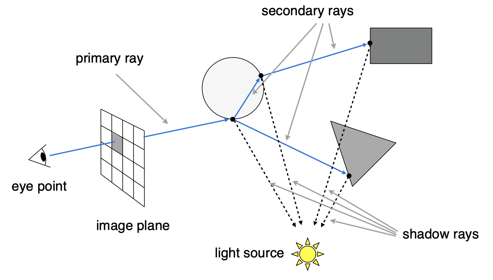
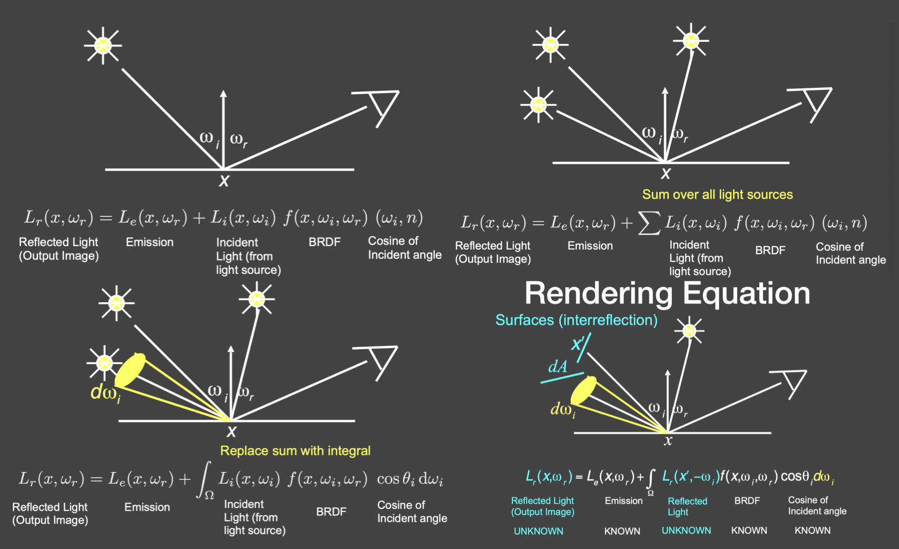

[TOC]

# 一、概率论 Probability

**随机变量** $X$​：可能取很多不同值的变量

**随机变量分布函数** $X \sim p(x)$​​​​​​​：
连续的分布函数又称**概率密度函数** Probability Density Function(PDF)，指不同概率事件下随机变量和概率的映射关系

某一个随机变量 $x$ 对应的概率 $P$​
$$
\begin{align}
离散：P &= p(x), & dx = 1\\
连续：P &= p(x)dx \\
\\
所有概率和：\sum p(x) &= 1
\end{align}
$$
**均值**：统计所有数据得到的结果

**期望** $E$​​：
抽取部分数据得到的**平均概率值**，无限接近于均值
$$
\begin{align}
\lim_{x \to \infty} E[X]&= \bar X \\
离散： E[X] &= \sum _{i=1}^{n} x_ip(x_i)，p(x) \geq 0\\
连续： E[X] &= \int_1^n xp(x)dx \\
\\
对于随机变量X,Y \\
Y &= f(X) \\
E[Y] &= E[f(x)] \\
&= \int f(x)p(x)dx
\end{align}
$$
**方差 Variance**：
用来度量随机变量和其期望（即均值）之间的**分散程度**，波动越大，方差越大
$$
\begin{align}
Var(x) 
&= s^2 \\
&= \sum _{i=1}^n(x_i - \bar x)^2f(x) \\
&=E((x - \bar x)^2) \\
&=E(x^2 - 2x\bar x + \bar x^2) \\
&=E(x^2) - 2E(x \bar x) + E(\bar x^2) \\
&=E(x)^2 - 2 \sum x \bar x p(x) + \sum \bar x^2 p(x) \\
&=E(x)^2 - 2 \bar x \sum xp(x) + \bar x^2 \sum p(x) \\
&=E(x)^2 - 2 \bar xE(x) + \bar x^2 \\
&=E(x)^2 - 2E(x)E(x) + (E(x))^2 \\
&=E(x)^2 - (E(x))^2
\end{align}
$$
**协方差**：
衡量两个变量之间的变化方向关系
$$
cov(X,Y) = E(XY) - E(X)E(Y)
$$

# 二、光线追踪 Ray Tracing

优点：真实，多用于离线渲染
缺点：计算量大

前提：

- **假设**光线近似直线传播

- **假设**光线交叉后仍然互不影响

- 光路可逆：从光源到人眼的路径 == 从人眼到光源

  

## 1. Whitted-Style Ray Tracing

方法

1. 从相机出发，向场景投射光线
2. 将场景进行合理分割，方便快速找到光线与物体的相交点
3. 判断光线与距离相机最近的地方相交(反射)，在相交处计算物体颜色
4. 光线会折射多次，在每一次折射点计算颜色值
   

## 2. 渲染方程推导

折射点渲染方程推导：

1. 考虑**自发光物体 Emission** 的光照

2. 考虑多个光源的光照

3. 考虑到面光源，将**累加 sum** 替换为**积分 integral** 更准确

4. 考虑到其他物体反射的光线（**间接光照 inter reflection**）

5. 渲染方程化简
   $$
   \begin{align}
   设:\\
   E &= L_e(x, \omega_r)\\
   L &= L_r(x, \omega_r) =L_i(x, \omega_i)\\
   K &= \int_{\Omega}f(x,\omega_i, \omega_r) \cos \theta_i d\omega_i \\
   则 \space 渲染方程简化为：\\
   L &= E + KL \\
   L - KL &= E \\
   (I - K)L &= E \\
   L &= (I - K)^{-1} E \\
   L &= (I + K + K^2 + K^3 + ...)E \\
   L &= E + KE + K^2E+ K^3E + ... \\
   其中：\\
   直接光照 &= KE \\
   间接光照 &= K^2E \\
   二次间接光照 &= K^3E \\
   ...
   \end{align}
   $$

# 三、路径追踪 Path Tracing

