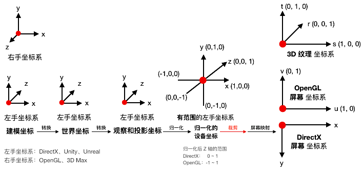
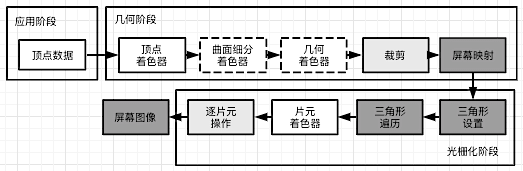

[TOC]


# 一、OpenGL 简介

>  OpenGL 作为图形硬件标准，是最通用的图形管线版本
>  使用 OpenGL 自带的数据类型可以确保各平台中每一种类型的大小都是统一的
>
>  **OpenGL 只是一个标准/规范，具体的实现是由驱动开发商针对特定显卡来实现**


## 1. OpenGL Context

由于 OpenGL 内部是一个类似于全局变量的状态机

- 切换状态 `glEnable()`、 `glDisable()` 
- 查询状态 `glIsEnabled()` 
- 存储状态 `glPushAttrib()`：保存 OpenGL 当前属性状态信息到属性栈中
- 恢复之前存储的状态 `glPopAttrib()`：从属性栈中获取栈首的一系列属性值


**OpenGL Context 的接口和实现没有统一的标准，随着不同操作系统平台的不同而不同** 

OpenGL 命令执行的结果影响 OpenGL 状态（由 OpenGL context 保存，包括OpenGL 数据缓存）或 影响帧缓存

1. 使用 OpenGL 之前必须先创建 OpenGL Context，并 make current 将创建的 上下文作为当前线程的上下文

2. **OpenGL 标准并不定义如何创建 OpenGL Context，这个任务由其他标准定义**
   如GLX（linux）、WGL（windows）、EGL（一般在移动设备上用）

3. 上下文的描述类型有 **core profile (不包含任何弃用功能)** 或 **compatibility profile (包含任何弃用功能)** 两种
   如果创建的是 core profile OpenGL context，调用如 glBegin() 等兼容 API 将产生GL_INVALID_OPERATION 错误（用 glGetError() 查询）

4. 共享上下文

   一个窗口的 Context 可以有多个，在某个线程创建后，所有 OpenGL 的操作都会转到这个线程来操作
   两个线程同时 make current 到同一个绘制上下文，会导致程序崩溃 

   一个线程同一时间只能用一个上下文，一个线程可以切换多个上下文
   
   一般每个窗口都有一个上下文，可以保证上下文间的不互相影响
   通过**创建上下文时传入要共享的上下文**，多个窗口的上下文之间图形资源可以共享
   可以共享的：纹理、shader、Vertex Buffer 等，外部传入对象
   不可共享的：Frame Buffer Object、Vertex Array Object（内存）、Vertex Buffer Object（显存）、等 OpenGL 内置容器**对象**


## 2. OpenGL 的环境配置流程

### 2.1 动态获取 OpenGL 函数地址

OpenGL 只是一个标准/规范，具体的实现是由驱动开发商针对特定显卡来实现，而且 OpenGL 驱动版本众多，它大多数函数的位置都**无法在编译时确定下来，需要在运行时查询**
因此，在编写与 OpenGL 相关的程序时需要开发者自己来获取 OpenGL 函数地址

相关库可以提供 OpenGL 函数获取地址后的头文件：[GLAD](https://github.com/Dav1dde/glad)


### 2.2 创建上下文

OpenGL 创建上下文的操作在不同的操作(窗口)系统上是不同的，所以需要开发者自己处理：**窗口的创建、定义上下文、处理用户输入**

相关库可以摆脱平台的限制，提供一个较为统一的接口和窗口、上下文用来渲染：[GLUT](http://freeglut.sourceforge.net/)、SDL、SFML、[GLFW](http://www.glfw.org/download.html)


## 3. OpenGL 的执行模型（Client - Server 模型）

> 主函数在 CPU 上执行，图形渲染在 GPU 上执行
> 虽然 GPU 可以编程，但这样的程序也需要在 CPU 上执行来操作 GPU

基本执行模型：CPU 上 push command 命令，GPU 上执行命令的渲染操作

- **应用程序 和 GPU 的执行通常是异步的**
  OpenGL API 调用返回 != OpenGL 在 GPU 上执行完了相应命令，但保证按调用顺序执行
  同步方式：**glFlush()** 强制发出所有 OpenGL 命令并在此函数返回后的有限时间内执行完这些 OpenGL 命令
  异步方式：**glFinish()** 等待直到**此函数之前**的 OpenGL 命令执行完毕才返回

- **应用程序 和 OpenGL 可以在也可以不在同一台计算机上执行**
  一个网络渲染的例子是通过 Windows 远程桌面在远程计算机上启动 OpenGL 程序，应用程序在远程计算机执行，而 OpenGL 命令在本地计算机执行（**将几何数据**而不是将渲染结果图像通过网络传输）

  > 当 Client 和 Server 位于**同一台计算机**上时，也称 GPU 为 Device，CPU 为 Host
  > Device、Host 这两个术语通常在用 GPU 进行通用计算时使用

- **内存管理**
  CPU 上由程序准备的缓存数据（buffer、texture 等）存储在显存（video memory）中，这些数据从程序到缓存中拷贝，也可以再次拷贝到程序的缓存中
  
- **数据绑定发生在 OpenGL 命令调用时**
  应用程序传送给 GPU 的数据在 OpenGL API 调用时解释，在调用返回时完成
  例，指针指向的数据给 OpenGL 传送数据，如 glBufferData()  在此 API 调用返回后修改指针指向的数据将不再对 OpenGL 状态产生影响


## 4. OpenGL 的着色器程序 Shader

### 4.1 不同平台的 shader 编译

OpenGL 的 GLSL（OpenGL Shading Language）

- 跨平台
- 运行时，将 GLSL 源码交给 GPU 图形驱动厂商编译成汇编语言后由 GPU 执行


DirectX 的 HLSL（High Level Shading Language）

- 微软独占，可以提前编译成机器语言，在运行时直接在 GPU 执行

  

NVIDIA 的 CG（C for Graphic）

- 跨平台，根据平台的不同编译成相应的中间语言


### 4.2 Shader 接口一致性

> shader link 到 program 里可以 detached 后继续使用，这样便无法抓取 shader 查看

- Vertex Shader 的 输入 和 应用程序的顶点属性数据接口 一致
- Vertex Shader 的 输出 和 Fragment Shader 对应的 输入 一致
- Fragment Shader 的 输出 和 帧缓存的颜色缓存接口 一致


固定管线功能阶段需要的一些特定输入输出由着色器的内置输出输入变量定义，如下图


### 4.3 GLSL 版本变化

通过**首行使用** `#version` 来说明当前 OpenGL Shader Language 版本


**GLSL 版本号对应 **

- OpenGL 和 OpenGL 的 Shading Language 版本对应
  | **Version OpenGL** | 2.0 | 2.1 | 3.0 | 3.1 | 3.2 | 3.3 | 4.0 | 4.1 | 4.2 | 4.3 |
  | --- | --- | --- | --- | --- | --- | --- | --- | --- | --- | --- |
  | **Version GLSL** | 110 | 120 | 130 | 140 | 150 | 330 | 400 | 410 | 420 | 430 |

- OpenGL ES 和 OpenGL ES 的 Shading Language 版本对应
  | **Version OpenGL ES** | 2.0 | 3.0 |
  | --------------------- | --- | --- |
  | **Version GLSL ES**   | 100 | 300 |


**GLSL 版本功能区别 **

1. GLSL 130+ 版本
   用 `in` 和  `out` 替换了 `attribute` 和 `varying`
2. GLSL 330+ 版本
   用 `texture` 替换了 `texture2D` 
   增加了 layout 内存布局功能
3. [其他版本重要功能变化](https://github.com/mattdesl/lwjgl-basics/wiki/glsl-versions)


### 4.4 编写 shader 的注意事项

精度问题

1. 颜色和单位向量用 lowp 精度
2. 减少对 highp 的使用


慎用分支和循环语句

1. GPU 使用了不同于 CPU 的技术来实现分支语句
2. 最坏情况下，花在一个分支上的时间相当于运行了所有的分支语句
3. 使用大量流程控制语句，shader 性能可能会成倍下降
4. 分支语句判断用的条件变量最好是常数
5. 每个分支中的操作指令数尽量少
6. 分支嵌套层数少


# 二、渲染同步

## 1. 同步异步的渲染方式 glFlush/glFinish

> 提交给 OpenGL 的指令并不是马上送到驱动程序里执行的，而是放到一个缓冲区里面，等这个缓冲区满了再一次过发到驱动程序里执行，glFlush 可以只接提交缓冲区的命令到驱动执行，而不需要在意缓冲区是否满了

同步方式：[void glFlush()](https://www.khronos.org/opengl/wiki/GLAPI/glFlush) 强制发出所有 OpenGL 命令并在此函数返回后的**有限时间**内执行这些 OpenGL 命令（这些命令可能没有执行完）
异步方式：[void glFinish()](https://www.khronos.org/opengl/wiki/GLAPI/glFinish) 等待直到**此函数之前**的 OpenGL 命令执行完毕才返回


## 2. 垂直同步 vsync

由于显示器的刷新一般是逐行进行的，因此为了防止交换缓冲区的时候屏幕上下区域的图像分属于两个不同的帧，因此交换一般会等待显示器刷新完成的信号，在显示器两次刷新的间隔中进行交换，这个信号就被称为垂直同步信号，这个技术被称为垂直同步

定义：确保显卡的运算频率（GPU 一秒绘制的帧数）和 显示器刷新频率（硬件决定）一致，防止在快速运动场景下，由于**显卡运算速率大于显示器运算速率**导致快速运动的动作割裂情况（画面撕裂）

流程：`显卡绘制一帧时间 > 显示器刷新一帧时间 ? 显示器刷新(显卡等待) : 显示器显示上一帧，等待显卡绘制完成(屏幕卡顿);`

缺点：开启垂直同步，画面会有延迟（无法达到显卡的最大运算速率），但并没有卡顿

规避缺点的方法：用三重缓冲代替垂直同步（三重缓冲：在双缓冲的基础上加了一个缓冲，引入了三缓冲区技术，在等待垂直同步时，来回交替渲染两个离屏的缓冲区，而垂直同步发生时，屏幕缓冲区和最近渲染完成的离屏缓冲区交换，实现充分利用硬件性能的目的）


# 三、渲染管线

> 所谓 OpenGL 管线（OpenGL pipeline），就是指 OpenGL 的渲染过程，即从输入数据到最终产生渲染结果数据所经过的通路及所经受的处理

真实生活中的流水线：


## 1. 管线流程总览

 例：OpenGL 4.4 渲染管线


## 2. 应用阶段

一般游戏引擎的绘制顺序

```c
// 每一帧：Draw layer > Draw Technique > Draw Pass
// 每一 Pass：相关 view、相关 shader、相关 material、相关 object
for each view {
    bind view resources					// camera, environment...
      
    for each shader {
        bind shader pipeline
        bind shader resources			// shader control values
          
			for each material {
        		bind material resources	// material params and textures
              
            for each object {
              	bind object reources	// object transforms
                draw object
                  
            } // object
          
        } // material
      
    } // shader
  
} // view
```


### 2.1 视锥剔除 3D

> 在裁剪空间下更容易进行视锥剔除，详见 几何阶段的视锥剔除

在世界空间下的视锥剔除流程（剔除的是包围盒）

1. 计算包围要绘制物体的 AABB 盒
2. 获得视锥体六个面的平面方程
3. 判断 AABB 盒的最小点和最大点在六个面的内侧还是外侧
4. 剔除掉最小和最大点完全在某一面外侧的物体


```c++
// 视锥体的六个平面方程，用于视锥剔除
// 所得的法向都是指向内部的（面向原点）
void GetViewingFrustumPlanesByProjM4(std::vector<glm::vec4> & result , const glm::mat4 &vp) {
	//左侧  
	result[0].x = vp[0][3] + vp[0][0];
	result[0].y = vp[1][3] + vp[1][0];
	result[0].z = vp[2][3] + vp[2][0];
	result[0].w = vp[3][3] + vp[3][0];
	//右侧
	result[1].x = vp[0][3] - vp[0][0];
	result[1].y = vp[1][3] - vp[1][0];
	result[1].z = vp[2][3] - vp[2][0];
	result[1].w = vp[3][3] - vp[3][0];
	//上侧
	result[2].x = vp[0][3] - vp[0][1];
	result[2].y = vp[1][3] - vp[1][1];
	result[2].z = vp[2][3] - vp[2][1];
	result[2].w = vp[3][3] - vp[3][1];
	//下侧
	result[3].x = vp[0][3] + vp[0][1];
	result[3].y = vp[1][3] + vp[1][1];
	result[3].z = vp[2][3] + vp[2][1];
	result[3].w = vp[3][3] + vp[3][1];
	//Near
	result[4].x = vp[0][3] + vp[0][2];
	result[4].y = vp[1][3] + vp[1][2];
	result[4].z = vp[2][3] + vp[2][2];
	result[4].w = vp[3][3] + vp[3][2];
	//Far
	result[5].x = vp[0][3] - vp[0][2];
	result[5].y = vp[1][3] - vp[1][2];
	result[5].z = vp[2][3] - vp[2][2];
	result[5].w = vp[3][3] - vp[3][2];
}

//点到平面距离 d =  Ax + By + Cz + D;
// d < 0 点在平面法向反方向所指的区域
// d > 0 点在平面法向所指的区域
// d = 0 在平面上
// d < 0为 false
bool Point2Plane(const glm::vec3 &v,const glm::vec4 &p) {
	return p.x * v.x + p.y * v.y + p.z * v.z + p.w >= 0;
}

std::vector<glm::vec4> ViewPlanes;
//构造函数中
ViewPlanes.resize(6, glm::vec4(0));

void UpdateViewPlanes() {
	ViewingFrustumPlanes(ViewPlanes,  ProjectMatrix * ViewMatrix);
}

bool ViewCull(const glm::vec4 &v1,const glm::vec4 &v2,const glm::vec4 &v3) {
	glm::vec3 minPoint, maxPoint;
	minPoint.x = min(v1.x, min(v2.x, v3.x));
	minPoint.y = min(v1.y, min(v2.y, v3.y));
	minPoint.z = min(v1.z, min(v2.z, v3.z));
	maxPoint.x = max(v1.x, max(v2.x, v3.x));
	maxPoint.y = max(v1.y, max(v2.y, v3.y));
	maxPoint.z = max(v1.z, max(v2.z, v3.z));
	// Near 和 Far 剔除时只保留完全在内的
	if (!Point2Plane(minPoint, ViewPlanes[4]) || !Point2Plane(maxPoint, ViewPlanes[4])) {
		return false;
	}
	if (!Point2Plane(minPoint, ViewPlanes[5]) || !Point2Plane(maxPoint, ViewPlanes[5])) {
		return false;
	}
	if (!Point2Plane(minPoint, ViewPlanes[0]) && !Point2Plane(maxPoint, ViewPlanes[0])) {
		return false;
	}
	if (!Point2Plane(minPoint, ViewPlanes[1]) && !Point2Plane(maxPoint, ViewPlanes[1])) {
		return false;
	}
	if (!Point2Plane(minPoint, ViewPlanes[2]) && !Point2Plane(maxPoint, ViewPlanes[2])) {
		return false;
	}
	if (!Point2Plane(minPoint, ViewPlanes[3]) && !Point2Plane(maxPoint, ViewPlanes[3])) {
		return false;
	}
	return true;
}
```


### 2.2 光照计算

基于以下管线流程，管线在**考虑到光照计算**时，在 m 个物体和 n 个光源下还分为

1. 前向管线 $O(m*n)$
   对场景中的每个物体着色，在每个光源下进行计算
2. 延迟管线 $ O(m+n)$
   使用多个 Buffer 缓存光照需要的数据，在最后结合 Buffer 数据进行光照计算


## 3. 几何阶段




### 3.1 观察/相机 空间


**LookAt 矩阵**：将世界空间坐标  乘以 lookat 矩阵 可以得到相机的 观察空间
$$
LookAt =
\begin{bmatrix}
\color{red}{R_x} & \color{red}{R_y} & \color{red}{R_z} & 0 \\
\color{green}{U_x} & \color{green}{U_y} & \color{green}{U_z} & 0 \\
\color{blue}{D_x} & \color{blue}{D_y} & \color{blue}{D_z} & 0 \\
0 & 0 & 0 & 1
\end{bmatrix}
\begin{bmatrix}
1 & 0 & 0 & \color{orange}{-P_x} \\
0 & 1 & 0 & \color{orange}{-P_y} \\
0 & 0 & 1 & \color{orange}{-P_z} \\
0 & 0 & 0 & 1
\end{bmatrix}
$$
相机对象和 LookAt 矩阵是两套不同的坐标系

- 其中，P 为相机的位置、U 为相机的 Y 轴、R 为相机的 X 轴、D 为相机指向的方向和相机的 Z 轴相反
- 相机对象的 Z 轴和 LookAt 矩阵 D 相反，其他轴和 LookAt 矩阵的基坐标相同，同时也和世界坐标的基坐标相同
  因此，如果相机对象为右手坐标系，LookAt 矩阵为左手坐标系，这样是方便其他方向的移动

```c
// 1. 计算 lookAt 矩阵的坐标系（根据指向的 目标坐标和相机坐标 求得）
glm::vec3 cameraFront = glm::normalize(cameraTarget - cameraPos);		// 指向目标物体
glm::vec3 lookAtDirection = glm::normalize(cameraPos - cameraTarget); 	// 指向相机

glm::vec3 WorldUp = glm::vec3(0.0f, 1.0f, 0.0f); 
glm::vec3 lookAtRight = glm::normalize(glm::cross(WorldUp, lookAtDirection)); // LookAt 为右手坐标系
glm::vec3 lookAtUp = glm::cross(lookAtDirection, lookAtRight);

// 2. 计算相机对象的坐标系（根据欧拉角 Yaw，Pich 求得）
glm::vec3 cameraFront;
cameraFront.x = cos(glm::radians(Yaw)) * cos(glm::radians(Pitch));
cameraFront.y = sin(glm::radians(Pitch));
cameraFront.z = sin(glm::radians(Yaw)) * cos(glm::radians(Pitch));
cameraFront = glm::normalize(cameraFront);

cameraRight = glm::normalize(glm::cross(cameraFront, WorldUp));  // 相机对象为左手坐标系
cameraUp    = glm::normalize(glm::cross(cameraRight, cameraFront));
```


### 3.2 透视/正交 投影变换

将观察空间的坐标转换到投影空间（一个 Frustum 平截头体空间），详见 [矩阵变换，透视投影](../LinearAlgebra/Part1_Matrix.md)


**OpenGL 的透视投影矩阵为**

- 列主序矩阵
- 相机坐标系为 **右手坐标系**
- Z 的标准设备空间范围限定为 [-w, w]

$$
M_{OpenGL} * P = 
\begin{bmatrix}
near \over right & 0 & 0 & 0 \\
0 & near \over top & 0 & 0\\
0 & 0 & -{{far+near} \over {far - near}} & -{2\cdot far \cdot near \over {far - near}}\\
0 & 0 & -1 & 0\\
\end{bmatrix}
\begin{bmatrix}
x \\ y \\ z \\ 1
\end{bmatrix}
= 
\begin{bmatrix}
{near \over right}x \\ {near \over top}y \\ {-{{far+near} \over {far - near}}}z -{2 \cdot far \cdot near \over {far - near}} \\ -z
\end{bmatrix}
$$


**DriectX  的透视投影矩阵为**

- 行主序矩阵
- 相机坐标系为 **左手坐标系**
- Z 的标准设备空间范围限定为 [0,w]

$$
P * M_{DriectX} = 
\begin{bmatrix}
x & y & z & 1
\end{bmatrix}
\begin{bmatrix}
near \over right & 0 & 0 & 0 \\
0 & near \over top & 0 & 0\\
0 & 0 & {far \over {far - near}} & 1 \\
0 & 0 & -{far \cdot near \over {far - near}} & 0\\
\end{bmatrix}
= 
\begin{bmatrix}
{near \over right}x & {near \over top}y & {{far \over {far - near}}}z -{far \cdot near \over {far - near}} & z
\end{bmatrix}
$$


### 3.3 视锥剔除 3D

一个面的三个顶点如果都被剔除，则当前三角形被剔除

```c
std::uint8_t checkViewCut(const glm::vec4& v)
{
    auto ret = (std::uint8_t)0;
    
    if 		(v.x < -v.w) ret |= 1;
    else if (v.x >  v.w) ret |= 2;
    if 		(v.y < -v.w) ret |= 4;
    else if (v.y >  v.w) ret |= 8;
    if 		(v.z < -v.w) ret |= 16;
    else if (v.z >  v.w) ret |= 32;
    
    return ret;
}
```


### 3.4 齐次坐标裁剪

假设 $P(x,y,z,w)$ 为投影空间内部的一个点，则
$$
-1 <= x/w <=1 \\
-1 <= y/w <=1 \\
-1 <= z/w <=1 \\

-w <= x <= w \\
-w <= y <= w \\
-w <= z <= w
$$
由 [线与面的关系判断](../LinearAlgebra/Part3_Triangles.md) 可知，如果线 $Q_1Q_2$ 与面交与点 $I$，则
$$
\begin{align}
Q_1&=(x_1,y_1,z_1,w_1) \\
Q_2&=(x_2,y_2,z_2,w_2) \\\\
I &= Q_1 + t(Q_2 - Q_1) \\
w_1 + t(w_2 - w_1) &= x_1 + t(x_2 - x_1) \\
t &= {{w_1 - x_1} \over (w_1 - x_1) - (w_2 - x_2)} 
\end{align}
$$
注意：为了防止透视除法除的 $w$ 为 0，这里裁剪的时候还要裁剪掉一个 $w=1e-5$ 这样一个极小数的平面

```c
enum AXIS {
    X = 0,
    Y = 1,
    Z = 2,
    W = 3
}

// EX: 0,1,2,3
//     3-0, 0-1, 1-2
void clipInHomoCoord(std::vector<Vertex>& vertIn, std::vector<Vertex>& vertOut, AXIS axis, bool isNegative)
{
    vertOut.clear();

    int preDot = -1;
    int curDot = -1;
    float w = 1.0f;
    float flag = isNegative ? -1.0f : 1.0f;
    for (int i = 0; i < vertIn.size(); ++i)
    {
        Vertex& preVert = vertIn[(i + vertIn.size() -1) % vertIn.size()];
        Vertex& curVert = vertIn[i];
        preDot = flag * preVert.position[axis] <= preVert.position.w ? 1 : -1；
        curDot = flag * curVert.position[axis] <= curVert.position.w ? 1 : -1;
        if (preDot * curDot < 0) // put intersection point first
        {
            w = preVert.position.w - flag * curVert.position[axis];
            w = w / (w - (curVert.position.w - flag * curVert.position[axis]));
            vertOut.push_back( lerp(preVert, curVert, w) ); 
        }
        if (curDot > 0)			// then put original point
        {
            vertOut.push_back(curVert);
        }
    }
}

// how to call clip function
std::vector<Vertex> vertIn;
std::vector<Vertex> vertOut;
clipInHomoCoord(vertIn, vertOut, X, true);	// clip on x axis
clipInHomoCoord(vertOut, vertIn, X, false);
clipInHomoCoord(vertIn, vertOut, Y, true); 	// clip on y axis
clipInHomoCoord(vertOut, vertIn, Y, false);
clipInHomoCoord(vertIn, vertOut, Z, true);	// clip on z axis
clipInHomoCoord(vertOut, vertIn, Z, false);

auto& vertexOut = vertIn;	// output

// draw point order must use trangles fan
GL_TRIANGLE_FAN
```


### 3.5 透视除法和 NDC 空间

通过透视除法将 <u>齐次坐标</u> 转换为的 <u>非齐次坐标</u> 具体见 [矩阵变换，齐次空间](../LinearAlgebra/Part1_Matrix.md)
将坐标点从 投影空间 转换到 NDC （Normalized Device Coordinates  标准设备坐标系）空间

```c
// Scope: [-w, w]
glm::vec4 proj;

// Scope: [-1, 1]
glm::vec4 ndc = glm::vec4(proj.x / proj.w, 
                          proj.y / proj.w, 
                          proj.z / proj.w,
                          1.0f);
```


### 3.6 将坐标映射到屏幕上

**屏幕坐标和像素的映射关系**

- 屏幕坐标是 2D 纹理坐标
  归一化后的裁剪坐标转换到屏幕坐 标的矩阵
  $$
  \begin{bmatrix}
  {width \over 2} & 0 & 0 & {width \over 2} \\
  0 & {height \over 2} & 0 & {height \over 2} \\
  0 & 0 & 1 & 0 \\
  0 & 0 & 0 & 1
  \end{bmatrix}
  $$

- 屏幕坐标表示的是屏幕空间中的像素坐标

- OpenGL 和 DirectX 10 以后的版本认为 像素中心 对应 屏幕坐标的值为 0.5，例：
  屏幕分辨率为 400 X 300，则其屏幕坐标 x 的范围是 [0.5, 400.5]，y 的范围是 [0.5, 300.5]
  $$
  Screen_x = (1 + x_{标准设备坐标}) \cdot {Pixel_{width} \over 2} \\
  Screen_y = (1 + y_{标准设备坐标}) \cdot {Pixel_{height} \over 2}
  $$


### 3.7 视口剔除 2D

光栅化时，根据设置的 Viewport 大小来限定光栅化范围（限定逐行光栅化的行数和列数）
以达到只有视口内部的数据被刷新了，避免了不必要的计算


## 4. 光栅化阶段



- **三角形设置 Triangle Setup**
  计算三角网格表示数据（每条边上的像素坐标）

- **三角遍历 Triangle Traversal**
  查找被三角形覆盖的像素，生成一个图元，这一过程又称扫描变换 Scan Conversion

- **模板测试**
  
  
- Pre-Z：在顶点着色之前（上一批次的渲染的单独 pass）
  软件实现，Pre-Z 弥补了 Early-Z 不能剔除透明物体的问题，提前将透明物体剔除避免 overdraw

- Early-Z：在顶点着色和片源着色之间
  需要硬件支持，Early-Z 在 Alpha Test 或者 Depth modify 会失效（只能提前判断不透明物体来剔除物体）

- **深度测试**
  深度缓冲中每个像素（或超采样）都有对应的值（通过三角形顶点深度信息差值得到）
  因为每个像素都有深度，所以不会存在两个图元交叉的深度问题
  
  
- **alpha 混合**
  开启 alpha 混合会关闭深度写入（如果不关闭后面片元将会被踢出，无法进入到 alpha 混合缓解混合颜色）
  但是深度测试依旧可以进行，**深度值对 alpha 混合来说是只读的**

  为了正确的做 alpha 混合，一般流程如下

  1. 确保混合的 alpha 物体是凸面体，将复杂的模型拆分成可独立排序的多个子模型
     从而防止循环重叠半透明物体出现
  2. 先渲染所有不透明物体，并且开启他们的深度测试和深度写入
  3. 开启深度测试，关闭深度写入（当前深度值已经确定）
     把半透明物体按照深度值依次排序，**从后向前渲染**（确保半透明物体被不透明物体遮挡）
     但这仍会存在两个图元交叉，导致从后向前渲染排序有误的问题。可以通过添加 alpha 缓存，或者使用排序无关的半透明混合方式（Depth peeling）

- alpha 预乘
  关闭 alpha 预乘的混合方式（假设：透明物体 B 在 A 前面）
  $$
  \begin{align}
  A &= (A_r,A_g,A_b, \alpha_A)\\
  B &= (B_r,B_g,B_b, \alpha_B)\\
  M_{rgb} &= \alpha_B B + (1-\alpha_B)\alpha_A A\\
  \alpha_M &= \alpha_B + (1-\alpha_B)\alpha_A
  \end{align}
  $$
  
  开启 alpha 预乘的混合方式（假设：透明物体 B 在 A 前面）
  透明图像边缘是黑色，为了防止在混合多个透明物体时 alpha 遮罩外的颜色由于不是黑色 0，而带来的混合颜色的色差

$$
  \begin{align}
  A' &= (\alpha_A A_r,\alpha_A A_g,\alpha_A A_b, \alpha_A)\\
  B' &= (\alpha_B B_r,\alpha_B B_g,\alpha_B B_b, \alpha_B)\\
  M'_{rgb} &= B' + (1-\alpha_B) A'\\
  \alpha_M &= \alpha_B + (1-\alpha_B)\alpha_A \\
  M_{rgb} &= M'_{rgb} / \alpha _M
  \end{align}
$$


# 引用

1. [OpenGL 加载库](https://www.khronos.org/opengl/wiki/OpenGL_Loading_Library)
2. [更多 OpenGL 的 lib 库文件](http://www.opengl-tutorial.org/miscellaneous/useful-tools-links/)
3. [水平同步 垂直同步](https://blog.csdn.net/hankern/article/details/90344384)
4. [Android 的 16ms 和垂直同步以及三重缓存](https://www.jianshu.com/p/3750db831aca)
6. [GLSL Versions](https://github.com/mattdesl/lwjgl-basics/wiki/glsl-versions)
6. [learnopengl-Blending](https://learnopengl-cn.github.io/04 Advanced OpenGL/03 Blending/)
7. [TriangleRasterization](http://www.sunshine2k.de/coding/java/TriangleRasterization/TriangleRasterization.html#algo2)
8. [Platform-specific rendering differences](https://docs.unity3d.com/Manual/SL-PlatformDifferences.html)
9. [Stateless, layered, multi-threaded rendering](https://blog.molecular-matters.com/2014/11/06/stateless-layered-multi-threaded-rendering-part-1/)
10. [Game Programming Patterns](http://gameprogrammingpatterns.com/contents.html)
11. [Shader detached program](https://github.com/google/gapid/issues/398)
12. [EarlyZ 和 PreZ 的区别](https://zhuanlan.zhihu.com/p/299798664)
13. [【Ogre编程入门与进阶】第十章 Ogre场景管理](https://blog.csdn.net/zhanghua1816/article/details/8130251)
14. [Explaining Homogeneous Coordinates & Projective Geometry](https://www.tomdalling.com/blog/modern-opengl/explaining-homogenous-coordinates-and-projective-geometry/)
15. [Fast Extraction of Viewing Frustum Planes from the WorldView-Projection Matrix](http://link.zhihu.com/?target=http%3A//www8.cs.umu.se/kurser/5DV180/VT18/lab/plane_extraction.pdf)
16. [OpenGL Projection Matrix (songho.ca)](http://www.songho.ca/opengl/gl_projectionmatrix.html)
17. [3D Clipping in Homogeneous Coordinates. | Development Chaos Theory (chaosinmotion.com)](https://chaosinmotion.com/2016/05/22/3d-clipping-in-homogeneous-coordinates/)
18. [计算机图形学补充2：齐次空间裁剪(Homogeneous Space Clipping) - 知乎 (zhihu.com)](https://zhuanlan.zhihu.com/p/162190576)
19. [从零开始的软渲染器（2.5）- 再谈裁剪与剔除 - 知乎 (zhihu.com)](https://zhuanlan.zhihu.com/p/97371838)
20. [Clipping using homegeneous coordinates by James F. Blinn and Martin E. Newell](https://link.zhihu.com/?target=https%3A//fabiensanglard.net/polygon_codec/clippingdocument/p245-blinn.pdf)
21. [CLIPPING by Kenneth I. Joy](https://link.zhihu.com/?target=https%3A//fabiensanglard.net/polygon_codec/clippingdocument/Clipping.pdf)
22. [Clipping implementation](https://link.zhihu.com/?target=https%3A//fabiensanglard.net/polygon_codec/)

