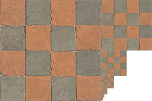

[TOC]

# 一、纹理基础

纹理材质的反光性质

- 各项异性：固定视角和光源方向旋转表面时，反射会发生任何改变
- 各项同性：固定视角和光源方向旋转表面时，反射不会发生任何改变


纹理映射坐标

- 所有的纹理尺寸都会映射在 [0, 1] 的范围
- OpenGL、Unity 纹理坐标原点在 左下角
- DirectX 纹理坐标原点在 左上角


纹理的尺寸

- 长宽大小应该是 2 的幂
  非 2 的幂的纹理会占用更多的内存空间和读取时间，有些平台会不支持非 2 的幂尺寸的纹理
- 纹理可以是非正方形的


## 1. 纹理环绕（坐标包装）

> 当**纹理坐标超出默认范围**时，每种纹理环绕方式都有不同的视觉效果输出

OpenGL 设置纹理不同坐标轴的环绕方式

```c
glTexParameteri(GL_TEXTURE_2D, GL_TEXTURE_WRAP_S, GL_NEAREST); //纹理坐标 s/u/x 轴的包装格式
glTexParameteri(GL_TEXTURE_2D, GL_TEXTURE_WRAP_T, GL_LINEAR);  //纹理坐标 t/v/y 轴的包装格式
```


| 环绕方式           | 描述                                                         |
| ------------------ | ------------------------------------------------------------ |
| GL_REPEAT          | 对纹理的默认行为，重复纹理图像                               |
| GL_MIRRORED_REPEAT | 和 GL_REPEAT 一样，但每次重复图片是镜像放置的                |
| GL_CLAMP_TO_EDGE   | 纹理坐标会被约束在 0 ～ 1之间，超出的部分会重复纹理坐标的边缘，产生一种边缘被拉伸的效果 |
| GL_CLAMP_TO_BORDER | 超出的坐标处的纹理为用户指定的边缘颜色                       |


## 2. 纹理过滤（采样）

> 当三维空间里面的多边形，变成二维屏幕上的一组像素的时候，对每个像素需要到相应纹理图像中进行采样，这个过程就称为纹理过滤 

纹理过滤的两种情况

- 纹理被缩小 `GL_TEXTURE_MIN_FILTER`：一个像素对应多个纹理单元
  例，一个 8 X 8 的纹理贴到远处正方形上，最后在屏幕上占了 2 X 2 个像素矩阵
- 纹理被放大 `GL_TEXTURE_MAG_FILTER`：一个纹理单元对应多个像素
  例，一个 2 X 2 的纹理贴到近处正方形上，最后在屏幕上占了 8 X 8 个像素矩阵


OpenGL 中针对放大和缩小的情况的设置

```c
glTexParameteri(GL_TEXTURE_2D, GL_TEXTURE_MIN_FILTER, GL_NEAREST); //缩小
glTexParameteri(GL_TEXTURE_2D, GL_TEXTURE_MAG_FILTER, GL_LINEAR);  //放大
```


### 2.1 最近点采样 GL_NEAREST

优点：效率最高
缺点：效果最差

方法：选择最接近中心点纹理坐标的 **1 个纹理单元**采样


### 2.2 双线性过滤 GL_LINEAR

优点：适于处理有一定精深的静态影像
缺点：不适用于绘制动态的物体，当三维物体很小时会产生深度赝样锯齿 (Depth Aliasing artifacts)

方法：选择最接近中心点纹理坐标的 2 X 2 纹理单元矩阵进行采样，取 **4 个纹理单元**采样的平均值


### 2.3 三线性过滤 GL_LINEAR_MIPMAP_LINEAR

> 多级渐远纹理 (Mipmap) 
> 效率高但是会占用一定的空间
> 一系列的纹理图像，后一个纹理图像是前一个的二分之一。距观察者的距离超过一定的阈值，OpenGL会使用不同的多级渐远纹理，即最适合物体的距离的那个。由于距离远，解析度不高也不会被用户注意到。
>
> 一张方形地板的多级渐远纹理如下图
>
> 

优点：效果最好，适用于动态物体或景深很大的场景
缺点：效率低，只能用于纹理被缩小的情况

方法：

1. 取 Mipmap 纹理中距离与当前屏幕上尺寸相近的两个纹理

2. 将 1 中选取的纹理 选择最接近中心点纹理坐标的 2 X 2 纹理单元矩阵进行采样（线性过滤）

3. 将 2 中两次采样的结果进行加权平均（**8 个纹理单元**采样），得到最后的采样数据


### 2.4 各向异性过滤

> 之前提到的三种过滤方式，默认纹理在 x，y 轴方向上的缩放程度是一致的
> 当纹理在 3D 场景中，出现一个轴的方向纹理放大，一个轴的方向纹理缩小的情况（**OpenGL 判定为纹理缩小**）需要使用各向异性过滤配合以上三种过滤方式来达到最佳的效果

优点：效果最好，使画面更加逼真
缺点：效率最低，由硬件实现

方法：

1. 确定 X、Y 方向的采样比例
   ScaleX = 纹理的宽 / 屏幕上显示的纹理的宽
   ScaleY = 纹理的高 / 屏幕上显示的纹理的高
   异向程度 = max(ScaleX, ScaleY) / min(ScaleX, ScaleY);

   例，64 X 64的纹理最后投影到屏幕上占了128 X 32 的像素矩阵
   ScaleX = 64.0 / 128.0 = 0.5;
   ScaleY = 64.0 / 32.0 = 2.0;
   异向程度 = 2.0 / 0.5 = 4;

2. 根据采样比例分别在 X、Y 方向上采用 *三线性过滤* 或 *双线性过滤* 获得采样数据，**采样的范围由异向程度决定，不是原来的 2 X 2 像素矩阵**

   例，64 X 64的纹理最后投影到屏幕上占了128 X 32 的像素矩阵
   异向程度为 4，且在 缩放方面 X 轴 > Y 轴，所以 X 轴采样 2 个像素，Y 轴采样 2 * 异向程度 = 8 个像素
   采样范围为最接近中心点纹理坐标的 2 X 8 的像素矩阵


OpenGL 中设置各向异性过滤

```c
glTexParameterf(GL_TEXTURE_2D, GL_TEXTURE_MAX_ANISOTROPY_EXT, 异向程度);
```

各向异性对比三线性


# 二、凹凸映射 bump mapping

## 1. 高度纹理 height map

高度纹理：使用一张高度纹理来模拟表面上下高度的位移，然后得到修改后的法线值

- 优点：非常直观，可以从高度纹理中明确的知道一个模型表面的凹凸情况
- 缺点：计算较复杂，不能直接得到表面法线，需要通过像素的灰度值计算得到


## 2. 法线纹理 normal map

法线纹理

- 直接存储表面法线
- 根据法线所在的坐标空间类型可分为
  模型空间的法线纹理 (object-space normal map)：将修改后的**模型**空间表面的法线存储在一张纹理中
  切线空间的法线纹理 (tangent-space normal map)：将修改后的**纹理**切线空间表面的法线存储在一张纹理中
  **一般使用切线空间的法线纹理**


法线的模型变换矩阵

- 在顶点坐标的模型变换中，当我们使用一个不等比缩放时，法线不会再垂直于对应的表面
  

- 法线需要一个基于顶点坐标的模型变换的专门的 模型矩阵
  如果模型变换 $M_t$ 不是正交变换，则法线变换矩阵为：$M_{n} = (M_t^T)^{-1}$
  如果模型变换 $M_t$ 是正交变换，则法线变换矩阵为：$M_{n} = M_t$
  正交变换：旋转变换，[公式的推导过程](../LinearAlgebra/Part1_Matrix.md)
  由于位移对于法线方向没有影响，而逆变换计算量较大，因此一般采用没有位移的 3 X 3 矩阵来计算法线变换


### 2.1 使用流程

**1. CPU**

   1. 由 模型变换 得到 法线的模型变换矩阵（逆矩阵耗时大，尽量放在 CPU 上算一次）
   2. 根据顶点位置和纹理坐标信息，计算**模型空间下的** 切线 和 副切线
   3. 每三个顶点构成一个平面，他们共享一组 切线 和 副切线


**2. 顶点着色器**

  1. 将顶点数据中的 切线、副切线、法线坐标系位置经过 法线的模型变换矩阵 转换为
    **世界空间下的** 切线空间坐标，归一化后构建 切线空间矩阵
  2. 计算世界空间下的光源在 切线空间 的坐标


**3. 片元着色器**

   1. 根据法线纹理对应的普通纹理的纹理坐标，从法线纹理读取切线空间下的法线数据（像素值）
   2. 将范围是 [0, 1] 的像素值，转换为范围是 [-1, 1] 的表面法线值：$normal = pixel*2.0 - 1.0$
   3. 将在**切线空间**下的光源和物体片元的坐标与法线计算得到片元颜色


### 2.2 切线空间

切线空间的坐标系
虽然实际在模型上进行纹理贴图时，实际的纹理坐标在贴图后并不一定互相垂直（非刚体变换），但这不会改变法线的方向

- 原点：模型的顶点
- Z 轴：N（Normal）法线方向（和 Z 轴的正方向始终保持一直）
- X 轴：T（Tagent）切线方向，和纹理坐标的 X 轴（U）一致
- Y 轴：B（Bitangent）副切线方向 ，和纹理坐标的 Y 轴（V）一致


计算映射 **模型空间** 到纹理法线 **切线空间** 的矩阵

- 已知切线空间法线纹理的切线 T 和 副切线 B 分别对应与法线纹理对应普通纹理的 U 和 V 坐标轴
  （此时 T、B 在模型空间下）且点 $P_1$、$P_2$、$P_3$ 与纹理坐标的对应关系如下图，
  求切线方向 T 和副切线方向 B

  

- 则：
  $$
  \begin{align}
  E_1 &= \Delta U_1 T + \Delta V_1 B\\
  E_2 &= \Delta U_2 T + \Delta V_2 B\\
  \begin{bmatrix} E_1\\ E_2 \end{bmatrix}
  &= 
  \begin{bmatrix}
  \Delta U_1 & \Delta V_1\\
  \Delta U_2 & \Delta V_2
  \end{bmatrix}
  \begin{bmatrix} T\\ B \end{bmatrix} \\
  \begin{bmatrix}
  \Delta U_1 & \Delta V_1\\
  \Delta U_2 & \Delta V_2
  \end{bmatrix}^{-1}
  \begin{bmatrix} E_1\\ E_2 \end{bmatrix}
  &= 
  \begin{bmatrix} T\\ B \end{bmatrix} \\
  {1 \over \Delta U_1 \Delta V_2 - \Delta U_2 \Delta V_1}
  \begin{bmatrix}
  \Delta V_2 & -\Delta V_1\\
  -\Delta U_2 & \Delta U_1
  \end{bmatrix}
  \begin{bmatrix} E_1\\ E_2 \end{bmatrix}
  &= 
  \begin{bmatrix} T\\ B \end{bmatrix} \\
  {1 \over \Delta U_1 \Delta V_2 - \Delta U_2 \Delta V_1}
  \begin{bmatrix}
  \Delta V_2 E_1 -\Delta V_1 E_2\\
  -\Delta U_2 E_1 + \Delta U_1 E_2
  \end{bmatrix}
  &= 
  \begin{bmatrix} T\\ B \end{bmatrix}
  \end{align}
  $$
  


### 2.3 不同坐标空间的比较

模型空间法线纹理的优点：

- 实现简单，更加直观
- 在纹理坐标的缝合处和尖锐的边角部分，可见的突变（缝隙）较少，边界过渡平滑
  模型空间的法线纹理存储的是同一坐标系下的法线信息，在边界可将法线通过插值，来实现平滑过渡
  切线空间的法线依靠纹理坐标的方向得到的结果，会在边缘处或尖锐的地方出现缝合现象


切线空间法线纹理的优点：

- 自由度高，可做 UV 纹理动画
  可映射到不同的网格上，而模型空间法线纹理只能用于创建他的网格
- 可以复用法线纹理
  一个砖块的 6 个面可以共用一张切线空间法线纹理
- 对于纹理使用的额外数据是 可压缩的
  可只存储额外的 切线 和 副切线 2 个方向，而模型空间的法线必须存储 3 个方向的值


## 3. 渐变纹理

- 为了控制物体在不同强度光线下颜色的过渡
- 渐进纹理多为一种 颜色查找表([LookUp Table](https://zhuanlan.zhihu.com/p/43241990))：将一种颜色映射为另一种颜色
  下图为 256 * 1 像素的渐进纹理和其对应的效果


## 4. 遮罩纹理

- 保护纹理的某些区域，使它们免于修改
- 主要用与控制光照，使同一个纹理的模型不同的角度拥有了不同的高光强度
- 一般为单通道纹理，不过有时候一张 RGBA 四通道的遮罩纹理可以控制 四种 表面属性的强度
- 使用方式为：物体的颜色 = 当前纹理坐标对应的遮罩纹理强度 * 光照计算后的颜色


# 三、高级纹理

## 1. 立方体纹理 Cube Map

立方体贴图

- 包含了 6 个 2D 纹理的纹理，每个 2D 纹理都组成了立方体的一个面，它通过一个方向向量来进行采样
  （方向向量的大小并不重要，只要提供了方向）

- 纹理坐标：处于世界坐标系下，是一个由立方体中心出发指向立方体面的三维向量

  


### 1.1 天空盒 Skybox

天空盒：包含了整个场景的（大）立方体，它包含周围环境的 6 个图像，让玩家以为他处在一个比实际大得多的环境当中

- 天空盒会跟随相机移动，从而让人认为天空盒的图像在无法到达的远方
- 使用提前深度测试将天空盒最后渲染以节省带宽
- 纹理环绕方式：超出采样部分取边界
- 通过将输出位置的 z 分量等于它的 w 分量，让 z 分量永远等于 1.0，使 z 在透视除法时，深度始终是最大的 1


### 1.2 环境映射 Environment Mapping

环境映射：通过使用环境的立方体贴图（不仅仅是天空盒）我们可以给物体反射和折射的属性

动态环境贴图：通过帧缓冲，为物体的 6 个角度创建出场景纹理，并在每个渲染迭代中将它们储存到一个立方体贴图中。之后可以使用这个（动态生成的）立方体贴图来创建出更真实的，包含其它物体的，反射和折射表面了

**反射**：通过物体表面单位法线，观察方向来计算反射方向作为立方体贴图的纹理坐标


**折射**：通过物体表面单位法线，观察方向，以及两个材质之间的折射率（Refractive Index）来求出折射方向，其中 OpenGL 输入的折射率 = $出发材质（空气）的折射率 \over 进入材质（水）的折射率$

折射法则通过 [斯涅尔定律 Snell's Law](https://en.wikipedia.org/wiki/Snell%27s_law) 来描述，其中 $\eta$ 为材质的折射率

$$
\eta_{入射角} \sin \theta_{入射角} = \eta_{出射角}  \sin \theta_{折射角}
$$


## 2. 渲染目标纹理 RTT

渲染目标纹理（Render Target Texture）把整个三维场景渲染到中间缓冲中，而不是传统的帧缓冲或者后备缓冲（back buffer），与之相关的是多重渲染目标（Multiple Render Target，MRT）


应用：

- 场景中的镜子
- 场景中的透明玻璃


## 3. 程序纹理

程序纹理：由计算机生成的纹理，可以使用各种颜色以外参数来控制纹理的外观

### 3.1 Perlin 噪声纹理

常用于模拟水波纹，火和地形，生成二维 Perlin 噪声纹理的过程如下：

1. 晶格划分
   将二维空间划分为多个大小相等的晶格（矩形）例：1024px * 1024px 的噪声图，可以选择 64px 为晶格尺寸
   
   ```glsl
   p0 = floor(pos / size) * size;
   p1 = p0 + float2(1, 0) * size;
   p2 = p0 + float2(0, 1) * size;
   p3 = p0 + float2(1, 1) * size;
   
   posInGrid = (pos - p0) / size;
   ```
   
   
   
2. 伪随机梯度生成
   根据晶格的位置 P 与随机种子，对晶格的每个顶点生成一个伪随机梯度，表示为一个二维向量
经过**随机函数 gold_noise** 生成的随机的 x, y 后再归一化，最后用 grad 表

  ```glsl
  #define PHI (1.61803398874989484820459 * 00000.1)
  #define PI (3.14159265358979323846264 * 00000.1)
  #define SQ2 (1.41421356237309504880169 * 10000.0)

  float gold_noise(float2 pos, float seed) {
    return frac(tan(distance(pos * (PHI + seed), float2(PHI, PI))) * SQ2) * 2 - 1;
  }
  ```


3. 晶格内插值
   计算当前点 P 相对于晶格四个顶点的偏移量 delta

   

   对 delta 和 伪随机梯度得到的 grad 进行点积得到 v，最后将四个顶点的 v 值插值为一个数值
   得到 Perlin 噪声的**最终值（范围 -1, 1）**

   插值系数的计算一般为：$k = 6t^5 - 15t^4 + 10t^3$ 或 $k = 3t^2 - 2t^3$

   ```glsl
   float smoothLerp(float a, float b, float t) {
       float k = pow(t, 5) * 6 - pow(t, 4) * 15 + pow(t, 3) * 10;
       return (1 - k) * a + k * b
   }
   
   v0 = dot(delta0, grad0);
   v1 = dot(delta1, grad1);
   v2 = dot(delta2, grad2);
   v3 = dot(delta3, grad3);
   
   // Lerp with x
   a = smoothLerp(v0, v1, posInGrid.x);
   b = smoothLerp(v2, v3, posInGrid.x);
   
   // Lerp with y
   return smoothLerp(a, b, posInGrid.y);
   ```

4. 分型噪声图

   仅通过晶格化随机梯度生成的二维噪声图难以模拟自然界中的噪声现象
   即便是缩小晶格尺寸，也只能徒增噪声图的 "颗粒感"
   需要通过：将多种不同晶格尺寸的噪声图**叠加**得到自相似的分形噪声图

   ```glsl
   // 噪声图的叠加过程也可以描述成一个 分形布朗运动（FBM）函数
   inline float fbm(float2 pos) {
       float value = 0;
       float amplitude = 0.5;
   
       for(int i = 0; i < _Iteration; i++) {
           // 由于 noise_function 返回值的范围在 -1 ~ 1，取绝对值后，可用于地形的生成
           // value += amplitude * abs(noise_function(pos));
           value += amplitude * noise_function(pos);
           pos *= 2;
           amplitude *= .5;
       }
     
       return value;
   }
   ```


### 3.2 Worley 噪声纹理

常用于模拟多孔噪声，如：石头、水、纸张


# 引用

1. [Render To Texture](http://www.paulsprojects.net/opengl/rtotex/rtotex.html)
2. [learnopengl-基础光照](https://learnopengl-cn.github.io/02 Lighting/02 Basic Lighting/)
3. [learnopengl-法线贴图](https://learnopengl-cn.github.io/05%20Advanced%20Lighting/04%20Normal%20Mapping/)
4. [learnopengl-立方体贴图](https://learnopengl-cn.github.io/04 Advanced OpenGL/06 Cubemaps/#_7)
5. [Understanding Perlin Noise](https://flafla2.github.io/2014/08/09/perlinnoise.html)
6. [基于 ComputeShader 生成 Perlin Noise 噪声图](https://zhuanlan.zhihu.com/p/88518193)
7. [Unity_Shaders_Book : https://github.com/candycat1992/Unity_Shaders_Book](https://link.zhihu.com/?target=https%3A//github.com/candycat1992/Unity_Shaders_Book)
8. [Unity Manual: https://docs.unity3d.com/Manual/TextureTypes.html](https://link.zhihu.com/?target=https%3A//docs.unity3d.com/Manual/TextureTypes.html)


