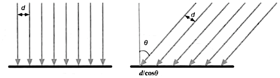
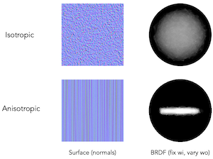

[TOC]

# 一、光照

光线实际上可以被认为是一束没有耗尽就不停向前运动的能量，而光束是通过碰撞的方式来消耗能量


## 1. 辐射量

辐射量

- $Q_e$ 辐射能（energy）
  代表单个光子的辐射能，表示为 $Q_e = {hc \over \lambda}$，单位是焦耳 $J$
  其中 $h$：Planck 常量（常数），$c$：光的速度（常数），$\lambda$：光的波长
- $\Phi_e$ 辐通量（radiant flux）
  辐通亮又称功率，代表<u>单位时间</u>内发射、接收或传输的能量 $\Phi_e = {dQ \over dt}$，单位是瓦特 $W$
  光源的全部发射能量通常用辐射通量表示
- $E_e$ 辐照度（irradiance）
  平行光的辐照度：**垂直于光线方向**的 **单位面积** 上 **单位时间** 内穿过的能量，单位是 $W/m^2$
  与平行光线垂直的平面 $A^\bot$ 上的辐照度 $E_e = {\Phi_e \over A\cos \theta}$
  辐射照度与距离的平方成反比



- $I_e$ 辐强度（radiant intensity）
  **元立体角**内的辐通量大小 $I_e = {d\Phi \over d\Omega}$，单位是 $W/sr$
  多用于测量点光源的强度
  
  > Angle 角，圆的弧长比半径
  >
  > Solid Angle 立体角，$\Omega = {A \over r^2}$，表示符号 $\Omega / \omega$， 单位 球面度 $sr$
  > 在[球坐标](https://baike.baidu.com/item/球坐标系) $(r,\theta,\phi)$ 下，观测点为球心，构造一个单位球面：
  > 任意物体投影到该单位球面上的投影面积，即为该物体相对于该观测点的立体角
  >
  > $$
  > \begin{align}
  > dA_2 &= rsin \theta d\phi * rd\theta = r^2(sin\theta d\phi d\theta) \\
  > d\Omega &= {dA_2 \over r^2} = sin\theta d \theta d \phi \\
  > \Omega &= \int d \Omega \\
	> \Omega_{总面积} &= \int _0^{2\pi} d\phi \int_0^{\pi} sin\theta d\theta = 4\pi
	> \end{align}
	> $$
	>  
- $L_e$ 辐亮度（radiance）
  表示**单位面积**和**单位立体角**上的辐通量，单位 $W/(m^2 \cdot sr)$
  考察一束激光，它射向一个物体表面，来自这个方向，并到达物理表面上一个给定点的辐射通量大小就是辐射亮度
  描述传感器（摄影机，人眼等）感受辐射最常用的量，辐亮度与距离无关
  其中，
  $\theta$ 入射光线与平面法线的夹角
  $A$ 真实的平面面积，是 $A^{\bot}$ 的投影
  $A^{\bot}$ 表示垂直光线方向的平面面积
  $$
  L_e = {d^2 \Phi_e \over d A^\bot \cdot d \Omega} = {d^2 \Phi_e \over cos\theta dA \cdot d\Omega}
  $$
  

色度学单位和辐度学单位是一一对应的，详细的单位名称分析和转换过程可以参考 [从真实世界到渲染](https://zhuanlan.zhihu.com/p/118272193)
其他相关的辐照单位对应的色度学单位如下：


## 2. 光的吸收和散射

光线与物体相交产生吸收和散射现象

散射（scattering）：只改变光的方向，不改变光的密度和颜色

- 反射（reflection）：光散射到物体外部 [ 形成 **高光反射** specular ]
- 折射（refraction）/ 透射（transmission）：光散射到与其相交物体的内部
  折射后的光线会继续在物体内部散射，最终 [ 形成 **漫反射**  diffuse ]
  1. 一部分光线被物体吸收（absorption）
  2. 一部分光线从物体表面被发射出去（这些光线和入射光线有不通的方向分布和颜色）


出射度（exitance）：出射光线的数量和方向

材质的漫反射和高光反射属性：辐射度 和 出射度 的比值（辐射度 和 出射度 满足线性关系）


# 二、基础光照模型

> 基础光照模型是对 BRDF 光照模型进行简化和理想化后的经验模型

**着色（shading）**：计算某个观察方向出射度的过程，期间需要材质属性、光源信息 和 一个等式（这个等式也称为光照模型）


## 1. 基础知识

常用的计算光照的方法：

- **物体反射的颜色（我们感知到的颜色）：光源的颜色 * 物体的颜色**
- 多光源的情况下，一般都是将各个光源的颜色累加起来，最后得出最终的颜色
- 同一个光源的光衰减系数是一样的，因此 **最终颜色 = 光衰减系数 * 光照模型计算的颜色**


**HDR (High Dynamic Range, 高动态范围)**

我们允许用更大范围的颜色值渲染从而获取大范围的黑暗与明亮的场景细节，最后将所有 HDR 值转换成在 [0.0, 1.0] 范围的 **LDR (Low Dynamic Range, 低动态范围)**

**色调映射(Tone Mapping)**：转换 HDR 值到 LDR 值的过程

```c
#version 330 core
out vec4 color;
in vec2 TexCoords;

uniform sampler2D hdrBuffer; // float frame buffer
uniform float exposure;

void main() {             
    const float gamma = 2.2;
    vec3 hdrColor = texture(hdrBuffer, TexCoords).rgb;

  	// Tone Mapping
    // Plan 1: reinhard
    // vec3 result = hdrColor / (hdrColor + vec3(1.0));
  
    // Plan 2: exposure
    vec3 result = vec3(1.0) - exp(-hdrColor * exposure);
    // also gamma correct while we're at it       
    result = pow(result, vec3(1.0 / gamma));
    color = vec4(result, 1.0f);
}
```


## 2. Phong 光照模型（标准光照模型）

> Phong 着色：使用 Phong 光照模型，在**片元着色器**逐像素的计算（使用的顶点法线在当前片面的插值）
> Gouraud 着色：使用 Phong 光照模型，在**顶点着色器**逐顶点的计算（计算量相对较小）

Phong 照模型只关心由光源发射，经过物体表面一次反射后**进入摄像机的光线**
$$
Phong \space 光照模型 = 环境光 + 自发光 + 漫反射 + 镜面反射
$$

- **环境光 Ambient**：间接光照（indirect light）经过多个物体之间反射的光照
  是一个全局光照，同一个场景中的所有物体都使用同样的环境光（一般为常量）

- **自发光 Emissive**：直接由光源发射的光照，一般为材质的颜色
  实时渲染中自发光不会作为光源来照亮其他物体

- **漫反射 Diffuse**：物体表面随机散射后反射的光照
  
  **兰伯特光照模型**（物体背面的光照不会参与着色计算）
  
  反射的光线强度 与 表面法线和光源方向夹角 的余弦值 成正比
  
  由于 两个单位向量的点积 $\hat n \cdot I = |\hat n||I| \cos \theta = \cos \theta$
  所以 反射的光线强度 和 **单位**表面法线和**单位**光源方向 的点积 成正比
  其中，max 函数防止出现表面法线 $n$ 和 光源方向 $I$ 夹角 $\theta$ 大于 90 度的情况（即，光源被物体遮挡的情况）
  
  
$$
Color_{diff} = Color_{light} \cdot Color_{材质强度} \max(0, n \cdot I)
$$

​		**半兰伯特光照模型**（物体背面的光照会参与着色计算）基于兰伯特光照模型
​		不通过限制余弦值的大小而是将余弦值的范围从 [-1, 1] 映射到 [0, 1]
​		采用半兰伯特光照模型的漫反射颜色计算公式为
$$
Color_{diff} = Color_{light} \cdot Color_{材质强度} (0.5 + 0.5* n \cdot I)
$$


- **镜面反射 Specular**：
  
  
  
  **计算反射方向** $r$，已知法线 $\hat n$ 是单位向量，$L$ 是入射光线 $I$ 到 $\hat n$ 的投影
  $$
  \begin{align}
  |\hat n| &= 1 \\ \\
  r + I &= 2 L\\
  &= 2(|I|cos \theta) \\
  &= 2(|\hat n||I|cos \theta) \\
  &= 2(\hat n\cdot I) \\
  r &= 2 (\hat n \cdot I) \hat n - I
  \end{align}
  $$
  
  **高光反射**，已知 观察方向 $\hat v$ 是单位向量
  
  
  $$
  Color_{spec} = Color_{light} \cdot Color_{高光强度} \max(0, \hat v \cdot r)^{Gloss}
  $$
  Gloss：光泽度，控制高光区域的亮点（光泽度越大，亮点越小）
  
  max 函数防止出现 $v$ 和 $r$ 夹角 $\theta$ 大于 90 度的情况（即，光源在摄像头后侧的情况）


## 3. Blinn-Phong 光照模型

$$
Blinn-Phong \space 光照模型 = 环境光 + 自发光 + 漫反射 + 镜面反射
$$

与 Phong 光照模型相似，Blinn-Phong 在 高光反射 的计算上有不同的实现

**Phong 光照的缺点**：

当物体的反光度非常小时，它产生的镜面高光半径足以让相反方向的光线对亮度产生足够大的影响。在这种情况下就不能忽略它们对镜面光分量的贡献了


Blinn-Phong 光照模型为了解决 Phong 光照的上述缺点，**计算高光强度的方法改为**计算 **半程向量** 与 法线向量 的夹角的方式


$$
\hat h = {I + \hat v \over |I + \hat v|}
$$
Blinn-Phong 的高光强度
$$
Color_{spec} = Color_{light} \cdot Color_{高光强度} \max(0, \hat h \cdot \hat n)^{Gloss}
$$


Blinn-Phong 较 Phong 具有更真实的光照效果


示例代码：


```glsl
// VS
#version 330 core
layout (location = 0) in vec3 aPos;
layout (location = 1) in vec3 aNormal;
layout (location = 2) in vec2 aTexCoords;

out vec3 FragPos;
out vec3 Normal;
out vec2 TexCoords;

uniform mat4 model;
uniform mat4 view;
uniform mat4 projection;

void main() {
    // Word coordinate
    FragPos = vec3(model * vec4(aPos, 1.0));
    
    // mode 4D to 3D for remove translate
    Normal = mat3(transpose(inverse(model))) * aNormal;  
    TexCoords = aTexCoords;
    
    gl_Position = projection * view * vec4(FragPos, 1.0);
}

// FS
vec3 CalcPointLight(PointLight light, vec3 normal, vec3 fragPos, vec3 viewDir)
{
    // lightDir from frag to light
    vec3 lightDir = normalize(light.position - fragPos);
    
    // diffuse shading
    float diff = max(dot(normal, lightDir), 0.0);
    
    // specular shading
    vec3 halfwayDir = normalize(viewDir + lightDir);
    float spec = pow(max(dot(viewDir, halfwayDir), 0.0), material.shininess);
    
    // combine results
    vec3 ambient = light.ambient * vec3(texture(material.diffuse, TexCoords));
    vec3 diffuse = light.diffuse * diff * vec3(texture(material.diffuse, TexCoords));
    vec3 specular = light.specular * spec * vec3(texture(material.specular, TexCoords));
    
    // attenuation
    float distance = length(light.position - fragPos);
    float attenuation = 1.0 / (light.constant + light.linear * distance + light.quadratic * (distance * distance)); 

    return (ambient + diffuse + specular) * attenuation;
}
```


## 4. 基于物理的 PBR 光照模型

**基于物理**的渲染（非真实的物理渲染）是为了使用一种更符合物理学规律的方式来模拟光线，因此这种渲染方式与我们原来的 Phong 或者 Blinn-Phong 光照模型相比总体上看起来要更真实一些

**Physically Based Rendering** 与物理性质非常接近，可以直接以物理参数为依据来编写表面材质，而不必盲目的修改与调整
PBR 满足以下条件

1. 基于微平面 (Microfacet) 的表面模型
2. 能量守恒 $L_{input}(\omega_{input}) = L_{output}(\omega_{output})$
3. 应用基于物理的 BRDF


### 4.1 PBR 材质系统概述

在遵循能量守恒、菲涅尔反射、微表面反射的物理规律下，PBR 描述的物体颜色构成：

> 注：在移动平台，BRDF 的计算会消耗较多的 ALU，同时对于 BRDF 计算结果的精度要求没有这么高。一种优化的方式是将 BRDF 的部分复杂计算，预计算存储到纹理中。以增加一张 BRDF 贴图和纹理采样器的代价，来节约 ALU。

1. **镜面反射 Specular**
   当光线照射到物体表面上时，光线会以和入射角度相同的反射角度从物体表面反弹出去
   如果一个表面足够光滑，那么它将表现的像个镜子一样
2. **漫反射 Diffuse Light / Diffusion / Subsurface Scattering**
   部分散射的光有可能会通过内部的传播最终又反射回表面，再次成为可以观察到的光线
   <u>物体所反射的颜色为物体的颜色</u>
3. **透明与半透明**
   在某些情况下扩散现象（Diffusion）会更加复杂，比如皮肤和蜡烛这些有着更广泛的扩散距离的材料
   这时仅仅一张固有色贴图 Albedo 是不够的，<u>整个着色系统必须考虑到被照射物体的形状与厚度</u>
   半透明：被照射物体足够的薄，那么往往能够从物体背面看到散射出来的光
   透明：被照射物体内的扩散程度很低（比如玻璃），那么光的散射几乎是不可见的，你可以从物体的这一面看到其后面的整个画面


**PBR 材质贴图**

- <u>反照率 Albedo 贴图</u>
  为每一个金属的纹素（Texel 纹理像素）指定表面颜色（固有色）或者基础反射率，只包含表面的颜色
  反照率贴图和漫反射贴图的区别，反照率贴图只有固有色没有其他的阴影细节纹理，漫反射贴图是一些细节纹理和固有色的集合
- <u>金属度 Metallic 贴图</u>
  导体有更强的反射，导体的反射光颜色会与 Albedo（固有色，金属没有漫反射）不同
  正式因为导体和非导体如此的不同，通常用金属度来控制一个材质是否为金属
  金属度可以用灰度值，也可以用二值图来表示物体表面具有金属特性的位置
- <u>法线 Normal 贴图</u>
  计算反射光线强度时使用
  根据分布方向的 一致 / 非一致性，可模拟出 各项异性 Anisotropic / 各项同性 Isotropic 材质
  
- <u>粗糙度 Roughness / 光滑度 Smoothness 贴图</u>
  微表平面模型的简化，以纹素为单位指定某个表面有多粗糙，粗糙度 = 1.0 – 光滑度
- <u>环境光遮蔽 Ambient Occlusion 贴图</u>
  固定光源的辐照度贴图，多用于大场景的环境光
  为表面和周围潜在的几何图形指定了一个额外的阴影因子
  网格/表面的环境遮蔽贴图要么通过手动生成，要么由 3D 建模软件自动生成


### 4.2 反射率方程 和 BRDF

反射率方程

- 所需的**辐亮度**可通过光源和环境贴图来估算得出
- 表示点 $p$ 在 $\omega_o$ 方向被反射出的**辐亮度**（见一、光学描述 1.辐射量的辐亮度）的**总和**
  它包含以 $p$ 为球心的单位半球领域 $\Omega$ 内所有入射方向的 $d\omega_i$ 之和
  其中，$\omega_o$ 观察/出射方向，$\omega_i$ 光线入射方向，$n\cdot\omega_i$ 入射方向和法线的夹角 $cos\theta$ 值
  $f_r$ BRDF，基于表面材质属性来对入射**辐亮度**进行缩放或者加权

$$
L_o(p,\omega_o) = \int_{\Omega} f_r(p,\omega_i,\omega_o)L_i(p,w_i)n\cdot\omega_id\omega_i
$$

BRDF（Bidirectional Reflectance Distribution Function）双向反射分布函数：
可以近似的求出每束光线对一个给定了材质属性的平面上最终反射出来的光线所作出的**贡献程度**，必须遵守能量守恒
简单来说，BRDF 就是材质的数学表达方式，它代表的就是材质的效果


### 4.3 Microfacet 微平面模型

现实当中大多数物体的表面都会有非常微小的缺陷：微小的凹槽，裂缝，几乎肉眼不可见的凸起，以及在正常情况下过于细小以至于难以使用 Normal map 去表现的细节。尽管这些微观的细节几乎是肉眼观察不到的，但是他们仍然影响着光的扩散和反射

- 平面越粗糙，这个平面上的微平面的排列就越混乱。当我们特指镜面光/镜面反射时，入射光线更趋向于向完全不同的方向发散 (Scatter) 开来
- 平面越光滑，光线大体上会更趋向于向同一个方向反射，造成更小更锐利的反射


**光泽度**（Glossy 平滑度）

- 用统计学的方法来概略的估算微平面的粗糙程度，表示半程向量（Blinn-Phong 中）的方向与微平面平均取向方向一致的概率

- 微平面的取向方向与中间向量的方向越是一致，镜面反射的效果就越是强烈越是锐利

  


Energy Conservation 能量守恒 ：出射光线的能量永远不能超过入射光线的能量（发光面除外）

- 根据能量守恒，随着粗糙度的上升镜面反射区域的会增加，但是镜面反射的亮度却会下降
- 反射/镜面反射 + 折射/漫反射 = 1.0（光强度）


传统的微平面模型的问题：太过于平滑，不能表现小于一个像素的几何级的细节


### 4.4 Cook-Torrance BRDF 模型

$$
f_r = k_d\cdot f_{lambert} + k_s \cdot f_{cook-torrance}
$$

其中，$k_d + k_s = 1$

- $k_d$ 折射光线能量比率

- $k_s$ 反射光线能量比率

- 漫反射 $f_{lambert} = {color_{light} \over \pi}$（除以 π 是为了对漫反射光进行归一化）
  假设在所有方向观察亮度都是相同的，因此 $f_{lambert}$ 是常数
  $$
  \begin{align}
  \int_{\Omega} f_{lambert} L_{Input} cos\theta d\omega' &= L_{Output}\\
  L_{Input} f_{lambert} \int_{\Omega} cos\theta d\omega' &= L_{Output}\\
  f_{lambert} \int_0^{2\pi} d\phi \int_0^{\pi\over 2} cos\theta d\theta &= 1\\
  f_{lambert} \pi &= 1\\
  f_{lambert} &= {color_{light} \over \pi}, \space color_{light} [0, 1]
  \end{align}
  $$

- 镜面反射 $f_{cook-torrance} = {DFG \over 4(\omega_o \cdot n)(\omega_i \cdot n)}$


在镜面反射中：
字母 D, F, G 分别代表着一种类型的函数，各个函数分别用来近似的计算出表面反射特性的一个特定部分

1. **反射光的粗糙度**：Normal Distribution Function 正态分布函数
   用来估算微平面的主要函数，估算在受到表面粗糙度的影响下，取向方向与中间向量一致的微平面的数量
   以下设给定向量 $h$，通过 NDF 函数 Trowbridge-Reitz GGX 计算与 $h$ 方向一致的概率
   $h$：平面法向量 $n$ 和光线方向向量之间的中间向量
   $\alpha$：表面的粗糙度（参数）
   $$
   NDF_{GGXTR}(n,h,\alpha) = {\alpha^2 \over \pi((n\cdot h)^2(\alpha^2-1)+1)^2}
   $$

2. **反射和视角的关系决定反射强度**：Fresnel reflection 菲涅耳反射

   用来描述不同的表面角下表面所**反射的光线所占折射和反射的比率**
   菲涅耳反射：观察方向和物体表面法线的夹角越大，反射效果越明显

   应用：菲涅耳反射计算的强度系数 * 噪声纹理 **可以表现出水波的效果**

   近似公式，其中 $v$ 表示视角方向的**单位向量**，$n$ 表示物体表面**单位法线**

   - Schlick 菲涅耳近似公式
     $F_{schlick}(v,n) = F_0 + (1-F_0)(1-v \cdot n)^5$
     其中 $F_0$ 表示平面的基础反射率（0 度角）
     它是利用所谓**折射指数**(Indices of Refraction)或者说 IOR 计算得出的
   - Empricial 菲涅耳近似公式
     $F_{empricial}(v,n) = max(0,min(1, bias + scale * (1- v \cdot n)^{power}))$
     其中 bias，scale，power 是控制项
     
     
     

3. **反射光的自遮挡**：Geometry Function 几何函数

   用来描述微平面自成阴影的属性
   当一个平面相对比较粗糙的时候，平面表面上的微平面有可能挡住其他的微平面从而**减少表面所反射的光线**

   1. 单纯的计算平面遮挡的几何函数可采用 GGX 与 Schlick-Beckmann 近似的结合体
      因此又称为 Schlick-GGX 
      $v$：观察方向
      $\alpha$：表面的粗糙度（参数）
      $k_{direct}$：直接光照
      $k_{IBL}$：IBL（Image based lighting）基于图像的光照

      - 其光源不是可分解的直接光源，而是将周围环境整体视为一个大光源
      - 通常使用（取自现实世界或从 3D 场景生成的）环境立方体贴图 (Cubemap) 
        我们可以将立方体贴图的每个像素视为光源，在渲染方程中直接使用它

      $$
      \begin{align}
      k_{direct} &= {(\alpha + 1)^2 \over 8} \\
      k_{IBL} &= {\alpha ^2 \over 2} \\
      G_{SchlickGGX}(n,v,k) &= {n \cdot v \over (n\cdot v)(1-k) + k}
      \end{align}
      $$

   2. 将观察方向（几何遮蔽 Geometry Obstruction）和光线方向向量（几何阴影 Geometry Shadowing）都考虑进去后采用 Smith’s method 方法计算
      $v$：观察方向
      $l$：光线方向
      $$
      G_{Smith}(n,v,l,k) = G_{SchlickGGX}(n,v,k) \cdot G_{SchlickGGX}(n,l,k)
      $$


完整的基于 Cook-Torrance BRDF 模型的反射率方程即 PBR 方程为
$$
L_o(p,\omega_o) = \int_{\Omega} (k_d{color \over \pi} + k_s{DFG \over 4(\omega_o \cdot n)(\omega_i \cdot n)})L_i(p,w_i)n\cdot\omega_id\omega_i
$$


## 5. PBR 计算简化代码实现

预计算的方法 **Precomputation-based methods**

```c
// 方法一：根据统一数据计算 FS
#version 330 core
out vec4 FragColor;
in vec2 TexCoords;
in vec3 WorldPos;
in vec3 Normal;

// material parameters
uniform vec3 albedo;
uniform float metallic;
uniform float roughness;
uniform float ao;

// lights
uniform vec3 lightPositions[4];
uniform vec3 lightColors[4];

uniform vec3 camPos;

const float PI = 3.14159265359;

// 3.1 正态分布函数：计算微表面粗糙度（高光区域）
float DistributionGGX(vec3 N, vec3 H, float roughness) {
    float a = roughness*roughness;
    float a2 = a*a;
    float NdotH = max(dot(N, H), 0.0);
    float NdotH2 = NdotH*NdotH;

    float nom   = a2;
    float denom = (NdotH2 * (a2 - 1.0) + 1.0);
    denom = PI * denom * denom;

	  // 避免在 NdotV=0.0 or NdotL=0.0 情况下出现除零错误
    return nom / max(denom, 0.0000001); 
}

// 3.2.1 几何函数：微表面自成阴影的程度
float GeometrySchlickGGX(float NdotV, float roughness) {
    float r = (roughness + 1.0);
    float k = (r*r) / 8.0;

    float nom   = NdotV;
    float denom = NdotV * (1.0 - k) + k;

    return nom / denom;
}
// 3.2.2 同时考虑观察方向和光源方向下的 几何函数值
float GeometrySmith(vec3 N, vec3 V, vec3 L, float roughness) {
    float NdotV = max(dot(N, V), 0.0);
    float NdotL = max(dot(N, L), 0.0);
    float ggx2 = GeometrySchlickGGX(NdotV, roughness);
    float ggx1 = GeometrySchlickGGX(NdotL, roughness);

    return ggx1 * ggx2;
}

// 3.3 菲涅尔方程：不同观察角下反射光线的强度
vec3 fresnelSchlick(float cosTheta, vec3 F0) {
    return F0 + (1.0 - F0) * pow(max(1.0 - cosTheta, 0.0), 5.0);
}

void main() {		
    vec3 N = normalize(Normal);
    vec3 V = normalize(camPos - WorldPos);

    // 1. 计算基础反照率：根据金属度来计算高光色是折射的固有色还是反射的高光色
    //    在菲涅尔反射中作为某类材质的固定参数使用
    vec3 F0 = vec3(0.04); 
    F0 = mix(F0, albedo, metallic);

    // 2. 前向渲染：使用双向反射分布函数 BRDF，累计处理每个光源的光照强度
    vec3 Lo = vec3(0.0);
    for(int i = 0; i < 4; ++i) {
      
        // 2.1 根据光体积，计算光源的光照强度
        vec3 L = normalize(lightPositions[i] - WorldPos);
        vec3 H = normalize(V + L);
        float distance = length(lightPositions[i] - WorldPos);
        float attenuation = 1.0 / (distance * distance);
        vec3 radiance = lightColors[i] * attenuation;

        // 2.2 计算双向反射分布函数的 Cook-Torrance
        float NDF = DistributionGGX(N, H, roughness);   
        float G   = GeometrySmith(N, V, L, roughness);      
        vec3 F    = fresnelSchlick(clamp(dot(H, V), 0.0, 1.0), F0);
           
        vec3 nominator    = NDF * G * F; 
        float denominator = 4 * max(dot(N, V), 0.0) * max(dot(N, L), 0.0);
        // 避免在 NdotV=0.0 or NdotL=0.0 情况下出现除零错误
        vec3 specular = nominator / max(denominator, 0.001); 
        
        // 2.3 计算光的辐射率强度，不用 Blinn-Phone 因为它不遵循能量守恒，更像是 BRDF 的替代简化版
        float NdotL = max(dot(N, L), 0.0);  
      
        // 2.4 计算反射和折射系数
        // kS 镜面反射强度：源于菲涅尔方程
        vec3 kS = F;
        // kD 漫反射强度（折射强度）：1.0 - 高光反射
        // 这个能量守恒总量是 1.0，要大于 1.0 除非是自发光物体
        vec3 kD = vec3(1.0) - kS;
        // kD 要考虑金属材质：因为金属不会折射光线，因此不会有漫反射
        kD *= 1.0 - metallic;	        

        // 4. 计算出射光的反射强度总量
        // Cook-Torrance 方程中的 F 就是 ks，因此方程的结果 specular 已经计入了 ks，不需要再次乘以 ks
        Lo += (kD * albedo / PI + specular) * radiance * NdotL;
    }   
    
    // 环境光照强度（将会被 IBL 基于图像的环境光代替）
    vec3 ambient = vec3(0.03) * albedo * ao;

    vec3 color = ambient + Lo;
    color = color / (color + vec3(1.0)); // HDR 色调映射
    color = pow(color, vec3(1.0/2.2)); 	 // gamma 矫正
  
    FragColor = vec4(color, 1.0);
}

// 方法二：根据贴图计算 FS
uniform sampler2D normalMap;
uniform sampler2D albedoMap;
uniform sampler2D metallicMap;
uniform sampler2D roughnessMap;
uniform sampler2D aoMap;

// ...

// 将法线向量从 切线空间 转换为 世界空间
vec3 getNormalFromMap() {
    vec3 tangentNormal = texture(normalMap, TexCoords).xyz * 2.0 - 1.0;

    vec3 Q1  = dFdx(WorldPos);
    vec3 Q2  = dFdy(WorldPos);
    vec2 st1 = dFdx(TexCoords);
    vec2 st2 = dFdy(TexCoords);

    vec3 N   = normalize(Normal);
    vec3 T  = normalize(Q1*st2.t - Q2*st1.t);
    vec3 B  = -normalize(cross(N, T));
    mat3 TBN = mat3(T, B, N);

    return normalize(TBN * tangentNormal);
}

// ...

void main() {		
    // 从纹理中获取多变的材质贴图
    // albedo 从贴图的非线性 sRGB 空间转化为线性的 RGB 空间
    vec3 albedo     = pow(texture(albedoMap, TexCoords).rgb, vec3(2.2));
    float metallic  = texture(metallicMap, TexCoords).r;
    float roughness = texture(roughnessMap, TexCoords).r;
    float ao        = texture(aoMap, TexCoords).r;

    vec3 N = getNormalFromMap();
    vec3 V = normalize(camPos - WorldPos);
    
    vec3 F0 = vec3(0.04); 
    F0 = mix(F0, albedo, metallic);

    // 反射方程
    vec3 Lo = vec3(0.0);
    for(int i = 0; i < 4; ++i) {
        // ...
    }   
    
    // ...
}
```


## 6. 基于图像的照明 IBL

IBL 通常使用（取自现实世界或从3D场景生成的）环境立方体贴图 (Cubemap) ，我们可以将立方体贴图的**每个像素视为光源**，在渲染方程中直接使用它。这种方式可以有效地捕捉环境的全局光照和氛围，使物体**更好地融入**其环境。

根据反射方程：
$$
\begin{align}
L_o(p,\omega_o) &= \int_{\Omega} (k_d{color \over \pi} + k_s{DFG \over 4(\omega_o \cdot n)(\omega_i \cdot n)})L_i(p,w_i)n\cdot\omega_id\omega_i \\
&= \int_{\Omega} k_d{color \over \pi}L_i(p,w_i)n\cdot\omega_id\omega_i + \int_{\Omega} k_s{DFG \over 4(\omega_o \cdot n)(\omega_i \cdot n)}L_i(p,w_i)n\cdot\omega_id\omega_i \\
&= k_d{color \over \pi}\int_{\Omega} L_i(p,w_i)n\cdot\omega_id\omega_i + \int_{\Omega} k_s{DFG \over 4(\omega_o \cdot n)(\omega_i \cdot n)}L_i(p,w_i)n\cdot\omega_id\omega_i \\
&= L_{o 漫反射} + L_{o 镜面反射}
\end{align}
$$

可知

- 漫反射与 物体的位置 和 入射光线方向 有关
- 镜面反射与 物体的位置、入射光线方向、<u>出射光线方向</u> 有关


### 6.1 IBL 漫反射

**辐照度图**

- 根据环境贴图，计算或预计算在一个<u>固定位置</u>下新的立方体贴图，它在每个采样方向（也就是纹素）中存储漫反射积分的结果，这些结果是通过卷积计算出来的
- 在图的每个像素上通过对光的辐射范围半球 $\Omega$ 上的大量方向进行离散采样并对其辐射度取平均值，来**计算每个输出采样方向的积分**


**反射探针**

- 辐照度贴图是从<u>固定位置</u>获得的光照贴图，在不同的室内场景位置中我们会使用不同的辐照度贴图来达到环境光动态变化的效果
  这个固定位置我们称为反射探针
- 根据当前视点的辐照度为：与其距离最近的几个反射探针处辐照度的插值


**IBL 漫反射贴图 制作流程**

1. 读取 hdr 图(从球体投影到平面上的图)，转换为距柱状投影图(Equirectangular Map)
   实际读取图片到 float texture 就可以

2. 等距柱状投影图 转换为 立方体贴图
   采用不同的观察空间，从柱状投影图逐个绘制纹理到对应的立方体贴图上（可以通过缩小立方图来提高效率）

   ```c
   #version 330 core
   out vec4 FragColor;
   in vec3 localPos; // 经过 VS 插值后的顶点坐标（模型空间）
   
   uniform sampler2D equirectangularMap;
   
   const vec2 invAtan = vec2(0.1591, 0.3183);
   // 球体 UV 坐标转 笛卡尔 uv 坐标
   vec2 SampleSphericalMap(vec3 v) {
       vec2 uv = vec2(atan(v.z, v.x), asin(v.y));
       uv *= invAtan;
       uv += 0.5;
       return uv;
   }
   
   void main() {       
       vec2 uv = SampleSphericalMap(normalize(localPos)); // make sure to normalize localPos
       vec3 color = texture(equirectangularMap, uv).rgb;
   
       FragColor = vec4(color, 1.0);
   }
   ```
   
3. 生成辐照度贴图：计算立方体贴图的卷积
   
   
   通过对有限数量的**所有方向**采样以近似求解（卷积）
   $$
   \begin{align}
   x &= rsin\theta cos\phi \\
   y &= rcos\theta \\
   z &= rsin\theta sin\phi \\\\
   r &= \sqrt {x^2 + y^2 + z^2} \\
   \theta &= cos^{-1}{y \over r} \\
   \phi &= tan^{-1}{z \over x} \\\\
   L_o(p,\omega_o) &= k_d{color \over \pi}\int_{\Omega} L_i(p,w_i)n\cdot\omega_id\omega_i \\
   L_o(p,\phi_o, \theta_o) &= k_d{color \over \pi} \int_{\phi = 0}^{2 \pi} \int_{\theta = 0}^{\pi \over 2} L_i(p,\phi_i, \theta_i) cos\theta sin\theta d\phi d\theta
   \end{align}
   $$
   
   根据以上公式进行离散均匀采样积分
   
   ```c
   vec3 irradiance = vec3(0.0);  
   
   // 根据法线制作 TBN 切线坐标矩阵
   vec3 up    = vec3(0.0, 1.0, 0.0);
   vec3 right = cross(up, normal);
   up         = cross(normal, right);
   
   float sampleDelta = 0.025;
   float nrSamples = 0.0;
   // 半球采样：phi 绕 y 轴 360，theta 绕 z 轴 180
   for(float phi = 0.0; phi < 2.0 * PI; phi += sampleDelta) {
       for(float theta = 0.0; theta < 0.5 * PI; theta += sampleDelta) {
           // 球形坐标 转 笛卡尔坐标 (切线空间)
           vec3 tangentSample = vec3(sin(theta) * cos(phi),  
                                     sin(theta) * sin(phi), 
                                     cos(theta));
           // 切线空间转换为世界空间
           vec3 sampleVec = tangentSample.x * right + 
                            tangentSample.y * up + 
                            tangentSample.z * N; 
   
           irradiance += texture(environmentMap, sampleVec).rgb * cos(theta) * sin(theta);
           nrSamples++;
       }
   }
   irradiance = PI * irradiance * (1.0 / float(nrSamples));
   ```
   
4. IBL 辐照度贴图 和 PBR 结合
   由于 IBL 的漫反射环境来自环境的所有方向，没有一个确定的方向来计算菲涅耳效应
   为了模拟菲涅耳效应，我们用法线和视线之间的夹角计算菲涅耳系数

   ```c
   vec3 fresnelSchlickRoughness(float cosTheta, vec3 F0, float roughness) {
       return F0 + (max(vec3(1.0 - roughness), F0) - F0) * pow(1.0 - cosTheta, 5.0);
   }  
   
   vec3 kS = fresnelSchlickRoughness(max(dot(N, V), 0.0), F0, roughness); 
   ```


### 6.2 IBL 镜面反射

#### 6.2.1 前置知识：蒙特卡洛积分和重要性采样

**概率密度函数 PDF  (probability density function)**：随着连续随机变量样本在整个样本集上发生的<u>概率</u>
**累积分布函数 CDF (Cumulative Distribution Function)**：随着连续随机变量而变化的<u>概率积分值</u>，CDF 的导数是 PDF

**大数定理**：抽样检测一部分数据得出的结果虽然不能完全代表整个样品，但结果随着采样数量的增加而逐渐接近

**蒙特卡洛积分**主要是统计和概率理论的组合。蒙特卡洛可以帮助我们离散地解决人口统计问题，而不必考虑**所有**人
蒙特卡洛积分在计算机图形学中非常普遍，因为它是一种以高效的离散方式对连续的积分求近似而且非常直观的方法：对任何面积/体积进行采样——例如半球 Ω ——在该面积/体积内生成数量 N 的随机采样，权衡每个样本对最终结果的贡献并求和

**重要性采样**：只在某些区域生成采样向量，该区域围绕微表面半向量，受粗糙度限制

1. 通过低差异序列根据索引整数获得均匀的随机数
2. 根据粗糙度和微表面等属性进行重要性质采样


#### 6.2.2 具体实现步骤

在实时状态下，对每种可能的 **入射光线** 和 出射光线 的组合预计算该积分是不可行的。 **Epic Games 的分割求和近似法**将预计算分成两个单独的部分求解，再将两部分组合起来得到后文给出的预计算结果。
$$
\begin{align}
f_r(p, w_i, w_o) &= k_s{DFG \over 4(\omega_o \cdot n)(\omega_i \cdot n)} \\
L_o(p, \omega_o) &= \int_{\Omega} k_s{DFG \over 4(\omega_o \cdot n)(\omega_i \cdot n)}L_i(p,w_i)n\cdot\omega_id\omega_i \\
&= \int_{\Omega} f_r(p, w_i, w_o)L_i(p,w_i)n\cdot\omega_id\omega_i \\
&= \int_{\Omega} L_i(p,w_i)d\omega_i * \int_{\Omega}f_r(p, w_i, w_o)n\cdot \omega_i d\omega_i \\\\
&= 预滤波环境贴图 * 镜面反射积分
\end{align}
$$

1. 制作**预滤波环境贴图**

   它类似于辐照度图，是预先计算的环境卷积贴图，但这次考虑了粗糙度。因为随着粗糙度的增加，参与环境贴图卷积的采样向量会更分散，导致反射更模糊，所以对于卷积的每个粗糙度级别，我们将按顺序把模糊后的结果存储在预滤波贴图的 mipmap 中，注意开启 `glEnable(GL_TEXTURE_CUBE_MAP_SEAMLESS);  `  让立方体接缝过渡自然

   可以通过 [cmftStudio](https://github.com/dariomanesku/cmftStudio) 或 [IBLBaker](https://github.com/derkreature/IBLBaker) 等工具生成预计算贴图

   

   ```c
   #version 330 core
   out vec4 FragColor;
   in vec3 WorldPos;
   
   uniform samplerCube environmentMap;
   uniform float roughness;
   
   const float PI = 3.14159265359;
   
   float DistributionGGX(vec3 N, vec3 H, float roughness) {
       float a = roughness*roughness;
       float a2 = a*a;
       float NdotH = max(dot(N, H), 0.0);
       float NdotH2 = NdotH*NdotH;
   
       float nom   = a2;
       float denom = (NdotH2 * (a2 - 1.0) + 1.0);
       denom = PI * denom * denom;
   
       return nom / denom;
   }
   
   // http://holger.dammertz.org/stuff/notes_HammersleyOnHemisphere.html
   // efficient VanDerCorpus calculation
   // 整数变小数：把十进制数字的二进制表示 镜像翻转 到小数点右边
   float RadicalInverse_VdC(uint bits) {
        bits = (bits << 16u) | (bits >> 16u);
        bits = ((bits & 0x55555555u) << 1u) | ((bits & 0xAAAAAAAAu) >> 1u);
        bits = ((bits & 0x33333333u) << 2u) | ((bits & 0xCCCCCCCCu) >> 2u);
        bits = ((bits & 0x0F0F0F0Fu) << 4u) | ((bits & 0xF0F0F0F0u) >> 4u);
        bits = ((bits & 0x00FF00FFu) << 8u) | ((bits & 0xFF00FF00u) >> 8u);
        return float(bits) * 2.3283064365386963e-10; // / 0x100000000
   }
   
   // 低差异序列：根据索引来生成均匀随机数，避免伪随机带来的不均匀采样
   vec2 Hammersley(uint i, uint N) {
   	return vec2(float(i)/float(N), RadicalInverse_VdC(i));
   }
   
   // 重要性采样
   vec3 ImportanceSampleGGX(vec2 Xi, vec3 N, float roughness) {
   	float a = roughness*roughness;
   	
     // 根据随机数获得随机角度
   	float phi = 2.0 * PI * Xi.x;
   	float cosTheta = sqrt((1.0 - Xi.y) / (1.0 + (a*a - 1.0) * Xi.y));
   	float sinTheta = sqrt(1.0 - cosTheta*cosTheta);
   	
   	// 根据随机角度获得半角向量，从球坐标转换为笛卡尔坐标
   	vec3 H;
   	H.x = cos(phi) * sinTheta;
   	H.y = sin(phi) * sinTheta;
   	H.z = cosTheta;
   	
   	// 将半角向量从切线空间转换为世界空间
   	vec3 up        = abs(N.z) < 0.999 ? vec3(0.0, 0.0, 1.0) : vec3(1.0, 0.0, 0.0);
   	vec3 tangent   = normalize(cross(up, N));
   	vec3 bitangent = cross(N, tangent);
   	
   	vec3 sampleVec = tangent * H.x + bitangent * H.y + N * H.z;
   	return normalize(sampleVec);
   }
   
   void main(){		
   	  // 在卷积环境贴图时事先不知道镜面反射方向, 因此假设镜面反射方向总是等于输出方向 w_o
   		// 这意味着掠角镜面反射效果不是很好
       vec3 N = normalize(WorldPos);
       vec3 R = N;
       vec3 V = R;
   
       const uint SAMPLE_COUNT = 1024u;
       vec3 prefilteredColor = vec3(0.0);
       float totalWeight = 0.0;
       
       for(uint i = 0u; i < SAMPLE_COUNT; ++i) {
           // 根据重要性采样随机生成半角向量 H
           vec2 Xi = Hammersley(i, SAMPLE_COUNT);
           vec3 H = ImportanceSampleGGX(Xi, N, roughness);
           vec3 L  = normalize(2.0 * dot(V, H) * H - V);
   
           float NdotL = max(dot(N, L), 0.0);
           if(NdotL > 0.0) {
               float D   = DistributionGGX(N, H, roughness);
               float NdotH = max(dot(N, H), 0.0);
               float HdotV = max(dot(H, V), 0.0);
               float pdf = D * NdotH / (4.0 * HdotV) + 0.0001; 
   
               float resolution = 512.0; // resolution of source cubemap (per face)
               float saTexel  = 4.0 * PI / (6.0 * resolution * resolution);
               float saSample = 1.0 / (float(SAMPLE_COUNT) * pdf + 0.0001);
   
               float mipLevel = roughness == 0.0 ? 0.0 : 0.5 * log2(saSample / saTexel); 
               
               // 根据纹理的 LOD 大小来加载纹理
               prefilteredColor += textureLod(environmentMap, L, mipLevel).rgb * NdotL;
               totalWeight      += NdotL;
           }
       }
   
       prefilteredColor = prefilteredColor / totalWeight;
       FragColor = vec4(prefilteredColor, 1.0);
   }
   ```

2. 制作 **BRDF 积分贴图**
   存储：入射角方向，建议存储为 512 x 512 大小的支持存储 mip 级别的 .dds 文件
   横坐标：BRDF 的输入 $n\cdot \omega_i$（范围在 0.0 和 1.0 之间，$\omega_i$ 为光源到片源方向，$\omega_o$ 为视点到片源方向）
   纵坐标：粗糙度
   将环绕模式设置为  `GL_CLAMP_TO_EDGE` 以防止边缘采样的伪像，并且在 NDC (译注：Normalized Device Coordinates) 屏幕空间四边形上绘制积分贴图

   
   
   根据 $n \cdot \omega_o$、表面粗糙度、菲涅尔系数 $F_0$ 来计算 BRDF 方程的卷积
   并且假设在纯白的环境光或者辐射度恒定为 1，为了减少因变量的个数，我们做以下化简
   $$
   \begin{align}
   \int_{\Omega}f_r(p, w_i, w_o)n\cdot \omega_i d\omega_i &= 
   \int_{\Omega}f_r(p, w_i, w_o){F(\omega_o, h) \over F(\omega_o, h)}n\cdot \omega_i d\omega_i\\
   &=\int_{\Omega}{f_r(p, w_i, w_o) \over F(\omega_o, h)}F(\omega_o, h)n\cdot \omega_i d\omega_i\\
   &=\int_{\Omega}{f_r(p, w_i, w_o) \over F(\omega_o, h)}(F_0 + (1-F_0)(1-\omega_o \cdot h)^5)n\cdot \omega_i d\omega_i\\
   设 \space \alpha = (1 - \omega_o \cdot h)^5, \space 则：\\
   &=\int_{\Omega}{f_r(p, w_i, w_o) \over F(\omega_o, h)}n\cdot \omega_i (F_0 + (1-F_0)\alpha) d\omega_i\\
   &=\int_{\Omega}{f_r(p, w_i, w_o) \over F(\omega_o, h)}n\cdot \omega_i (F_0 + \alpha -F_0 *\alpha) d\omega_i\\
   &=\int_{\Omega}{f_r(p, w_i, w_o) \over F(\omega_o, h)}n\cdot \omega_i (F_0 * (1 -\alpha)+ \alpha) d\omega_i\\
   &=\int_{\Omega}{f_r(p, w_i, w_o) \over F(\omega_o, h)}n\cdot \omega_i (F_0 * (1 -\alpha)) d\omega_i + \int_{\Omega}{f_r(p, w_i, w_o) \over F(\omega_o, h)}n\cdot \omega_i \alpha d\omega_i\\
   &=F_0\int_{\Omega}{f_r(p, w_i, w_o) \over F(\omega_o, h)}n\cdot \omega_i (1 -\alpha) d\omega_i + \int_{\Omega}{f_r(p, w_i, w_o) \over F(\omega_o, h)}n\cdot \omega_i \alpha d\omega_i\\
   &=F_0\int_{\Omega}{f_r(p, w_i, w_o) \over F(\omega_o, h)}n\cdot \omega_i (1 -(1 - \omega_o \cdot h)^5) d\omega_i + \int_{\Omega}{f_r(p, w_i, w_o) \over F(\omega_o, h)}n\cdot \omega_i (1 - \omega_o \cdot h)^5 d\omega_i\\
   &=F_0 A + B\\
   \end{align}
   $$
   转换为代码为：
   ```glsl
   float GeometrySchlickGGX(float NdotV, float roughness) {
       // 不使用 IBL 
     	// float a = (roughness + 1.0);
       // float k = (a * a) / 8.0;
     
       // 使用 IBL 后和不用 IBL 这里公式略有不同
       float a = roughness;
       float k = (a * a) / 2.0; 
   
       float nom   = NdotV;
       float denom = NdotV * (1.0 - k) + k;
   
       return nom / denom;
   }
   
   float GeometrySmith(vec3 N, vec3 V, vec3 L, float roughness) {
       float NdotV = max(dot(N, V), 0.0);
       float NdotL = max(dot(N, L), 0.0);
       float ggx2 = GeometrySchlickGGX(NdotV, roughness);
       float ggx1 = GeometrySchlickGGX(NdotL, roughness);
   
       return ggx1 * ggx2;
   }
   
   vec2 IntegrateBRDF(float NdotV, float roughness) {
       vec3 V;
       V.x = sqrt(1.0 - NdotV*NdotV);
       V.y = 0.0;
       V.z = NdotV;
   
       float A = 0.0;
       float B = 0.0;
   
       vec3 N = vec3(0.0, 0.0, 1.0);
   
       const uint SAMPLE_COUNT = 1024u;
       for(uint i = 0u; i < SAMPLE_COUNT; ++i) {
           // 根据重要性采样随机生成入射光线和反射光线的 半角向量
           vec2 Xi = Hammersley(i, SAMPLE_COUNT);
           vec3 H  = ImportanceSampleGGX(Xi, N, roughness);
           vec3 L  = normalize(2.0 * dot(V, H) * H - V);
   
           float NdotL = max(L.z, 0.0);
           float NdotH = max(H.z, 0.0);
           float VdotH = max(dot(V, H), 0.0);
   
           if(NdotL > 0.0) {
               float G = GeometrySmith(N, V, L, roughness);
               float G_Vis = (G * VdotH) / (NdotH * NdotV);
               float Fc = pow(1.0 - VdotH, 5.0);
   
               A += (1.0 - Fc) * G_Vis;
               B += Fc * G_Vis;
           }
       }
       A /= float(SAMPLE_COUNT);
       B /= float(SAMPLE_COUNT);
       return vec2(A, B);
   }
   
   void main()  {
       vec2 integratedBRDF = IntegrateBRDF(TexCoords.x, TexCoords.y);
       FragColor = integratedBRDF;
   }
   ```
   
3. 结合预滤波环境和 BRDF 积分贴图，完成 IBL 反射

   ```glsl
   uniform samplerCube prefilterMap; // 预滤波环境贴图
   uniform sampler2D   brdfLUT;  		// BRDF 积分贴图
   
   void main() {
       [...]
       vec3 R = reflect(-V, N);   
       const float MAX_REFLECTION_LOD = 4.0;
       vec3 prefilteredColor = textureLod(prefilterMap, R,  roughness * MAX_REFLECTION_LOD).rgb;    
     
     	vec3 F = FresnelSchlickRoughness(max(dot(N, V), 0.0), F0, roughness);
   
       vec3 kS = F;
       vec3 kD = 1.0 - kS;
       kD *= 1.0 - metallic;     
   
       vec3 irradiance = texture(irradianceMap, N).rgb;
       vec3 diffuse    = irradiance * albedo;
   
       const float MAX_REFLECTION_LOD = 4.0;
       vec3 prefilteredColor = textureLod(prefilterMap, R,  roughness * MAX_REFLECTION_LOD).rgb;   
       vec2 envBRDF  = texture(brdfLUT, vec2(max(dot(N, V), 0.0), roughness)).rg;
   		// specular 由于已经乘过了菲涅尔系数，所以这里不用乘以 kS
       vec3 specular = prefilteredColor * (F * envBRDF.x + envBRDF.y);
   
       vec3 ambient = (kD * diffuse + specular) * ao; 
       [...]
   }
   ```


# 三、光源类型

光源类型，即投光物(Light Caster)：将光**投射**(Cast)到物体的光源


## 1. 平行光 Directional light

平行光，又称定向光：光源处于无限远处，所有光线有相同的方向

- 不考虑光源位置，只考虑光的方向
- 表示用方向：平行光从光源发出的方向
- 计算用方向：平行光从片段发出到光源的方向（与平行光的表示相反）


```glsl
vec3 CalcDirLight(DirLight light, vec3 normal, vec3 viewDir)
{
    vec3 lightDir = normalize(-light.direction);
    
    // diffuse shading
    float diff = max(dot(normal, lightDir), 0.0);
    
    // specular shading
    vec3 reflectDir = reflect(-lightDir, normal);
    float spec = pow(max(dot(viewDir, reflectDir), 0.0), material.shininess);
    
    // combine results
    vec3 ambient = light.ambient * vec3(texture(material.diffuse, TexCoords));
    vec3 diffuse = light.diffuse * diff * vec3(texture(material.diffuse, TexCoords));
    vec3 specular = light.specular * spec * vec3(texture(material.specular, TexCoords));
    
    return (ambient + diffuse + specular);
}

```


## 2. 点光源 Point light

点光源：光源处于世界中某一个位置的光源，它会朝着所有方向发光，但光线会随着距离逐渐衰减

- 计算用方向：平行光从片段发出到点光源的方向
- 衰减系数：点光源的最终结果需要乘以一个衰减系数


点光源的辐亮度物理计算公式：
$$
\begin{align}
\phi &= \int _s I_e d I_e = \int _0^{2\pi} \int_0^{\pi} I_e d\theta d\phi = 4\pi \space I_e \\\\
L_e &= f(v, l)E_e \\
&= f(v, l)L_{in} <n \cdot l> \\
&= f(v, l){I_e \over distance^2}<n \cdot l >\\
&= f(v, l){\phi \over{4 \pi \space distance^2}}<n \cdot l>
\end{align}
$$

**光的衰减**

衰减(Attenuation)：随着光线传播距离的增长逐渐削减光的强度

光的衰减的模拟公式（其中 $K_c$、$K_l$、$K_q$ 的取值都是经验值）

- $K_c$ 通常保持为 1.0，它的主要作用是保证分母永远不会比1小，否则的话在某些距离上它反而会增加强度，这肯定不是我们想要的效果
- $K_l$ 与距离值相乘，以线性的方式减少强度
- $K_q$ 与距离的平方相乘，让光源以二次递减的方式减少强度。二次项在距离比较小的时候影响会比一次项小很多，但当距离值比较大的时候它就会比一次项更大了

$$
L_{att} = {1.0 \over K_c + K_l * d + K_q * d^2}
$$


实际的光的衰减的计算

1. 通过一张 256 * 1 的纹理作为查找表
   通过的**点到光源距离的平方** 来（为了避免开方操作）查找衰减值（Unity 内的光衰减纹理）
2. 使用简化后的数学公式计算衰减（Unity 内使用的计算公式）

$$
L_{att} = {1.0 \over D_{光源到着色物体的距离}}
$$


```glsl
vec3 CalcPointLight(PointLight light, vec3 normal, vec3 fragPos, vec3 viewDir)
{
    vec3 lightDir = normalize(light.position - fragPos);
    
    // diffuse shading
    float diff = max(dot(normal, lightDir), 0.0);
    
    // specular shading, func reflect need inverse direction of input light
    vec3 reflectDir = reflect(-lightDir, normal);
    float spec = pow(max(dot(viewDir, reflectDir), 0.0), material.shininess);
    
    // combine results
    vec3 ambient = light.ambient * vec3(texture(material.diffuse, TexCoords));
    vec3 diffuse = light.diffuse * diff * vec3(texture(material.diffuse, TexCoords));
    vec3 specular = light.specular * spec * vec3(texture(material.specular, TexCoords));
    
    // attenuation
    float distance = length(light.position - fragPos);
    float attenuation = 1.0 / (light.constant + light.linear * distance + light.quadratic * (distance * distance));   

    return (ambient + diffuse + specular) * attenuation;
}
```


## 3. 聚光 Spot light

聚光：只朝一个特定方向而不是所有方向照射光线，只有在聚光方向的特定半径内的物体才会被照亮，其它的物体都会保持黑暗

- LightDir：聚光照射到片元的方向

- SpotDir：聚光的方向

- $\phi$ 切光角：聚光的照在物体上光圈的半径大小

- $\theta$ LightDir 和 SpotDir 之间的夹角


**聚光的边缘软化**

- 聚光边缘强度变化：需要一个内切光角和一个外切光角，通过从内到外切光角的过渡来表示聚光强度的变化

- 强度计算公式，其中
  $I$ 为聚光强度，范围是 [0, 1] 
  $\theta$ 为 LightDir 和 SpotDir 之间的夹角
  $\phi$ 为外切光角，$\gamma$ 为内切光角（$\phi$、$\gamma$ 一般作为聚光的属性，都是常数）

  $I = {\theta - \phi \over cos\gamma - cos\phi}$


```glsl
vec3 CalcSpotLight(SpotLight light, vec3 normal, vec3 fragPos, vec3 viewDir)
{
    vec3 lightDir = normalize(light.position - fragPos);
    
    // diffuse shading
    float diff = max(dot(normal, lightDir), 0.0);
    
    // specular shading
    vec3 reflectDir = reflect(-lightDir, normal);
    float spec = pow(max(dot(viewDir, reflectDir), 0.0), material.shininess);
    
    // combine results
    vec3 ambient = light.ambient * vec3(texture(material.diffuse, TexCoords));
    vec3 diffuse = light.diffuse * diff * vec3(texture(material.diffuse, TexCoords));
    vec3 specular = light.specular * spec * vec3(texture(material.specular, TexCoords));
    
    // attenuation
    float distance = length(light.position - fragPos);
    float attenuation = 1.0 / (light.constant + light.linear * distance + light.quadratic * (distance * distance));  

    // spotlight intensity
    float theta = dot(lightDir, normalize(-light.direction)); 
    float epsilon = light.cutOff - light.outerCutOff;
    float intensity = clamp((theta - light.outerCutOff) / epsilon, 0.0, 1.0);
    
    return (ambient + diffuse + specular) * attenuation * intensity;
}
```


## 4. 面光源 Area light

> 由于面光源会同时从几个不同的方向照亮对象，因此阴影比其他类型的光更柔和细微
> 可用于创建逼真的路灯或靠近播放器的一排灯
>
> 小面积的光源可以模拟较小的光源（例如室内照明），比点光源具有更逼真的效果

面光源：由空间中的矩形限定，在所有方向上均匀地在其表面区域上发出光，但仅从矩形的一侧发出


## 5. 环境映射 Light probe

基于图像的光照，其物理公式为
$$
L_e(v) = \int _\Omega f(l,v,\Theta) L(l)dl
$$


# 四、 阴影

## 1. 阴影效果分析

**阴影具有近实（边缘锐利清晰），远虚（边缘模糊）的效果**

根据被遮挡程度，阴影的类型可分为：

1. lit 照亮：没有被遮挡
2. umbra 本影区：完全被遮挡
3. penumbra 半影区：部分被遮挡


## 2. 阴影映射 Shadow Mapping

注意：

- 由于阴影数据的精度问题，光源距离物体越远效果越好
- 点光源的阴影（透视投影）需要更高的精度和更小的竖直方向的视角
- 法线最好采用法线贴图，顶点法线生成的阴影在一些特殊视角会有阴影形变问题


整体思路


方法：

1. **渲染深度贴图（阴影贴图）**
   以光的位置为视角进行渲染，我们能看到的东西都将被点亮，看不见的是阴影
   以光源的类型选择 正交投影 或者 透视投影
   
   ```c
   // 存储的是实际 Z 的深度值，没有标准化（这个时候的 Z 无法确定输入范围）
   GLuint depthMap;
   glGenTextures(1, &depthMap);
   glBindTexture(GL_TEXTURE_2D, depthMap);
   glTexImage2D(GL_TEXTURE_2D, 0, GL_DEPTH_COMPONENT, 
                SHADOW_WIDTH, SHADOW_HEIGHT, 0, GL_DEPTH_COMPONENT, GL_FLOAT, NULL);
   glTexParameteri(GL_TEXTURE_2D, GL_TEXTURE_MIN_FILTER, GL_NEAREST);
   glTexParameteri(GL_TEXTURE_2D, GL_TEXTURE_MAG_FILTER, GL_NEAREST);
   glTexParameteri(GL_TEXTURE_2D, GL_TEXTURE_WRAP_S, GL_REPEAT); 
   glTexParameteri(GL_TEXTURE_2D, GL_TEXTURE_WRAP_T, GL_REPEAT);
   ```
   
2. **深度贴图纹理坐标计算**
   世界空间坐标 -> 光源空间坐标 -> 裁切空间的标准化设备坐标-> 根据深度贴图和坐标求出阴影深度值

3. 计算片段是否在阴影之中：若当前坐标的 Z 值比深度贴图的值大，则物体在阴影后面，物体有阴影

   ```c
   // shadow 只能为 0 或 1
   // 阴影中只有环境光，没有高光反射和漫反射
   vec3 lighting = (ambient + (1.0 - shadow) * (diffuse + specular)) * color;
	```

   

重点：

1. 不使用颜色缓冲，不包含颜色缓冲的帧缓冲是不完整的，因此只能禁止颜色缓冲
   并且在片源着色器里什么都不干
   
   ```c
   glBindFramebuffer(GL_FRAMEBUFFER, depthMapFBO);
   glFramebufferTexture2D(GL_FRAMEBUFFER, GL_DEPTH_ATTACHMENT, GL_TEXTURE_2D, depthMap, 0);
   glDrawBuffer(GL_NONE);
   glReadBuffer(GL_NONE);
   glBindFramebuffer(GL_FRAMEBUFFER, 0);
   ```
   
2. 获取阴影贴图的值为透视投影下的非线性深度值

   **解决方案**：将非线性深度值通过透视投影的逆变换转换为线性深度，[投影矩阵](../LinearAlgebra/Part1_Matrix.md)
   $$
   \begin{align}
   Z_n &= {{far + near} \over {far - near}} +{2 \cdot far \cdot near \over {far - near}}{1 \over Z_{linear}} \\
   (far - near)Z_n &= (far + near) + 2 \cdot far \cdot near {1 \over Z_{linear}} \\
   {(far - near)Z_n - (far + near) \over 2 \cdot far \cdot near} &= {1 \over Z_{linear}} \\
   Z_{linear} &= {2 \cdot far \cdot near \over (far - near)Z_n - (far + near)}
   \end{align}
   $$
   
3. 在**距离光源比较远**时，多个片段会从深度贴图的同一个值中采样
   当光以一定角度朝向物体表面时，物体表面会产生明显的线条样式

   

   **解决方案**：阴影偏移（shadow bias）+ 深度纹理的线性采样 + 精度修正
   根据对阴影贴图应用一个**随 物体表面朝向和光线的角度**变化的偏移量

   ```c
   // 1. 阴影偏移
   float bias = max(0.05 * (1.0 - dot(normal, lightDir)), 0.005);
   float shadow = currentDepth - bias > closestDepth  ? 1.0 : 0.0;
   
   // 2. 精度问题 
   // 2.1 精度打包
   vec4 bitShift = vec4(1.0, 256.0, 256.0 * 256.0, 256.0 * 256.0 * 256.0);
   const vec4 bitMask = vec4(1.0/256.0, 1.0/256.0, 1.0/256.0, 0.0);
   vec4 rgbaDepth = fract(gl_FragCoord.z * bitShift);
   rgbaDepth -= rgbaDepth.gbaa * bitMask;
   
   // 2.2 精度解包
   
   ```
   
   
   
   这样会带来一个问题 —— 悬浮
   
   
   
   解决悬浮的一种方法：通过在生成阴影深度贴图时采用正面剔除的方式，只保留实体物体背面阴影深度，这样阴影的深度更真实，由于偏移出现的部分多余的阴影也会由于阴影深度的更精确而消失，但是地板的深度会去掉
   
   
   
4. 阴影贴图有一定的范围，无法覆盖所有场景

   

   **解决方案**：让阴影贴图范围外的没有阴影

   1. <u>采样位置超出深度贴图边缘</u>
      将阴影贴图的纹理环绕选项设置为 `GL_CLAMP_TO_BORDER`，给边框设一个较亮的白色（最大深度 1）

   2. <u>深度 Z 的范围超过远平面的裁剪范围 -1.0 ～ 1.0</u>
      首先在片源着色器里判断深度值是否超出 1.0，如果超出，强制设置为无阴影

      

5. 阴影贴图受限于分辨率，画出的阴影有锯齿感

   

   **解决方案**：PCF（percentage-closer filtering）
   计算阴影时，多次进行深度图的采样计算，给做一次 BoxBlur 均值滤波，来模糊阴影边缘的锯齿


## 3. Percentage-Closer Soft Shadows（PCSS）

PCF 由于采样区域是固定大小的，因此会在所有地方展示同样形状的软阴影。
为了做到**近实远虚**的效果，我们需要一个系数来控制 PCF 的步长，让近处 PCF步长短（清晰），远处 PCF 步长长（模糊）


$$
\begin{align}
{W_{Penumbra} \over W_{Light}} &= {{(d_{Receiver} - d_{Blocker})} \over W_{Blocker}} \\
W_{Penumbra} &= {{(d_{Receiver} - d_{Blocker})}  W_{Light} \over W_{Blocker}}
\end{align}
$$

在计算平均深度时，可以使用 mipmap 来加速平均深度的计算，通过减少采样次数的方式来提高效率

```c++
#define BIAS 		5e-5
#define nSamples 	8

float findAVGBlocker(const vec3& coords, const float& bias)
{
    int blockerCount = 0;
    float totalDepth = 0;
    for (int i = 0; i < nSamples - 2; ++i) {
        vec2 uv = vec2(coords.x, coords.y) + u_offsets[i]；
        float shadowMapDepth = sample2D(texDepth, uv);
        if (coord.z > (bias + shadowMapDepth)) {
            totalDepth += shadowMapDepth;
            blockCount += 1;
        }
    }
    
    if (0 == blockCount) {
        return -1.0f;
    } else if (nSamples - 2 == blockCount) {
        return 2.0f;
    } else {
        return totalDepth / float(blockCount);
    }
}

float PercentageCloserSoftShadows(
    const vec3& coords, 
    const vec3& normal, 
    const vec3& lightDir
)
{
    float bias = MAX(BIAS, BIAS * (1.0f - nomral.dot(lightDir)));
    
    // 1. avg blocker depth
    float zBlocker = findAVGBlocker(coords, bias);
    if (zBlocker > EPS) {
        return 1.0f;
    } else if (zBlocker > 1.0f + EPS) {
        return 0.0f;
    }
    
    // 2. penumbra size
    float penumbraScale = (coord.z - zBlocker) / zBlocker;
    
    // 3. filtering
    float sum = 0.0f;
    for (int i = 0; i < nSamples; ++i) {
        vec2 uv = vec2(coord.x, coord.y) + u_offsets[i] * penumbraScale;
        sum += (coord.z > sample2D(texDepth, uv) ? 0.0f : 1.0f);
    }
    
    return sum / nSamples;
}
```

另外还有通过影子都是水平的这个假设 + 概率方差的方式来给 PCSS 计算加速的 Variance Shadow Maps（VSM），以及修正 VSM 漏光问题的 Moment Shadow Mapping（MSM）方法，由于使用场景特定且实现方式复杂等问题，这里不再详述，具体可以看 [实时渲染｜Shadow Map：PCF、PCSS、VSM、MSM - 知乎 (zhihu.com)](https://zhuanlan.zhihu.com/p/369710758)


## 4. 级联式纹理映射 Cascaded Shadow Map（CSM）

**阴影贴图**方法对于**大型场景**渲染显得力不从心，很容易出现**阴影抖动**和**锯齿边缘**现象
**Cascaded Shadow Maps(CSM)** 方法根据**对象**到**观察者**的距离提供**不同分辨率**的**深度纹理**来解决上述问题

1. 将**相机**的**视锥体**分割成若干部分，然后为分割的每一部分生成**独立**的**深度贴图**
2. 根据物体在场景中的位置对位置附近的两张深度贴图进行采样，根据 深度 距离来对两个采样进行线性插值


## 5. 点光源阴影 Point Shadows

点光阴影，过去的名字是万向阴影贴图（omnidirectional shadow maps）技术

方法：

1. 渲染深度**立方体**贴图
   将立方体贴图 GL_TEXTURE_CUBE_MAP 绑定到 FBO 上，通过几何着色器，一次绘制 6 个面的贴图
   顶点着色器：将顶点变换到世界空间
   几何着色器：将所有世界空间的顶点变换到 6 个不同的光空间（输入：一个三角形的 3 个顶点）

   ```c
   // 几何着色器
   #version 330 core
   layout (triangles) in;
   layout (triangle_strip, max_vertices=18) out;
   
   uniform mat4 shadowMatrices[6];
   out vec4 FragPos; // FragPos from GS (output per emitvertex)
   
   void main() {
       for(int face = 0; face < 6; ++face) {
           gl_Layer = face; // built-in variable that specifies to which face we render.
           for(int i = 0; i < 3; ++i) { // for each triangle's vertices
               FragPos = gl_in[i].gl_Position;
               gl_Position = shadowMatrices[face] * FragPos;
               EmitVertex();
           }    
           EndPrimitive();
       }
   }
   
   // 片源着色器
   #version 330 core
   in vec4 FragPos;
   
   uniform vec3 lightPos;
   uniform float far_plane;
   
   void main() {
       // get distance between fragment and light source
       float lightDistance = length(FragPos.xyz - lightPos);
   
       // map to [0;1] range by dividing by far_plane
       lightDistance = lightDistance / far_plane;
   
       // write this as modified depth
       gl_FragDepth = lightDistance;
   }
   ```

   

2. 渲染场景
   为了确保 6 个面的深度贴图边缘都对齐，设置透视投影的视角为 90 度

   ```c
   float ShadowCalculation(vec3 fragPos) {
       // Get vector between fragment position and light position
       vec3 fragToLight = fragPos - lightPos;
       // Use the fragment to light vector to sample from the depth map    
       float closestDepth = texture(depthMap, fragToLight).r;
       // It is currently in linear range between [0,1]. 
       // Let's re-transform it back to original depth value
       closestDepth *= far_plane;
       // Now get current linear depth as the length between the fragment and light position
       float currentDepth = length(fragToLight);
       // Now test for shadows
       float bias = 0.05; 
       // We use a much larger bias since depth is now in [near_plane, far_plane] range
       float shadow = currentDepth -  bias > closestDepth ? 1.0 : 0.0;
   
       return shadow;
   }
   ```


## 6. 透明物体的阴影


## 7. 屏幕空间的环境光遮挡 SSAO

屏幕空间的环境光遮挡 （Screen Space Ambient Occlusion，SSAO）通过将褶皱、孔洞和非常靠近的墙面变暗的方法近似模拟出间接光照（常用来模拟大面积的光源对整个场景的光照 如，下图）


方法：在三维物体已经生成二维图片之后计算遮蔽因子

1. 几何阶段：准备输入数据
   **1.1 渲染当前相机范围的 顶点、法线、线性深度 到观察空间下的 G-Buffer（Geometry Buffer）**
   注意：纹理采样使用 `GL_CLAMP_TO_EDGE` 方法，防止采样到在屏幕空间中纹理默认坐标区域之外的深度值
   
   ```c
   // 几何着色器 VS
   #version 330 core
   layout (location = 0) in vec3 position;
   layout (location = 1) in vec3 normal;
   layout (location = 2) in vec2 texCoords;
   
   out vec3 FragPos;
   out vec2 TexCoords;
   out vec3 Normal;
   
   uniform mat4 model;
   uniform mat4 view;
   uniform mat4 projection;
   
   void main() {
       vec4 viewPos = view * model * vec4(position, 1.0f);
       FragPos = viewPos.xyz; // 观察空间
       gl_Position = projection * viewPos;
       TexCoords = texCoords;
       
       mat3 normalMatrix = transpose(inverse(mat3(view * model)));
       Normal = normalMatrix * normal; // 观察空间 -> 切线空间
   }
   
   // 几何着色器 FS
   #version 330 core
   layout (location = 0) out vec4 gPositionDepth;
   layout (location = 1) out vec3 gNormal;
   layout (location = 2) out vec4 gAlbedoSpec;
   
   in vec2 TexCoords;
   in vec3 FragPos;
   in vec3 Normal;
   
   const float NEAR = 0.1; // 投影矩阵的近平面
   const float FAR = 50.0f; // 投影矩阵的远平面
   float LinearizeDepth(float depth) {
       float z = depth * 2.0 - 1.0; // 回到NDC
       return (2.0 * NEAR * FAR) / (FAR + NEAR - z * (FAR - NEAR));    
   }
   
   void main() {    
       // 1. 储存片段的位置矢量到第一个 G 缓冲纹理
       gPositionDepth.xyz = FragPos;
       // 2. 储存线性深度到 gPositionDepth 的 alpha 分量
       gPositionDepth.a = LinearizeDepth(gl_FragCoord.z); 
       // 3. 储存法线信息到 G 缓冲
       gNormal = normalize(Normal);
       // 4. 储存漫反射颜色
       gAlbedoSpec.rgb = vec3(0.95);
   }
   ```
   
   **1.2 计算法向半球采样在切线空间的位置**
   在**切线空间**内，距离**每个片源**半球形范围内随机取固定数量的采样坐标，一般会将采样点靠近分布
   
      ```c
   // 在应用程序初始化中调用
   // 随机浮点数，范围0.0 - 1.0
   std::uniform_real_distribution<GLfloat> randomFloats(0.0, 1.0);
   std::default_random_engine generator;
   std::vector<glm::vec3> ssaoKernel;
   
   GLfloat lerp(GLfloat a, GLfloat b, GLfloat f) {
     return a + f * (b - a);
   }
   
   for (GLuint i = 0; i < 64; ++i) {
     // 半球采样点 x，y ~ [-1, 1], z ~ [0, 1]
     glm::vec3 sample(
       randomFloats(generator) * 2.0 - 1.0, 
       randomFloats(generator) * 2.0 - 1.0, 
       randomFloats(generator)
     );
     sample = glm::normalize(sample);
     sample *= randomFloats(generator);
     GLfloat scale = GLfloat(i) / 64.0;
     // 将更多的注意放在靠近真正片段的遮蔽上，也就是将核心样本靠近原点分布
     scale = lerp(0.1f, 1.0f, scale * scale);
     ssaoKernel.push_back(sample * scale);  
   }
      ```
   
   **1.3 创建随机核心旋转噪声纹理**
   半球内采样位置会被所有片源共享使用，需要通过随机转动来确保在较低采样数量的情况下有较好的采样效果
   由于，对场景中每一个片段创建一个随机旋转向量，会占用大量内存
   因此，创建一个小的随机旋转向量纹理（4X4）<u>像瓷砖一样反复平铺</u>在屏幕上
   
      ```c
   // 纹理生成
   std::vector<glm::vec3> ssaoNoise;
   for (GLuint i = 0; i < 16; i++) {
     glm::vec3 noise(
       randomFloats(generator) * 2.0 - 1.0, 
       randomFloats(generator) * 2.0 - 1.0, 
       0.0f); // 围绕 Z 轴偏移旋转，因此 Z 轴不需要有任何变化
     ssaoNoise.push_back(noise);
   }
      ```
   
2. 光照处理阶段：计算遮蔽因子

   **2.1 SSAO 阶段**
   SSAO  着色器在 2D 的铺屏四边形上运行，它对于每一个生成的片段计算遮蔽值（为了在最终的光照着色器中使用）。由于环境遮蔽的结果是一个灰度值，只需要纹理的红色分量，所以将颜色缓冲的内部格式设置为 `GL_RED`

   ```c
   #version 330 core
   out float FragColor;
   in vec2 TexCoords;
   
   uniform sampler2D gPositionDepth;
   uniform sampler2D gNormal;
   uniform sampler2D texNoise;
   
   uniform vec3 samples[64];
   uniform mat4 projection;
   
   // 最好设置为 uniform
   int kernelSize = 64;
   float radius = 1.0;
   
   void main() {
       // Get input for SSAO algorithm
       vec3 fragPos = texture(gPositionDepth, TexCoords).xyz;
       vec3 normal = texture(gNormal, TexCoords).rgb;
     
     	// 为了将 [0,1] 的屏幕纹理坐标转化为平铺的噪声纹理坐标 [0,1]
   		// 1. 获取随机旋转向量这里需要一个缩放值
   		const vec2 noiseScale = vec2(800.0f/4.0f, 600.0f/4.0f); // 屏幕 = 800x600
       vec3 randomVec = texture(texNoise, TexCoords * noiseScale).xyz;
     
       // 2. 根据随机旋转向量创建正交坐标
       vec3 tangent = normalize(randomVec - normal * dot(randomVec, normal));
       vec3 bitangent = cross(normal, tangent);
       mat3 TBN = mat3(tangent, bitangent, normal);
     
       // 3. 根据每个片源共用的半球体内采样数量计算遮蔽因子
       float occlusion = 0.0;
       for(int i = 0; i < kernelSize; ++i)
       {
           // 3.1 获取半球体内每个采样点位置（切线空间内）
           vec3 sample = TBN * samples[i];     // 切线 -> 观察空间
           sample = fragPos + sample * radius; // 根据偏移步长和方向，计算偏移后的采样点
           
           // 3.2 将观察空间的采样点投影到屏幕上
           vec4 offset = projection * vec4(sample, 1.0); // from view to clip-space
           offset.xyz /= offset.w; 											// perspective divide
           offset.xyz = offset.xyz * 0.5 + 0.5;          // transform to range 0.0 - 1.0
           
           // 3.3 获取采样点对应周围采样的深度值
           float sampleDepth = -texture(gPositionDepth, offset.xy).w;
           
           // 3.4 检测周围采样的深度如果在法向半球采样半径内，则被保留
           // 从而避免：当检测一个靠近表面边缘的片段时，它将会考虑测试表面之下的表面的深度值
           float rangeCheck = smoothstep(0.0, 1.0, radius / abs(fragPos.z - sampleDepth ));
         
           // 3.5 若周围采样的深度比当前观察深度大，则累加遮蔽因子的值
           occlusion += (sampleDepth >= sample.z ? 1.0 : 0.0) * rangeCheck;           
       }
     
       // 4. 均值化遮蔽因子
       occlusion = 1.0 - (occlusion / kernelSize);
       
       FragColor = occlusion;
   }
   ```

   **2.2 模糊环境遮蔽结果**
   重复的噪声纹理再上一步的图中清晰可见，为了创建一个光滑的环境遮蔽结果，需要用 box bluer 来模糊环境遮蔽纹理

   ```c
   // 需要额外创建 FBO 在存储这种后处理效果
   #version 330 core
   in vec2 TexCoords;
   
   out float fragColor;
   
   uniform sampler2D ssaoInput;
   const int blurSize = 4; // use size of noise texture (4x4)
   
   void main() {
      vec2 texelSize = 1.0 / vec2(textureSize(ssaoInput, 0));
      float result = 0.0;
      for (int x = 0; x < blurSize; ++x) {
         for (int y = 0; y < blurSize; ++y) {
            vec2 offset = (vec2(-2.0) + vec2(float(x), float(y))) * texelSize;
            result += texture(ssaoInput, TexCoords + offset).r;
         }
      }
    
      fragColor = result / float(blurSize * blurSize);
   }
   ```

   **2.3 应用遮蔽因子在光照计算中**
   光照模型中的环境光 = 原来的环境光常量 * 遮蔽因子（环境遮蔽纹理中）

   ```c
   #version 330 core
   out vec4 FragColor;
   in vec2 TexCoords;
   
   uniform sampler2D gPositionDepth;
   uniform sampler2D gNormal;
   uniform sampler2D gAlbedo;
   uniform sampler2D ssao;
   
   struct Light {
       vec3 Position;
       vec3 Color;
   
       float Linear;
       float Quadratic;
       float Radius;
   };
   uniform Light light;
   
   void main() {             
       // 从 G 缓冲中提取数据
       vec3 FragPos = texture(gPositionDepth, TexCoords).rgb;
       vec3 Normal = texture(gNormal, TexCoords).rgb;
       vec3 Diffuse = texture(gAlbedo, TexCoords).rgb;
   	  // BoxBlur 后的遮蔽因子
       float AmbientOcclusion = texture(ssao, TexCoords).r;
   
       // Blinn-Phong (观察空间中)
       vec3 ambient = vec3(0.3 * AmbientOcclusion); // 这里我们加上遮蔽因子
       vec3 lighting = ambient; 
       vec3 viewDir  = normalize(-FragPos); // Viewpos 为 (0.0.0)，在观察空间中
       // 漫反射
       vec3 lightDir = normalize(light.Position - FragPos);
       vec3 diffuse = max(dot(Normal, lightDir), 0.0) * Diffuse * light.Color;
       // 镜面
       vec3 halfwayDir = normalize(lightDir + viewDir);  
       float spec = pow(max(dot(Normal, halfwayDir), 0.0), 8.0);
       vec3 specular = light.Color * spec;
       // 衰减
       float dist = length(light.Position - FragPos);
       float attenuation = 1.0 / (1.0 + light.Linear * dist + light.Quadratic * dist * dist);
       diffuse  *= attenuation;
       specular *= attenuation;
       lighting += diffuse + specular;
   
       FragColor = vec4(lighting, 1.0);
   }
   ```


# 五、全局光照

全局光照主要对以下生活中的现象进行模拟：

1. **间接光照**
   也称反射照明，通过其他物体反射的光线照亮物体的光照效果
   
2. **环境光遮蔽**
   常用来模拟大面积的光源对整个场景的光照
   
3. **反射**
   指镜子会反射场景中一摸一样像的效果
   
4. **焦散**
   光经过透明物体的折射后聚焦在一定范围上的效果
   


**离线渲染方案**

1. 路径追踪 
2. 光子映射 Photon Mapping 
3. 辐射度 只能模拟漫反射现象


**实时渲染方案**

- 屏幕空间
  1. 屏幕环境光遮蔽
  2. 屏幕空间反射
- 世界空间
  1. 体素 Voxel Cone Tracing
  2. 距离场 Distance Field
  3. 实时光线追踪


# 六、光照渲染路径 Rendering Path

渲染路径：**决定光照**如何应用到 shader 中，是当前渲染目标使用光照的流程

以下渲染流程按照产生的先后顺序排列


## 1. Forward

前向渲染路径（Unity 默认渲染路径）

- 方法：
  对场景中的每个物体进行着色，在 VS 或 FS 对 每个光源逐个进行计算（世界坐标系）并累加到 frame buffer
  例，Unity3D 4.X 版本中，根据光照对物体的距离采用不同程度的计算
  距离由近到远采用的光照计算方式为，每个光源：逐像素计算、逐顶点计算、求调和函数计算 Spherical Harmonic
  
  ```c
  For each light:
      For each object affected by the light:
          framebuffer += object * light
  ```
  
- 缺点：
  1. 如果像素被其他像素遮蔽了，就浪费了宝贵的处理结果
  2. 光源数量越多，计算越复杂
  
- 适合场景：
  光源较少的场景，室外
  
- 优化：
  有些作用程度特别小的光源可以不进行考虑（Unity 中只考虑重要程度最大的前 4 个光源）


## 2. Deferred

多渲染目标：

```c
// 1. 一个 FBO 绑定多个 buffer
GLuint gBuffer;
glGenFramebuffers(1, &gBuffer);
glBindFramebuffer(GL_FRAMEBUFFER, gBuffer);
GLuint gPosition, gNormal, gColorSpec;

// - 位置颜色缓冲
glGenTextures(1, &gPosition);
glBindTexture(GL_TEXTURE_2D, gPosition);
glTexImage2D(GL_TEXTURE_2D, 0, GL_RGB16F, SCR_WIDTH, SCR_HEIGHT, 0, GL_RGB, GL_FLOAT, NULL);
glTexParameteri(GL_TEXTURE_2D, GL_TEXTURE_MIN_FILTER, GL_NEAREST);
glTexParameteri(GL_TEXTURE_2D, GL_TEXTURE_MAG_FILTER, GL_NEAREST);
glFramebufferTexture2D(GL_FRAMEBUFFER, GL_COLOR_ATTACHMENT0, GL_TEXTURE_2D, gPosition, 0

// - 法线颜色缓冲
glGenTextures(1, &gNormal);
glBindTexture(GL_TEXTURE_2D, gNormal);
glTexImage2D(GL_TEXTURE_2D, 0, GL_RGB16F, SCR_WIDTH, SCR_HEIGHT, 0, GL_RGB, GL_FLOAT, NULL);
glTexParameteri(GL_TEXTURE_2D, GL_TEXTURE_MIN_FILTER, GL_NEAREST);
glTexParameteri(GL_TEXTURE_2D, GL_TEXTURE_MAG_FILTER, GL_NEAREST);
glFramebufferTexture2D(GL_FRAMEBUFFER, GL_COLOR_ATTACHMENT1, GL_TEXTURE_2D, gNormal, 0);

// - 颜色 + 镜面颜色缓冲
glGenTextures(1, &gAlbedoSpec);
glBindTexture(GL_TEXTURE_2D, gAlbedoSpec);
glTexImage2D(GL_TEXTURE_2D, 0, GL_RGBA, SCR_WIDTH, SCR_HEIGHT, 0, GL_RGBA, GL_FLOAT, NULL);
glTexParameteri(GL_TEXTURE_2D, GL_TEXTURE_MIN_FILTER, GL_NEAREST);
glTexParameteri(GL_TEXTURE_2D, GL_TEXTURE_MAG_FILTER, GL_NEAREST);
glFramebufferTexture2D(GL_FRAMEBUFFER, GL_COLOR_ATTACHMENT2, GL_TEXTURE_2D, gAlbedoSpec, 0);

// - 告诉OpenGL我们将要使用(帧缓冲的)哪种颜色附件来进行渲染
GLuint attachments[3] = { GL_COLOR_ATTACHMENT0, GL_COLOR_ATTACHMENT1, GL_COLOR_ATTACHMENT2 };
glDrawBuffers(3, attachments);
                       
// 2. 片源着色器绘制 buffer
#version 330 core
layout (location = 0) out vec3 gPosition;  // location = 0 和 frame buffer 的 GL_COLOR_ATTACHMENT0 对应
layout (location = 1) out vec3 gNormal;
layout (location = 2) out vec4 gAlbedoSpec;

in vec2 TexCoords;
in vec3 FragPos;
in vec3 Normal;

uniform sampler2D texture_diffuse1;
uniform sampler2D texture_specular1;

void main() {    
    // 存储第一个G缓冲纹理中的片段位置向量
    gPosition = FragPos;
    // 同样存储对每个逐片段法线到G缓冲中
    gNormal = normalize(Normal);
    // 和漫反射对每个逐片段颜色
    gAlbedoSpec.rgb = texture(texture_diffuse1, TexCoords).rgb;
    // 存储镜面强度到gAlbedoSpec的alpha分量
    gAlbedoSpec.a = texture(texture_specular1, TexCoords).r;
}  
```


延迟渲染

- 方法：将光照处理这一步放在三维物体已经生成二维图片之后进行处理（屏幕坐标系）
  1. 每个 light 需要画一个 light volume，以决定它会影响到哪些 pixel
     
  2. 几何阶段：渲染所有 几何/颜色 到 G-Buffer（Geometry Buffer）
     G-Buffer：用来存储每个像素对应的 Position，Normal，Diffuse Color 和其他 Material parameters（所有变量都在**世界坐标系**下，同一个场景会渲染多次产生多个 Render Target）
  
     > 此时，已经剔除了许多 3D 场景中的数据，只剩下少量由几何 mesh 组成的片元信息
     >
     > 通过 多渲染目标(Multiple Render Targets, MRT)技术，可以一此渲染完成对像素 位置、颜色、法线等对象信息到多个帧缓冲里
  
  3. 光照处理阶段：使用 G-buffer 计算场景的光照渲染
  
  ```c
  For each object: 
  		Render to multiple targets 
  For each light: 
		  Apply light as a 2D postprocess
  ```
  
- 缺点：
  
  1. 虽然计算的复杂度不随光源数目的增加而产生巨大变化，但帧缓冲区带宽会随着光源数量的增加而增高
     但是随着场景的复杂增加 G-Buffer 会越来越大，造成纹理和帧缓冲存取的带宽开销
  2. 不支持真正的抗锯齿功能
     由于硬件限制或者性能限制，不能使用硬件支持的 *MSAA*，只能使用类似后期处理的 *FXAA* 或者 *Temporal AA*
  3. 不能处理半透明物体（G buffer 只有最前面的片段信息）
  4. 对显卡有一定要求（Shader Mode 3.0 及以上）
  
- 适合场景：室内

- 优化：

  1. 光体积
     光源能够达到片段的范围（通过光的衰减计算出光的半径）
     一般通过渲染光的衰减半径的球体来确定光源的影响范围

     根据衰减公式可知，衰减值只能无限接近于 0，因此需要通过选定一个衰减的最小值来限定光的范围
     一般 $L_{att} = {x \over 256}$，除以 256 是因为默认的 8-bit 帧缓冲可以每个分量显示这么多强度值
     $$
     \begin{align}
     L_{att} &= {1.0 \over K_c + K_l * d + K_q * d^2}\\
     K_q * d^2 + K_l * d + K_c &= {1.0 \over L_{att}}\\
     K_q * d^2 + K_l * d + K_c - {1.0 \over L_{att}} &= 0\\
     d &= {-K_l + \sqrt{K_l^2 - 4*K_q*(K_c - {1.0 \over L_{att}})} \over 2 * K_q}
     \end{align}
     $$


## 3. Tile-Based Deferred

贴片式延迟渲染

- 方法：
  1. 生成 G-Buffer，这一步和传统 deferred shading 一样。
  2. 把 G-Buffer 划分成许多16×16 的 tile，每个 tile 根据 depth 得到 bounding box
  3. 对于每个 tile，把它的 bounding box 和 light 求交，得到对这个tile有贡献的light序列。
  4. 对于 G-Buffer 的每个 pixel，用它所在 tile 的 light 序列累加计算 shading
- 优点（相对于 Deferred）：
  减少对光照强度纹理上某个像素频繁读写的次数，降低带宽


## 4. Light Pre-Pass

延迟光照（又叫 deferred lighting）

- 方法：
  1. 只在 G-Buffer 中存储 Z 值 和 Normal值
     对比 Deferred Render，少了 Diffuse Color， Specular Color 以及对应位置的材质索引值
  2. 在 FS 阶段利用 G-Buffer 计算出所必须的 light properties
     比如 Normal*LightDir, LightColor, Specular 等 light properties
     将这些计算出的光照进行 alpha-blend 并存入 LightBuffer（用来存储 light properties 的 buffer）
  3. 将结果送到 forward rendering 渲染方式在 FS 里计算最后的光照效果
  
- 优点：
  1. 使用 MSAA 上很有利，通过 G-Buffer 中存储的 Z 值和 Normal 值可以很好的找到边缘进行采样
  2. 对每个不同的几何体使用不同的 shader 进行渲染
  
- 衍生方法：**Hybrid deferred lighting**

  对于大多数物体来说，*Deferred rendering* 的方式
  对于特殊材质，则使用 *Deferred lighting* 的方式


## 5. Forward+

前向渲染增强

- 方法：
  1. Z-prepass，很多 forward shading 都会用这个作为优化，而在 forward+ 中，这个变成了必然步骤
  2. 把 Z-Buffer 划分成许多16×16 的 tile，每个 tile 根据 depth 得到 bounding box
  3. 对于每个 tile，把它的 bounding box和 light 求交，得到对这个 tile 有贡献的 light 序列
  4. 对于每个物体，在 PS 中用该 pixel 所在 tile 的 light 序列累加计算 shading
- 优点：
  1. 渲染效果好
  2. 带宽开销低，尤其适用于 *VR* 这种每帧需要渲染两遍场景的应用
  3. 可以使用硬件支持的 *MSAA*，质量最高
- 缺点：
  一个场景依然要渲染两遍


# 引用

- [The Book of Shaders](https://thebookofshaders.com/)
- [learnopengl-Lighting Advanced](https://learnopengl-cn.github.io/05 Advanced Lighting/01 Advanced Lighting/)
- [learnopengl-Light casters](https://learnopengl-cn.github.io/02%20Lighting/05%20Light%20casters/)
- [learnopengl-Deferred Shading](https://learnopengl-cn.github.io/05 Advanced Lighting/08 Deferred Shading/)
- [learnopengl-ShadowMapping](https://learnopengl-cn.github.io/05 Advanced Lighting/03 Shadows/01 Shadow Mapping/)
- [learnopengl-Point Shadows](https://learnopengl-cn.github.io/05 Advanced Lighting/03 Shadows/02 Point Shadows/)
- [learnopengl-SSAO](https://learnopengl-cn.github.io/05 Advanced Lighting/09 SSAO/)
- [learnopengl-PBR Theory](https://learnopengl.com/PBR/Theory)
- [Everything has Fresnel](http://filmicworlds.com/blog/everything-has-fresnel/)
- [Unity_Shaders_Book](https://github.com/candycat1992/Unity_Shaders_Book)
- [弧长和曲面面积](https://blog.csdn.net/sunbobosun56801/article/details/78657455)
- [深入浅出基于物理的渲染一](https://zhuanlan.zhihu.com/p/33630079)
- [实时渲染中常用的几种 Rendering Path](https://www.cnblogs.com/polobymulberry/p/5126892.html)
- [Unity 手册/图形/图形概述](https://docs.unity3d.com/cn/current/Manual/RenderingPaths.html)
- [Unity Shader: 基于物理的渲染](./EXT2_UnityShadersChapter18.pdf)
- [OGL-Cascaded Shadow Mapping](http://ogldev.atspace.co.uk/www/tutorial49/tutorial49.html)
- [MSDN-Cascaded Shadow Maps](https://docs.microsoft.com/zh-cn/windows/win32/dxtecharts/cascaded-shadow-maps?redirectedfrom=MSDN)
- [Cascaded Shadow Maps(CSM)实时阴影的原理与实现](https://zhuanlan.zhihu.com/p/53689987)
- [彻底看懂 PBR/BRDF 方程](https://zhuanlan.zhihu.com/p/158025828)
- [PBR 材质系统原理简介](https://blog.csdn.net/weixin_42660918/article/details/80989738)
- [BRDF 材质贴图](https://blog.csdn.net/mconreally/article/details/50629098)
- [BRDF（双向反射分布函数）](https://zhuanlan.zhihu.com/p/21376124)
- [PBR 材质基础概念，限制及未来发展](https://blog.csdn.net/qq_42145322/article/details/100621811)
- [【Unity】Compute Shader 计算 BRDF 存储到纹理](https://www.cnblogs.com/jaffhan/p/7389450.html)
- [Create icosphere mesh by code](http://blog.andreaskahler.com/2009/06/creating-icosphere-mesh-in-code.html)
- [概率密度函数(PDF)](https://www.jianshu.com/p/70b188d512aa)
- [The Mathematics of Shading](https://www.scratchapixel.com/lessons/mathematics-physics-for-computer-graphics/mathematics-of-shading)
- [低差异序列（一）- 常见序列的定义及性质](https://zhuanlan.zhihu.com/p/20197323?columnSlug=graphics)
- [实时阴影技术总结 - xiaOp的博客 (xiaoiver.github.io)](https://xiaoiver.github.io/coding/2018/09/27/实时阴影技术总结.html)

