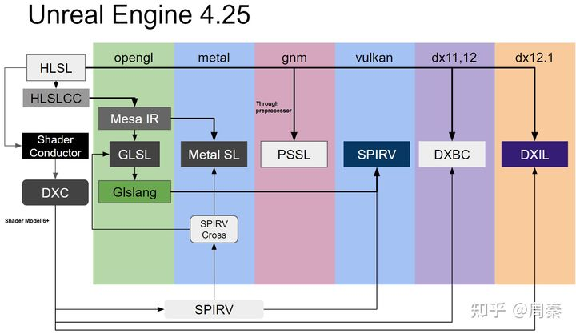

[TOC]

# 一、UE4 GamePlay 架构

UObject 的整体继承关系如下：


## 1. <span id="inherit">继承与组合关系</span>

UObject 在 Gameplay 架构里的继承关系如下：

> 查看原图更清晰


Gameplay 架构组合关系大体如下

> 查看原图更清晰


## 2. MVC 的数据处理方式

Gameplay 架构类按照 MVC 设计理念分类如下


# 二、UE4 多线程

虽然 UE4 遵循 C++11 标准，但并没有使用 std::thread，而是自己实现了一套多线程机制，用法上很像 Java

## 1. 无序并行 AsyncTask 系统

FAsyncTask 模板类使用示例

```c++
// 1. 定义自己的 Task 类
class ExampleAsyncTask : public FNonAbandonableTask
{
    friend class FAsyncTask<ExampleAsyncTask>;

    int32 ExampleData;
    
    ExampleAsyncTask(int32 InExampleData): ExampleData(InExampleData) { }

    // Task 需要执行的具体执行的操作
    void DoWork() { }

    FORCEINLINE TStatId GetStatId() const
    {
        RETURN_QUICK_DECLARE_CYCLE_STAT(ExampleAsyncTask, STATGROUP_ThreadPoolAsyncTasks);
    }
};

// 2. 调用自定义的 Task 类实例
void Example()
{
    FAsyncTask<ExampleAsyncTask>* MyTask = new FAsyncTask<ExampleAsyncTask>( 5 );
    MyTask->StartBackgroundTask();
    //--or --
    MyTask->StartSynchronousTask();

    //to just do it now on this thread
    //Check if the task is done :
    if (MyTask->IsDone())
    {
    }

    //Spinning on IsDone is not acceptable( see EnsureCompletion ), but it is ok to check once a frame.
    //Ensure the task is done, doing the task on the current thread if it has not been started, waiting until completion in all cases.

    MyTask->EnsureCompletion();
    delete Task;
}
```


**异步**线程池执行的层级顺序

1. FAsyncTask 模板类实现了 IQueuedWork 的接口，将自定义的 Task 放入线程池中（多个 Task 被分配到多个线程中，**分配顺序和执行顺序无关**）
2. FQueuedThreadPool 控制多个线程资源的分配，包含多个 FQueuedThread 实例
3. FQueuedThread 控制单个线程的调度，包含 FRunnableThread
4. FRunnableThread 存储单个线程信息，包含 FRunnable
5. FRunnable 执行线程内方法，常被当作参数对象传递

> 查看原图更清晰


## 2. 有序并行 TaskGraph 系统

TaskGraph 使用示例

- FTaskThreadAnyThread 会将 FBaseGraphTask 按照**优先级**放到 IncomingAnyThreadTasks 数组里（这个优先级队列可以在运行时**可以修改**）
- FNamedTaskThread 会将  FBaseGraphTask 按照**优先级**放到 IncomingAnyThreadTasks 数组里（运行时**无法修改**）
- **任务依赖**：
  一个任务的执行可能依赖于多个事件对象，这些事件对象都触发之后才会执行这个任务
  而这个任务完成后，又可能触发其他事件，其他事件再进一步触发其他任务

```c++
// 1. 定义自己的 Task 类
// 如 FTickFunctionTask、FReturnGraphTask，不需要继承，要实现如下几个静态函数
class FMyTestTask
{
public:
    FMyTestTask() { }
    
    FORCEINLINE static TStatId GetStatId()
	{
		RETURN_QUICK_DECLARE_CYCLE_STAT(FMyTestTask, STATGROUP_TaskGraphTasks);
	}
    
    static const TCHAR*GetTaskName()
	{
		return TEXT("FMyTestTask");
	}
    
    // 在哪个线程上执行
	static ENamedThreads::Type GetDesiredThread()
	{
        // option:
        // - AnyThread: 无名称的任意 Task 线程
        // - StatThread、RHIThread、AudioThread、
        //   GameThread、ActualRenderingThread: 有名称的 Task 线程
		return ENamedThreads::AnyThread;
	}
	static ESubsequentsMode::Type GetSubsequentsMode()
	{
        // option:
        // - TrackSubsequents: 存在后续任务
        // - FireAndForget: 没有后续任务
		return ESubsequentsMode::TrackSubsequents;
	}

    // Task 需要执行的具体执行的操作
	void DoTask(ENamedThreads::Type CurrentThread, const FGraphEventRef& MyCompletionGraphEvent) { }
};

// 2. 调用自定义的 Task 类实例
void Example()
{
	FGraphEventRef iJoin = TGraphTask<FMyTestTask>::CreateTask(
		NULL,						// 该任务依赖事件数组
        ENamedThreads::GameThread   // 该任务需要执行的线程，默认是 AnyThread
    ).ConstructAndDispatchWhenReady();
    
    FTaskGraphInterface::Get().WaitUntilTaskCompletes(iJoin, ENamedThreads::GameThread_Local);
    
    // 如果当前的线程有 Task 任务，他就创建一个 ScopeEvent
    FScopedEvent Event;
	TriggerEventWhenTasksComplete(Event.Get(), Tasks, CurrentThreadIfKnown);
}
```


TaskGraph 执行的层级顺序

1. TGraphTask 模板类将自定义的 Task，交给 FTaskGraphInterfaceImplementation
2. FTaskGraphInterfaceImplementation 按照优先级排列 Task 后**通过事件调度** Task 到 FWorkThread 数组里
3. FWorkThread 是一个 Task（FTaskThreadBase）和 Task 运行线程（FRunnableThread）的**集合**
4. FTaskThreadBase  执行线程内方法，常被当作参数对象传递

> 查看原图更清晰


## 3. UE4 线程调用

### 3.1 线程的执行顺序


线程都附加在 TaskGraph 系统里，总体流程执行顺序：
其中 GameThread 为主线程，在 `RenderThread::StartRenderThread` 函数中先后创建 RHI 和 Render 线程

1. **GameThread（Main Thread）**
   执行 AI、碰撞、寻路、物理等游戏逻辑后通过宏定义 `ENQUEUE_RENDER_COMMAND` 生成各种 CMD（平台无关）传入渲染线程中
2. **RenderThread（渲染前端）**
   执行 `TEnqueueUniqueRenderCommandType` 等类型的 CMD
   将其转化成指定图形的调用 Graphical Command 传入 RHI 线程中（**可并行生成 CMD**）
   CMD 对象**种类不固定**的在运行时可根据不同的逻辑自定义
4. **RHIThread（渲染后端 Render Hardware Interface）**
   启用该线程需要将 `r.RHIThread.Enable` 设为 1，否则将会在渲染线程执行
   使用 **FRHIResource** 资源，该资源采用引用计数的方式管理内存
   执行 Graphical Command，将数据提交到 GPU 执行（**可并行处理 CMD**）
   CMD 对象**种类固定**的，通过宏定义 `FRHICOMMAND_MACRO` 声明后在调用（最初的RHI是基于D3D11 API设计而成）
   


### 3.2 线程间的同步

GameThread 不可能领先于 RenderThread 超过一帧，否则 GameThread 会等待渲染线程处理完
**同步时机**：

- GameThread 和 RenderThread 之间，通过渲染命令栅栏同步
  RenderThread  和 RHIThread 之间，通过 SwapBuffer 同步
- 引擎循环的 `FEngineLoop::Tick` 末尾添加同步函数 `FFrameEndSync::Sync` 向渲染线程添加栅栏

```c++
// 渲染命令栅栏
class RENDERCORE_API FRenderCommandFence {
public:
    // 向渲染命令队列增加一个栅栏. bSyncToRHIAndGPU 是否同步 RHI 和 GPU 交换 Buffer, 否则只等待渲染线程.
    void BeginFence(bool bSyncToRHIAndGPU = false); 

    // 等待栅栏被执行. bProcessGameThreadTasks没有作用.
    void Wait(bool bProcessGameThreadTasks = false) const;

    // 是否完成了栅栏.
    bool IsFenceComplete() const;

private:
    mutable FGraphEventRef CompletionEvent; // 处理完成同步的事件
    ENamedThreads::Type TriggerThreadIndex; // 处理完之后需要触发的线程类型.
};
```


## 4. UE4 线程间通讯

游戏线程和渲染线程内部使用的数据结构对比，详见 [一、1.继承与组合关系](#inherit)

```c++
// Game Thread
UWorld->ULevel->AActor->UActorComponent(UPrimitiveComponent)

// Render Thread
FSceneRenderer->FScene
    		  ->TArray<FViewInfo>
```

不同线程，同种数据的对应关系

| Game Thread                                  | Render Thread                                          |
| :------------------------------------------- | :----------------------------------------------------- |
| UWorld                                       | FScene                                                 |
| UPrimitiveComponent                          | FPrimitiveSceneProxy / FPrimitiveSceneInfo             |
| -                                            | FSceneView / FViewInfo                                 |
| ULocalPlayer                                 | FSceneViewState                                        |
| ULightComponent                              | FLightSceneProxy / FLightSceneInfo                     |
| FVertexStreamComponent                       | FVertexStream / FVertexElement                         |
| UMaterial（父类 UMaterialInterface）         | FDefaultMaterialInstance（父类 FMaterialRenderProxy）  |
| UMaterialInstance（父类 UMaterialInterface） | FMaterialInstanceResource（父类 FMaterialRenderProxy） |

尝试跨线程操作数据，将会引发不可预料的结果
有些对象作为线程间数据的传递者（FPrimitiveSceneProxy、FLightSceneProxy）会在**游戏线程**创建，在**渲染线程**执行，最后在**渲染线程**销毁


### 4.1 数据的传递与更新

```c++
// 数据传递
// 1. UWorld -> FScene
//    UWorld 里有成员变量指针 FSceneInterface* Scene
//	  FScene 的构造函数内部总会让传入的 UWorld 对象的 Scene 指向 FScene 对象本身 

// 2. UPrimitiveComponent -> FPrimitiveSceneProxy
FPrimitiveSceneProxy::FPrimitiveSceneProxy(const UPrimitiveComponent* InComponent, FName InResourceName);
void FScene::AddPrimitive(UPrimitiveComponent* p) {
    p->CreateSceneProxy();
}
    
    
// 数据更新：为了高效，游戏更新（Tick）和渲染更新（遍历场景）是异步的，并不同时进行
// 在 UWorld 的 Tick 里，遍历所有可见的 Actor (这里用 UActorComponent 的子类 ULightComponent 来举例)
void ULightComponent::SendRenderTransform_Concurrent() {
    GetWorld()->Scene->UpdateLightTransform(this);
    Super::SendRenderTransform_Concurrent();
}
```


### 4.2 共享数据的生命周期管理

**UObject**

- 创建和销毁：都在**游戏线程**，使用渲染同步命令 `FRenderCommandFence` 防止 GC 在渲染线程使用 UObject 时，游戏线程提前将其删除
- 管理生命周期的方式：**Garbage Collection**（GC）


**FRenderResource**

- 创建和销毁：本身的创建和销毁在游戏线程，但其 **InitResources / ReleaseResources** 方法都在**渲染线程**
- 管理生命周期的方式：引用计数
- **静态资源**（游戏初始化完成后便不在更新）
  通过每帧不断查询标志位信息 `USkeletalMesh::IsReadyForFinishDestroy ` 来判断渲染线程
  是否已经不在占用游戏线程已释放的对象，来销毁游戏线程对象
- **动态资源**（运行时需要不断更新）
  通过将游戏线程数据拷贝到渲染线程数据来传递数据，当渲染资源释放时
  将已经释放渲染资源的游戏线程对象加入到延迟渲染队列中去，等待下一帧释放游戏线程对象


# 三、UE4 的渲染流程

渲染的宏观流程：渲染数据（场景/图像） > 渲染器 > 上下文

一个3D渲染引擎的核心工作就是组织好这一宏观上的工作流，使其最大化利用目标平台的硬件资源（CPU,GPU,内存，硬盘或闪存等）和特性，使其使用最便利、性能最优，效果最佳


## 1. Mesh Draw Pipeline

基本的图形 API 调用流程

1. 构造三角形顶点和索引数据
2. 创建 GPU 的资源并绑定
3. 清理图像 buffer 背景
4. 绘制三角形


商业游戏引擎在调用图形 API 前会有更多的操作

1. 遮挡剔除
2. 动态 / 静态合拼
   动态 Instance
3. 缓存状态和命令
4. 生成中间指令
5. 转译成图形 API 指令


**UE4.21 及之前**

1. 遍历场景的所有经过了可见性测试的 FPrimitiveSceneProxy 对象
2. 通过 FPrimitiveSceneProxy 收集不同的 FMeshBatch
3. 通过不同的渲染 Pass 中遍历 FMeshBatch 生成 Pass 对应的 RHICommandList 命令
4. 根据 RHICommandList 的命令调用 图形 API 指令


**UE4.22 及之后**
UE4.23 支持**移动端**的动态实例化渲染

1. 遍历场景的所有经过了可见性测试的 FPrimitiveSceneProxy 对象
2. 通过 FPrimitiveSceneProxy 收集不同的 FMeshBatch
   在这一步缓存**静态网格**的绘制命令（缓存并重用 FMeshBatch，动态路径不会缓存，缓存不会改变资源的生命周期）
3. **通过不同的渲染 Pass 在 FMeshPassProcessor 中遍历 FMeshBatch 生成 FMeshDrawCommand**
   在这一步缓存**静态网格**的绘制命令（缓存并重用 FMeshDrawCommand，动态路径不会缓存，缓存不会改变资源的生命周期，不能依赖依 FSceneView）
4. 通过不同的渲染 Pass 中生成的 FMeshDrawCommand 转换成对应的 RHICommandList 命令
5. 根据 RHICommandList 的命令调用 图形 API 指令


### 1.1 动态绘制路径

> **动 / 静态绘制并不冲突，一个 AActor 可能既有动态元素，又有静态元素**

方法：在运行阶段合并多个 Actor 作为一个资源

应用场景：一个建筑如果是一个模型的话

- 是一个 drawcall，如果分成十个模型拼组成建筑就是十个 drawcall
- 只看到这个建筑的一个像素，引擎也会把整个房子渲染一遍


UE并没有像 Unity 那样的动态合批功能，只有编辑器阶段手动合网格

- 合并的网格不能撤销，需要**谨慎操作**
- 合并的网格可以被导出到其他三维软件再次编辑


### 1.2 静态绘制路径

方法：在开发阶段合并多个 Actor 作为一个资源

应用场景：

- **UInstancedStaticMeshComponent(ISM)**：静态的模型 Instance
  只有位置相异而 mesh 和材质均完全相同的物体可以合并成一个 Actor，在理想情况下只提交一次DrawCall
  ISM 好处是 DrawCall 少，坏处是 LOD 计算，裁剪和 OC 等等都是按一个对象来做，往往 ISM 的 Drawcall 减少了，但提交渲染的三角形却更多了
- **UHierarchicalInstancedStaticMeshComponent(HISM)：**基于分层实现
  一个 Mesh 有大量实例时分区域进行裁剪、计算 LOD，UE中 的植被就是 HISM 的子类
  HISM 的实现有两部分
  一部分是构建分层（自动化的，每次修改它的 instance 个数、位置等都会触发）并保存到文件中
  另一部分则是基于分层的可见性计算、LOD 和渲染组织


静态绘制路径通常可以被缓存，所以也叫缓存绘制路径，适用的对象可以是静态模型


## 2. 渲染中各个 Pass 绘制流程

流程总览

1. **PrePass / Depth Only Pass**（Early Z Pass）
   使用 FDepthDrawingPolicy 策略进行绘制，只绘制 depth 到 Depth-Buffer，这个有利于减少后面的 Base pass 中的 pixel 填充，节省 pixel-shader 的执行
2. **Base pass**
   绘制不透明体和 masked material 属性的几何体，输入材质属性到 G-Buffer
   计算 Lightmap 和 sky lighting 的贡献量到 scene color buffer
3. **Issue Occlusion Queries / BeginOcclusionTests**
   执行遮挡查询（通过绘制几何体的包围盒进行 z-depth 测试）
   在绘制下一帧时，InitView 会使用这些信息进行可见性判断
4. **ShadowMap**
   针对每个光源渲染相应的 Shadowmap，光源也被累积到 translucency lighting volumes 中
5. **Lighting**（光照计算）
   分为如下子阶段:
   Pre-lighting composition lighting stage 预处理组合型光照(eg. deferred decals, SSAO)
   Render lights
6. **Draw atmosphere**
   对非透明表面绘制大气效果
7. **Draw Fog**
   针对非透明表面逐像素计算雾
8. **Draw translucency**
   在离屏渲染 RT 上（也是绘制雾的 RT）绘制半透明几何体（在单个 pass 中计算光照的最终透明度来混合）
9. **Post Processing**
   绘制 BoxBlur 等这样的后处理效果


# 四、UE4 渲染技巧

## 1. 光源


## 2. 阴影


# 五、UE4 材质系统

材质是多个 Shader 和它们所需要的资源和参数的组合，材质系统建立于 Shader 系统之上

## 1. 缓存对象

通过 Shader 关联容器 Shader Map（统称）可知一组最复杂的关联数据由 FMaterial、FVertexFactoryType、EMeshPass 类型 三个方面构成


Shader 的容器 **Shader Map**（存储运行时编译后的 shader 代码，最后由 FMaterialResource 持有）

- FGlobalShaderMap：保存并管理着所有编译好的 FGlobalShader 代码，在 `FEngineLoop::PreInitPreStartupScreen` 初始化完成
- FMaterialShaderMap：存储和管理着一组 FMaterialShader 实例的对象（Mesh 无关 Shader，种类少）
- FMeshMaterialShaderMap：存储和管理一组 FMeshMaterialShader 实例的对象（Mesh 相关 Shader，种类多）


**离线缓存（开发阶段）**

- 打包预编译获得的数据保存在工程目录的 Saved 目录下，后缀是 `.upipelinecache`


**运行时缓存**

- 早期的 UE 用 FShaderCache 来缓存
- UE4.26 用 FShaderPipelineCache 来代替 FShaderCache 缓存


## 2. 运行对象

### 2.1 材质

**UMaterial**：对应着在材质编辑器编辑的 uasset 资源文件，继承自 UMaterialInterface
UMaterialInterface 继承自 UObject其内部包含物理材质 UPhysicalMaterial，内部属性和编辑器里的属性面板一致
一般作为母材质，来描述一类材质（<u>其子材质对象为 UMaterialInstance，只是参数上有区别</u>）

**UMaterialInstance**：对象的构造依赖 UMaterial 对象，只能覆盖 UMaterial 的部分参数，继承自 UMaterialInterface
UMaterialInstance 的母材质可以有多层，其最顶层一定是 UMaterial，中间都是 UMaterialInstance

- 子类 **UMaterialInstanceConstant**：固定材质实例，用于编辑器预先创建和编辑好的材质实例资源
  运行时修改材质不会重新编译，应用：地貌的材质

- 子类 **UMaterialInstanceDynamic**：动态材质实例，可在运行时动态创建和修改材质属性
  运行时修改材质不会重新编译，应用：特效变化

  

**FMaterialResource**：继承自 FMaterial，用于将材质数据传递到渲染器
不仅仅包含 UMaterial 的材质信息，还包含当前渲染 Pass 需要的 Vertex Factory、ShaderMap、ShaderPipelineline、FShader 及各种着色器参数等


### 2.2 Shader

**Shader Parameter**：松散参数，一组由 CPU 的 C++ 层传入 GPU Shader 并存储于 GPU 寄存器或显存的数据（FRHITexture、UAV、Uniform buffer）
没有统一的父类，一般只有一层类
Parameter 类型和到 GPU 的数据类型一一对应，一个 Parameter 类型对应一种 GPU 数据

```c++
// 在 UE4.22 及以上版本
// LAYOUT_FIELD 是可以声明指定着色器参数的类型、名字、初始值、位域、写入函数等数据的宏
LAYOUT_FIELD(FShaderParameter, ShaderParam); // 等价于: FShaderParameter ShaderParam;
```


**Shader Permutation**：UE Shader 的自定义数据类型，方便将用户的自定义类型转化为 UE 的自定义类型填充到 HLSL，编译出对应的着色器代码
可以让用户定义的数据 和 Permutation 值是 1 对 多 的映射关系

```c++
// UE Shader 自己的 bool 类型
struct FShaderPermutationBool { /** static functions */ }

// 对应的宏定义声明 
// 注意宏定义里 FShaderPermutationBool 前面的 public
#define SHADER_PERMUTATION_BOOL(InDefineName) \
public FShaderPermutationBool { \
	public:\
        static constexpr const TCHAR* DefinedName = TEXT(InDefineName); \
}

// 使用时
class FDeferredLightPS : public FGlobalShader {
    // 相当于继承了全都是静态函数的 FShaderPermutationBool 类
    // class FSourceTextureDim : public FShaderPermutationBool { ... };
    class FSourceTextureDim : SHADER_PERMUTATION_BOOL("USE_SOURCE_TEXTURE");
}
```


**Uniform Buffer**：最底层的是 RHI 层的 FRHIUniformBuffer，封装了各种图形 API 的统一缓冲区（也叫 Constant Buffer）
继承自 FRenderResource 在 UE4.27 的版本相比 4.21 版本减少了许多对象

**Vertex Factory**：表示 Mesh 类型，它的一种子类只表示一种网格类型
继承自 FRenderResource，

- 顶点着色器
  顶点着色器的输入输出需要顶点工厂来表明数据的布局
- 顶点工厂的参数和 RHI 资源
  这些数据将从 C++ 层传入到顶点着色器中进行处理
- 顶点缓冲和顶点布局
  通过顶点布局，我们可以自定义和扩展顶点缓冲的输入，从而实现定制化 Shader 代码
- 几何预处理
  顶点缓冲、网格资源、材质参数等等都可以在真正渲染前预处理它们


**FShader**：已经编译好的着色器代码和它的参数绑定的类型
存储着 Shader 关联的绑定参数、顶点工厂、编译后的各类资源等数据，并提供了编译器修改和检测接口，其子类有

- **FGlobalShader**
  全局着色器，只有唯一的实例，常用于屏幕绘制、后处理、光照、工具类、可视化、地形、虚拟纹理等**不需要与材质交互**的方面

- **FMaterialShader**
  材质着色器，由 FMaterialShaderType 指定的材质引用的着色器，是材质蓝图在实例化后的一个 shader 子集

- 自定义的 Shader

  ```c++
  // Shader 声明和实现宏
  // 声明指定类型（FShader子类）的 Shader, 可以是 Global, Material, MeshMaterial, ...
  #define DECLARE_SHADER_TYPE(ShaderClass,ShaderMetaTypeShortcut,...)
  // 实现指定类型的 Shader, 可以是 Global, Material, MeshMaterial, ...
  #define IMPLEMENT_SHADER_TYPE(TemplatePrefix,ShaderClass,SourceFilename,FunctionName,Frequency)
  
  // 声明 FGlobalShader 及其子类.
  #define DECLARE_GLOBAL_SHADER(ShaderClass)
  // 实现 FGlobalShader 及其子类.
  #define IMPLEMENT_GLOBAL_SHADER(ShaderClass,SourceFilename,FunctionName,Frequency)
  
  // 实现Material着色器.
  #define IMPLEMENT_MATERIAL_SHADER_TYPE(TemplatePrefix,ShaderClass,SourceFilename,FunctionName,Frequency)
  
  // 其它不常见的宏
  [......]
  
  // 例
  class FDeferredLightPS : public FGlobalShader
  {
      // 1. 在 FDeferredLightPS 类内声明全局着色器
      DECLARE_SHADER_TYPE(FDeferredLightPS, Global)
      [......]
  };
  
  // 2. 实现 FDeferredLightPS 着色器, 让它和代码文件, 主入口及着色频率关联起来.
  IMPLEMENT_GLOBAL_SHADER(FDeferredLightPS, "/Engine/Private/DeferredLightPixelShaders.usf", "DeferredLightPixelMain", SF_Pixel);
  ```


### 2.3 Shader 变种

Shader 变种不会被存储在开发文件中，在根据平台打包 Cook 的时候生成
过多的 Shader 变种会导致包体积的膨胀，增加内存占用

- Mesh 无关的材质，一般对应生成一个 Shader
- Mesh **有关**的材质，会根据用途不同对应生成很多 Shader Code，叫做变种


**Shader 变种的数量** = Permutation Count * **(**<u>VertexFactoryType \* MeshShaderType + MaterialShaderType + ShaderPipelineType \* StageTypes</u>**)**
其中部分 Shader 可以根据判断条件不去编译，从而避免无用的组合变种出现


## 3. 编译流程

材质和 Shader 的编译都是一个**离线的过程**，一般在项目启动／打包时进行

**编译 Material**（Cook 时）
在材质编辑器中，每个材质节点 UMaterialGraphNode 都有一个 UMaterialExpression（表达式）成员实例
而多个 UMaterialGraphNode 存放在 UMaterialGraph 中，最终由 UMaterial 包含 UMaterialGraph 的信息
流程（自定义 C++ 材质时，就需要根据编译流程将对应的 C++ 对象都实现）

1. FMaterial开始不断的序列化内部 ShaderMap 数据
2. FHLSLMaterialTranslator 通过 MaterialTemplate.ush 编译材质
3. 编译后的 Shader 代码保存到 FMaterialShaderMap 缓存起来，防止重复编译 
   材质编辑器之中是可以查看填充 MaterialTemplate 之后的各个目标平台代码（UEEditor / Window / Shader code / HLSL code）


**编译 Shader**（Cook 时）
UE4 为了方便跨平台编译，基于[Mesa GLSL parser and IR](https://www.mesa3d.org/) 造了个自己的轮子 HLSLCC（HLSL Cross Compiler）
通过**输入 HLSL 源码**，会先转成 MCPP，然后转换成各种 shader language 的源代码

生成 Shader 文件的编译流程如下

1. 收集 Shader 的各种变种的可能
2. 通过 `GShaderCompilingManager` 对象的 `FShaderCompilingManager::AddJobs` 方法
3. 通过 `FShaderCompileThreadRunnable::PullTasksFromQueue` 方法拉取作业并执行（多生产者多消费者模式）




**注：**由于 OpenGL 和 DirectX 的 UV 坐标不一致，UE4 为了操作的一致性，将 OpenGL 的 UV 进行了垂直翻转（渲染后期会再次翻转回去）


**编译 Shader**（运行时）

Shader 还有一个阶段由于图形驱动的限制只能放到运行时编译
Shader 的**运行时编译**一般产生在准备加载场景时为了不在内存中缓存 Shader Code，避免运行时卡顿

1. 通过运行时预处理所有可能用到的 Shader 变种，记录到列表中
2. 在加载场景时进行 Shader 编译（指生成 Shader Program）


## 4. 文件库存储

UE 的内置 Shader 文件在 Engine\Shaders 目录下

- `.ush` Shader 的声明文件（头文件，可被 include，例 `#include "Common.ush"`）
- `.usf` Shader 的定义文件（不可被 include）
- `.tps` Shader 的功能介绍，证书说明文件，本质是 xml 文件


常用 USH 文件介绍

- **Platform.ush**
  定义了跟图形API（DirectX、OpenGL、Vulkan、Metal）和 FEATURE_LEVEL 相关的宏、变量及工具类接口
- **Common.ush**
  包含了图形 API 或 Feature Level 相关的宏、类型、局部变量、静态变量、基础工具接口等
- **Definitions.ush**
  预先定义了一些常见的宏，防止其它模块引用时出现语法错误
- **ShadingCommon.ush**
  定义了材质所有着色模型，并提供了少量相关的工具类接口
  其中 UE 默认的 ShadingModel ID 只占用 4bit，最多 16 个，而目前 UE 内置着色模型已占用了 13 个，意味着自定义的 ShadingModel 最多只能 3 个了
- **BasePassCommon.ush**
  定义了 BasePass 的一些变量、宏定义、插值结构体和工具类接口
- **VertexFactoryCommon.ush**
  定义了顶点变换相关的辅助接口
- **LocalVertexFactoryCommon.ush**
  顶点工厂的数据插值结构体及部分辅助接口
- **BRDF.ush**
  双向反射分布函数模块，提供了很多基础光照算法及相关辅助接口
- **ShadingModels.ush**
  着色模型以及光照计算相关的类型和辅助接口


**文件和 C++ 对象建立联系**

```c++
// 1. 新建着色器文件 iShaderFile.usf
float4 MyColor;
float4 MainPS() : SV_Target0
{
    return MyColor;
}

// 2. 新建 C++ 类（对应着色代码中 PS 函数）
#include "GlobalShader.h"
class FMyTestPS : public FGlobalShader
{
    DECLARE_EXPORTED_SHADER_TYPE(FMyTestPS, Global, /*MYMODULE_API*/);

    FShaderParameter MyColorParameter;

    FMyTestPS() { }
    FMyTestPS(const ShaderMetaType::CompiledShaderInitializerType& Initializer)
        : FGlobalShader(Initializer)
    {
        // 3. 绑定 C++ 的成员变量到 Shader 文件中的参数 MyColor
        MyColorParameter.Bind(Initializer.ParameterMap, TEXT("MyColor"), SPF_Mandatory);
    }
}

// 4. 注册着色器类型
//    建立着色器文件 iShaderFile.usf 到 着色入口函数 MainPS 与频率/着色阶段（SF_Pixel）的映射关系
IMPLEMENT_SHADER_TYPE(, FMyTestPS, TEXT("iShaderFile"), TEXT("MainPS"), SF_Pixel);
```


## 5. 调试和优化

**调试 Shader**

同过修改 `Engine\Config\ConsoleVariables.ini` 内的配置变量，查看 Shader 源码（不开启将是汇编指令）单步调试

- **r.ShaderDevelopmentMode**=1
  获得关于着色器编译的详细日志和错误重试的机会
- **r.DumpShaderDebugInfo**=1
  将编译的所有着色器的文件保存到磁盘 `ProjectName/Saved/ShaderDebugInfo` 目录
  包含源文件、预处理后的版本、一个批处理文件（用于使用编译器等效的命令行选项来编译预处理版本）
- **r.Shaders.Optimize**=0
  禁用着色器优化，使得 shader 的调试信息被保留
- **r.DumpShaderDebugShortNames**=1
  保存的 Shader 路径将被精简
- **r.Shaders.KeepDebugInfo**=1
  保留调试信息，配合 RenderDoc 等截帧工具时特别有用
- **r.Shaders.SkipCompression**=1
  忽略 shader 压缩，省调试时间


**通过 UE4 控制台输入调试 Shader**

- 控制台输入 `RecomplieShaders` 命令可以重新编译 Shader，这样就不需要通过重启 UE 编辑器来重新编译 Shader 了
- [通过在 VisualStudio 配置后，在通过 ShaderCompileWorker 的命令来调试 Shader](https://docs.unrealengine.com/4.26/zh-CN/ProgrammingAndScripting/Rendering/ShaderDevelopment/ShaderCompileProcess/)


**优化 Shader 的执行效率**

1. 通过减少不必要的功能配置来减少 Shader 自动生成的种类
   

2. 同过关闭部分模块有的 `ShouldCompilePermutation` 接口来减少 Shader 自动生成的种类 FShader
   以下模块都有此接口
   FGlobalShader、FMaterialShader、FMeshMaterialShader、FVertexFactory
   FLocalVertexFactory、FShaderType、FGlobalShaderType、FMaterialShaderType

3. 关闭材质属性模板的 `Usage / Automatically Set Usage in Editor` 选项，防止编辑过程中产生额外的标记，减少 Shader 自动生成的种类 FShader

4. 减少在材质蓝图中的 Switch 节点的使用

5. 指令优化

   ```c++
   /**
   1. 避免 if、switch 分支语句
   2. 避免 for 循环语句，特别是循环次数可变的
   3. 避免或减少临时变量
   4. 减少纹理采样次数
   5. 减少复杂数学函数调用
   6. 尽量将 Pixel Shader 计算移到 Vertex Shader 
      例如像素光改成顶点光
   7. 降分辨率渲染
      有些信息没有必要全分配率渲染，如模糊的倒影、SSR、SSGI 等
   8. 尽可能用 Compute Shader 代替传统的 VS、PS 管线
      CS 的管线更加简单、纯粹，利于并行化计算，结合 LDS 机制，可有效提升效率
   9. 禁用 clip 或 discard 操作
   10. 分级策略
       不同画质不同平台采用不同复杂度的算法
   
   11. 顶点输入应当采用逐 Structure 的布局，避免每个顶点属性一个数组
       逐 Structure 的布局有利于提升 GPU 缓存命中率
   
   12. 使用更低精度的浮点数
       OpenGL ES 的浮点数有三种精度（很多计算不需要高精度，可以改成低精度浮点）
       - highp（32位浮点）
       - mediump（16位浮点）
       - lowp（8位浮点）
   */
   
   // 13. 避免重复计算
   // - 将跟顶点或像素无关的计算移到 CPU，然后通过 uniform 传进来
   // - 可以将所有像素一样的变量提前计算好，或者由 C++ 层传入：
   precision mediump float;
   float a = 0.9;
   float b = 0.6;
   
   varying vec4 vColor;
   
   void main() {
       gl_FragColor = vColor * a * b; // a * b每个像素都会计算，导致冗余的消耗。可将 a * b 在 c++ 层计算好再传进 shader
   }
   
   // 14. 向量延迟计算
   highp float f0, f1;
   highp vec4 v0, v1;
   v0 = (v1 * f0) * f1; // v1 和 f0 计算后返回一个向量，再和 f1 计算，多了一次向量计算
   // 改成：
   v0 = v1 * (f0 * f1); // 先计算两个浮点数，这样只需跟向量计算一次
   
   // 15. 充分利用向量分量掩码
   highp vec4 v0;
   highp vec4 v1;
   highp vec4 v2;
   v2.xz = v0 * v1; // v2 只用了 xz 分量，比 v2 = v0 * v1 的写法要快
   ```


# 引用

- [《Exploring in UE4》多线程机制详解 原理分析 - 知乎 (zhihu.com)](https://zhuanlan.zhihu.com/p/38881269)
- [剖析虚幻渲染体系（02）- 多线程渲染 - 0向往0 - 博客园 (cnblogs.com)](https://www.cnblogs.com/timlly/p/14327537.html)
- [A new, community-hosted Unreal Engine Wiki - Announcements and Releases - Unreal Engine Forums](https://forums.unrealengine.com/t/a-new-community-hosted-unreal-engine-wiki/141494)
- [Unreal Engine 4 Materials Tutorial](https://links.jianshu.com/go?to=https%3A%2F%2Fwww.raywenderlich.com%2F504-unreal-engine-4-materials-tutorial)
- [UE4 Instance 使用 – Cheney Shen](https://cheneyshen.com/ue4-instance-使用/)
- [UE4 Mesh Drawing pipeline official](https://docs.unrealengine.com/zh-CN/Programming/Rendering/MeshDrawingPipeline/index.html)
- [游戏程序员的自我修养-房燕梁 ](https://neil3d.github.io/unreal/mcpp-fork-join.html)
- [Unreal Engine 4 Rendering Part 2: Shaders and Vertex Data](https://medium.com/@lordned/unreal-engine-4-rendering-part-2-shaders-and-vertex-data-80317e1ae5f3)
- [Unreal Engine 4 Rendering Part 5: Shader Permutations](https://medium.com/@lordned/unreal-engine-4-rendering-part-5-shader-permutations-2b975e503dd4)
- [调试着色器编译过程 | 虚幻引擎文档 (unrealengine.com)](https://docs.unrealengine.com/4.26/zh-CN/ProgrammingAndScripting/Rendering/ShaderDevelopment/ShaderCompileProcess/)
- [着色器开发 | 虚幻引擎文档 (unrealengine.com)](https://docs.unrealengine.com/4.26/zh-CN/ProgrammingAndScripting/Rendering/ShaderDevelopment/)
- [新建全局着色器为插件 | 虚幻引擎文档 (unrealengine.com)](https://docs.unrealengine.com/4.26/zh-CN/ProgrammingAndScripting/Rendering/ShaderInPlugin/QuickStart/)
- [启用和编译 PSO 缓存 | 虚幻引擎文档 (unrealengine.com)](https://docs.unrealengine.com/4.27/zh-CN/SharingAndReleasing/PSOCaching/EnablingBuildingPSOCaching/)

