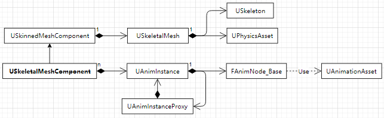

[TOC]

# 一、粒子系统

UE4 有两种粒子系统

- Cascade 粒子系统
  通过 CPU 主线程来计算粒子属性值
  通过 Level Of Detail（LOD）让远处的粒子配置的简洁，近处的粒子配置的复杂的方法来降低粒子的功耗
- Niagara 粒子系统

## 1. Cascade 编辑器配置

### 1.1 普通粒子

普通的粒子包涵的多个粒子发射器的集合，其中一个粒子发射器有以下模块：

- **Required**（默认模块，无法删除）
  包含了一些属性，都是对粒子系统绝对需要用到的属性，比如粒子使用的材质，发射器发射粒子的时间，以及其他
- **Spawn**（默认模块，无法删除）
  这个模块控制粒子从发射器生成的速度（个/秒）= Rate * Rate Scale，它们是否以 Burst 生成（爆破形式），以及其他和粒子发生时机有关的属性
- **Lifetime**
  定义了每个粒子在生成后存在的时间（单位：秒），**决定了粒子的最终长度**
- **发射器类型数据模块**（只能有一个，不能重复添加）
  发射器默认都是面片发射器
  可以不使用该模块

### 1.2 Ribbon 条带粒子

> 条带粒子的发射源头可能不止一个，因此其发射配置不能使用默认的 Spawn 模块（由于默认模块无法删除，通过将发射速率设置 0 来关闭 Spawn 模块）

**Trail/Source 模块**：指定条带粒子发射器的位置配置

- PET2SRCM Default 粒子发射器位置**实时跟随**粒子组件 attach 的组件上
- PET2SRCM Particle 粒子发射器位置**实时跟随**另一个粒子发射器产生的粒子
- PET2SRCM Actor 粒子发射器位置**实时跟随** Actor 对象

**Spawn PerUnit 模块**：Source 模块为 **PET2SRCM Default** 模式下配置有效
用于物体**只有移动时**才会产生拖尾的效果

- Unit Scalar 每秒条带的长度
- Spawn Per Unit 每秒粒子发射数
- 每个条带每秒内每单位位移产生的粒子个数：Spawn Per Unit / Unit Scalar，**会使发射器移动速度影响条带的粗细**
  如果每个条带每秒内每单位位移产生粒子数过多，每个条带每秒产生的粒子总数是不变的，这会让粒子在**位移的时**产生的条带过细

**Ribbon Data 模块**：装配该数据模块的发射器在<u>移动</u>后会形成一个条带轨迹

- Sheets Per Trail 围绕条带延伸方向旋转进行渲染的面片数量
- Max Trail Count 每秒允许存活条带的数量
- Max Particle In Trail Count 所有条带总共包含的最大粒子数量，**决定每秒条带包含的固定粒子数**
  Max Particle In Trail Count = Active Particle In Trail Count + Spawn Per Unit / Unit Scalar
  会销毁过多的 Active 粒子来确保当前的 Max Particle In Trail Count 不变

## 2. 内存结构 Freelist

粒子系统采用 Freelist 的内存结构，用链表的方式存储粒子内存池的当前活动索引
避免了大量粒子产生和销毁的过程中频繁的进行内存开辟和释放

每个拖尾粒子对象都会有一个 int32 的 Flags 成员变量，它包含了在同一个尾迹内

1. 下一个拖尾粒子的索引 [13 - 0 bits] 
2. 上一个拖尾粒子的索引 [27 - 14 bits] 
3. 当前粒子的标志类型 [31 - 28 bits]

粒子对象和索引数组

- 运行时历史最长数组作为数组的最终长度
- 采用标记删除法，将删除的对象移动到数组最后，通过 ActiveParticles 来说明当前存储长度
- Start 索引标记：条带粒子的开始，将会一直指向新产生的粒子
- End 索引标记：条带粒子的结束，将会一直指向即将清除的粒子

# 二、动画系统

## 1. 基本概念

做好一个动画战斗系统最好要有一个人能全包 **资源生产** + **动画系统搭建** + **动画战斗逻辑代码编写** 才行

一般由模型编辑器制作 `.fbx` 的资源文件导入到 UE 编辑器内一个模型资源会分为 材质资源、骨架资源、骨架网格体资源，物理资源（默认是生成物理资源的导入时可选择不生成）

FBX 模型的材质资源不可用，因为模型编辑器用的渲染引擎和 UE4 并非一套渲染引擎，材质系统的结构并不相通（可以给模型编辑写到对应渲染引擎的材质导出插件）

**骨骼、动画、模型的对应关系**

- **骨骼**和动画是 一（bone）对多（Animal）关系
- **骨骼**和模型是 一（bone）对多（Animal）关系

**动画制作流程**

1. **骨架 编辑器**
   编辑骨架的关节（关节层级），用于管理骨架网格和动画的驱动（增删动画通知）
2. **骨架网格 编辑器**
   编辑骨架网格（角色外观）
3. **动画 编辑器**
   编辑动画资源，动画应用于骨架（而不是骨架网格）通过使用**相同的骨架**，多个骨架网格体可以**共享动画**
   动画导入的文件格式一般为 `.fbx`，由其他<u>模型编辑器制作</u>（动画导入时需要选择一个作用的骨骼，一般一个动画文件对应一个动作）
   动画序列资源由动画师产出，然而实际运行中，角色需要做的动作并非和动画序列资源中一模一样，而是基于一些动画序列资源的混合
   混合可以通过 BlendSpace 来实现，例：通过 移动速度 来混合 步行 和 跑步
   混合也可通过 **动画蒙太奇** 来实现，例：在动画蓝图添加一个 LayerdBlendPerBone 节点，让某一个骨骼层级播放出拳动画，而其他的播放跑步动画
4. **蓝图 编辑器**
   - **事件图** Event Graph：对应 UAnimInstance 对象
     根据事件触发（动画通知）编写逻辑来更新当前对象 Actor 的数据（计算最终骨骼 Pos）
   - **动画图** Anim Graph：对应 UAnimInstance 对象
     根据事件逻辑更新后的数据触发状态机内的**动画序列**切换逻辑以及**动画混合**方式（[可调试](https://docs.unrealengine.com/4.27/zh-CN/AnimatingObjects/SkeletalMeshAnimation/Persona/Debug/)）
   - **动画状态机**：对应 UAnimGraphNode_StateMachineBase 对象（继承自 UAnimGraphNode_Base）
     主要通过控制逻辑数据值来控制动画的切换流程
   - **不同蓝图间的互相通讯**
     <u>Pawn 蓝图类</u>可以通过 Mesh 获取动画实例 get anim instance，在进行类型转换后直接和<u>动画蓝图</u>的变量通信（读写动画蓝图的变量）
     同理，<u>动画蓝图</u>中可以通过一节点转换为 <u>Pawn 蓝图类</u>来反向通信
5. **物理资源 编辑器**
   编辑骨架网格的碰撞包围盒，用于制作布娃娃系统(RagDoll System)

**动画通知**

- 功能：当动画播放到某一帧时，需要触发个什么事情
  比如我一脚踩下去，需要脚在伸直瞬间触发一个地板塌陷的动作
- 实现：是个代理，允许延迟调用

**动画蒙太奇**（Montage）

- 功能：可以有效打断**动画图表**的执行，非常适合玩家有输入或启动某触发事件时打断**动画图表**，常与[骨骼分层动画](https://docs.unrealengine.com/4.27/zh-CN/AnimatingObjects/SkeletalMeshAnimation/AnimHowTo/AdditiveAnimations/)搭配使用
- 实现：是动画混合的应用（加法动画，分层动画）
- 使用方法：使用蒙太奇，需要在<u>动画图表</u>新增 slot 节点（插槽名称为蒙太奇名称），蒙太奇在<u>事件图表</u>里的节点设置有个 Section，负责设置播放蒙太奇的那一小节

**动画曲线**（Curve）

- 功能：方便程序根据逻辑控制动画幅度，在动画播放时更改骨骼属性，材质属性或变形目标值的方法
  由于导出的动画文件均为动画序列文件，DDC 内的曲线文件需要在 UEEdtior 内部创建动画曲线
- 方法：动画曲线本质上是动画运动的偏移或者缩放（取决于运动方式）
- 应用场景：模型面部表情的制作

**动画序列**（Sequence）

- 功能：动画序列是用来记录骨骼运动状态的资源
- 动画通知信息：记录了触发通知的类型和时间
  动画曲线信息：记录了随时间轴变化的曲线信息
  其他基础信息：包括了叠加动画设置、Root Motion 设置等信息

**Root Motion**

- 功能：让角色的位置能跟随动画旋转和位移（默认动画会随角色而一起旋转和位移）
  在播放跳远这样的动画时，没有 Root Motion 或者玩家的控制，角色只能在原地播放动画，无法进行旋转和位移
- 实现：设置一个无动画，只跟角色位置绑定的 Root 根骨骼节点
  动画运动跟随角色时：Root 节点与角色绑定，跟随角色运动
  角色运动跟随动画时：角色与 Root 节点绑定，通过动画蒙太奇及时打断**动画图表**，跟随动画运动
- 使用方法：UEEdtior > 动画蓝图 > Animation preview editor > Root motion > Mode

其他基本概念可以看更基础的 [OpenGL 教程，动画](../OpenGL/Part6_Animation.md)

## 2. 动画逻辑

### 2.1 数据结构

关键类继承树
USkeletalMeshComponent > **USkinnedMeshComponent** > UMeshComponent > **UPrimitiveComponent** > USceneComponent > UActorComponent

USkeletalMeshComponent：负责计算骨骼动画的 Pose
USkinnedMeshComponent：负责根据骨骼的 Pose 计算 Mesh 的顶点位置
UAnimInstance：对应 动画蓝图的一个（事件/动画）图，所有逻辑的控制中心，一般在**其他线程**上运行，不能在 Game play 线程对其进行读写
**UAnimInstanceProxy**：是 UAnimInstance 的代理，一般在 **Game play 线程**，与 UAnimInstance 通过复制等策略来交换数据
FAnimNode_Base：对应 动画蓝图的一个节点，只能通过 UAnimInstanceProxy 来读写 UAnimInstance 的数据

### 2.2 动画同步

在网络游戏的制作中，为了让服务器和客户端动画数据同步，UE 会有一些同步操作

### 2.3 动画事件流程

开启多线程蓝图数据更新

1. UEEditor > Project Settings > Engine > General Settings > Anim Blueprints > Allow Multi Threaded Animation Update **checked**
2. UEEditor > Animation Blueprints Window > Details broad > Optimization > Use Multi Threaded Animation Update **checked**

流程：

1. 动画对象数据在 USkeletalMeshComponent 的 `OnRegister` 初始化，在 `OnUnregister` 销毁动画资源
2. 重置当前帧需要的动画数据
3. 更新组件内的 `FAnimInstance::UpdateAnimation`
   1. 如果只更新蒙太奇数据：清空通知，更新同步计数器，更新蒙太奇、**Root Motion** 混合动画插值数据，跳转到上层的步骤 4
   2. 如果不更新蒙太奇数据
      通过 `FAnimInstanceProxy::InitializeObjects` 将 FAnimInstance 对象数据同步给 **FAnimInstanceProxy**
   3. 更新蒙太奇、**Root Motion** 混合动画插值数据到 **FAnimInstanceProxy**
   4. 更新本地自定义动画 `NativeUpdateAnimation`
   5. 更新蓝图动画数据
   6. 更新同步组数据
   7. 通过 `FAnimInstance::PostUpdateAnimation` 将 **FAnimInstanceProxy** 对象 RootMotion 数据同步给 FAnimInstance
4. **多线程 并发**的执行 `USkeletalMeshComponent::PerformAnimationProcessing` 更新每个 **FAnimInstanceProxy** 对象的 Pose 节点数据
   （只能在组件的 tick 中执行 Pose 和 MorphTargets 的更新两者中的一个）
5. 在 Gameplay 线程处理动画通知 和 蒙太奇事件
6. 删除无用的蒙太奇动画 Instance

## 3. 动画渲染

**FSkeletalMeshRenderData**：导入的骨骼模型资源渲染数据

**坐标系统的嵌套**：世界坐标 > 组件 Component 坐标 > ParentBoneSpace > BoneSpace

# 引用

- [粒子系统的关键概念 | 虚幻引擎文档 (unrealengine.com)](https://docs.unrealengine.com/4.26/zh-CN/RenderingAndGraphics/ParticleSystems/Overview/)
- [动画系统概述 | 虚幻引擎文档 (unrealengine.com)](https://docs.unrealengine.com/4.27/zh-CN/AnimatingObjects/SkeletalMeshAnimation/Overview/)
- [UE4：Niagara 使用基础要点 - 知乎 (zhihu.com)](https://zhuanlan.zhihu.com/p/338810919)
- [UE4官方直播学习记录\] Niagara 基础1 - 知乎 (zhihu.com)](https://zhuanlan.zhihu.com/p/90188073)
- [玩转 UE4/UE5 动画系统](https://www.zhihu.com/column/c_1368817227106471936)
- [UE4 动画系统笔记（经验向）](https://blog.csdn.net/hechao3225/article/details/113531847)
- [UE4 动画系统 源码及原理剖析](https://blog.csdn.net/qq_23030843/article/details/109103433)
- [使用 UE4 动画蒙太奇实现分层动画](https://blog.csdn.net/u013412391/article/details/106926303)
- [虚幻4 渲染编程（动画篇）【第一卷：先从引擎编辑器入手】](https://zhuanlan.zhihu.com/p/38463925)
- [虚幻4 渲染编程（图元汇编篇）【第一卷：CableComponent 的原理及 Unity 实现】](https://zhuanlan.zhihu.com/p/36990803)

